## 2020 诗词大会
#### 选拔赛冲刺

---
#


<!-- ## 早发白帝城
#### 【唐】李白 -->
```
朝辞白帝彩云间，千里江陵一日还。两岸猿声啼不住，轻舟已过万重山。
```

###### [参考](https://new.qq.com/omn/20181228/20181228A1KO6I.html?pgv_ref=aio2015&ptlang=2052)

```
- 诗仙：李白（701年－762年） ，字太白，号青莲居士，又号“谪仙人”，
  是唐代伟大的浪漫主义诗人，被后人誉为“诗仙”，与杜甫并称为“李杜”，
  为了与另两位诗人李商隐与杜牧即“小李杜”区别，杜甫与李白又合称“大李杜”。
  李白的乐府、歌行[xíng]及绝句成就为最高。在盛唐诗人中，王维、孟浩然长
  于五绝，王昌龄等七绝写得很好，兼长五绝与七绝而且同臻极境的，只有李白一人。
```

```
- 诗圣：杜甫（712年—770年），字子美，自号少陵野老。
- 诗魔：白居易（772年－846年），字乐天，号香山居士，又号醉吟先生。
  白居易与元稹共同倡导新乐府运动，世称“元白”，与刘禹锡并称“刘白”。
- 诗神：苏轼（1037年—1101年），字子瞻，又字和仲，号铁冠道人、东坡居士。
  北宋著名文学家、书法家、画家。
- 诗狂：贺知章（约659年— 约744年），唐代诗人、书法家。字季真，晚年自号“四明狂客”。
- 诗佛：王维（701年－761年），字摩诘，号摩诘居士。精通诗、书、画、音乐等，
  尤长五言，多咏山水田园，与孟浩然合称“王孟”，有“诗佛”之称。
- 诗鬼：李贺（约公元791年-约817年），字长吉，是中唐的浪漫主义诗人，
  与李白、李商隐称为唐代三李，是中唐到晚唐诗风转变期的一个代表者。
- 诗杰：王勃，与杨炯、骆宾王以及卢照邻三人并称为“初唐四杰”。
```

---
#


```
元日 -【宋】王安石
爆竹声中一岁除，春风送暖入屠苏。千门万户曈曈日，总把新桃换旧符。
```

```
送元二使安西(渭城曲) -【唐】王维
渭城朝雨浥轻尘，客舍青青柳色新。劝君更尽一杯酒，西出阳关无故人。
```

```
过华清宫 -【唐】杜牧
长安回望绣成堆，山顶千门次第开。一骑红尘妃子笑，无人知是荔枝来。
```

```
小儿垂钓 -【唐】胡令能
蓬头稚子学垂纶，侧坐莓苔草映身。路人借问遥招手，怕得鱼惊不应人。
```

---
#


<!-- #### 画鸡
###### 【明】 唐寅
```
头上红冠不用裁，满身雪白走将来。
平生不敢轻言语，一叫千门万户开。
``` -->

---
#

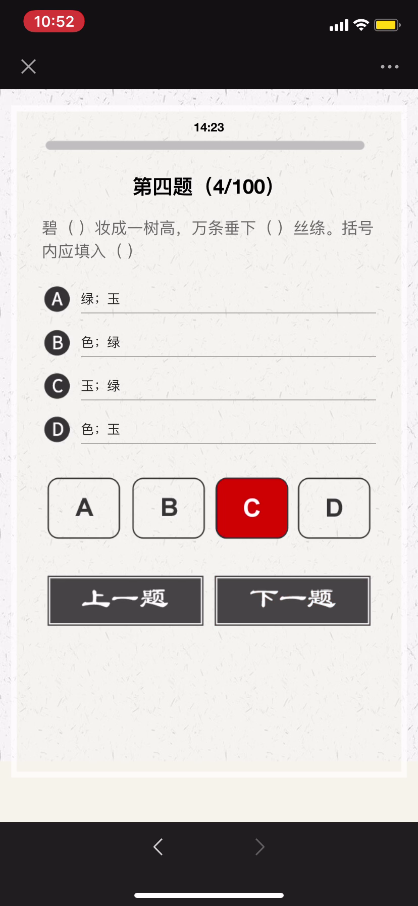

<!-- #### 咏柳
###### 【唐】贺知章
```
碧玉妆成一树高，万条垂下绿丝绦。
不知细叶谁裁出，二月春风似剪刀。
``` -->

---
#


---
#


##### [赠刘景文](https://baike.baidu.com/item/赠刘景文/2822413) 【宋】苏轼
```
荷尽已无擎雨盖，菊残犹有傲霜枝。
一年好景君须记，最是橙黄橘绿时。
```

---
#


---
#

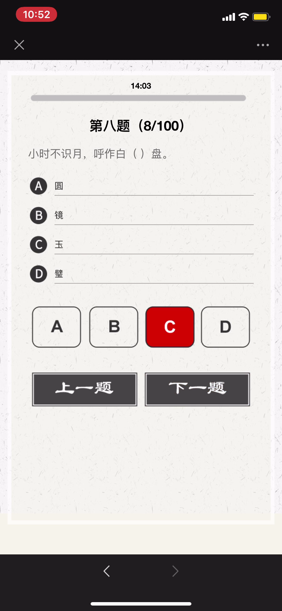

---
#


---
#


---
#


## 郑燮

```
郑板桥（1693年－1766年），原名郑燮，字克柔，号理庵，又号板桥，
人称板桥先生，江苏兴化人，祖籍苏州。清代书画家、文学家。
郑板桥一生只画兰、竹、石，自称“四时不谢之兰，百节长青之竹，
万古不败之石，千秋不变之人”。
其诗书画，世称“三绝”，是清代比较有代表性的文人画家。
```

##### 竹石 -【清】郑燮

```
咬定青山不放松，立根原在破岩中。
千磨万击还坚劲，任尔东西南北风。
```

---
#

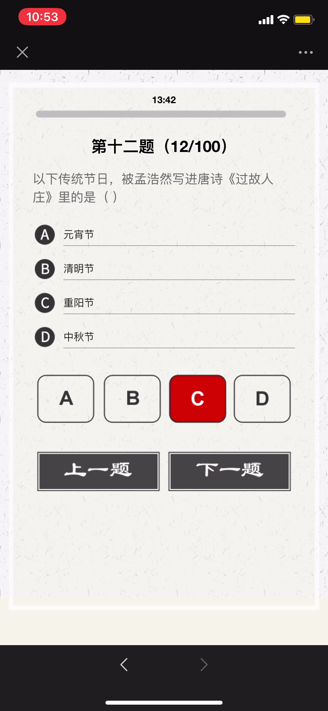

---
#


###### 橘颂

```
《九章·橘颂》是战国时期楚国大诗人屈原的作品。这是一首托物言志的咏物诗，
表面上歌颂橘树，实际是诗人对自己理想和人格的表白。
```

---
#


###### 无衣
###### 先秦·佚名
```
岂曰无衣？与子同袍。王于兴师，修我戈矛。与子同仇！
岂曰无衣？与子同泽。王于兴师，修我矛戟。与子偕作！
岂曰无衣？与子同裳。王于兴师，修我甲兵。与子偕行！
```

---
#


##### 病起书怀 - 宋代 陆游

```
病骨支离纱帽宽，孤臣万里客江干。
位卑未敢忘忧国，事定犹须待阖棺。
天地神灵扶庙社，京华父老望和銮。
出师一表通今古，夜半挑灯更细看。
```

```
《病起书怀》为宋代诗人陆游被免官后于淳熙三年（1176年）四月在成都所作的诗作。
这首诗从衰病起笔，以挑灯夜读《出师表》结束，所表现的是百折不挠的精神和永不磨
灭的意志。其中“位卑”句不但使诗歌思想生辉，而且令这首七律警策精粹、灵光独具，
艺术境界拔人一筹。全诗表达了诗人的爱国情怀以及忧国忧民之心。
```

---
#


##### 西江月 宋代： 朱敦儒

```
元是西都散汉，江南今日衰翁。从来颠怪更心风。做尽百般无用。 
屈指八旬将到，回头万事皆空。云间鸿雁草间虫。共我一般做梦。
```

---
#


##### 冬夜读书示子聿(八首 其一) 
###### 宋代：陆游

```
古人学问无遗力，少壮工夫老始成。
纸上得来终觉浅，绝知此事要躬行。
```

- 示：训示、指示。
- 子聿(yù)：陆游的小儿子。

---
#


##### 终南望馀（yú）雪 唐代 - 祖咏

```
终南阴岭秀，积雪浮云端。
林表明霁（jì）色，城中增暮寒。
```

```
词句注释
⑴终南：终南山，在唐京城长安（今陕西西安）南面六十里处。馀（yú）雪：指未融化之雪。馀，即余。
⑵阴岭：北面的山岭，背向太阳，故曰阴。
⑶林表：林外，林梢。霁（jì）：雨、雪后天气转晴。
⑷暮寒：傍晚的寒气。
```

```
这是一首应试诗。《唐诗纪事》记载，祖咏年轻时去长安应考，文题是“终南望馀雪”，
必须写出一首六韵十二句的五言长律。祖咏看完后思考了一下，写出了四句就搁笔了。
他感到这四句已经表达完整，若按照考官要求写成六韵十二句的五言体，则有画蛇添足
的感觉。当考官让他重写时，他还是坚持了自己的看法，考官很不高兴。结果祖咏未被录取。
```

---
#

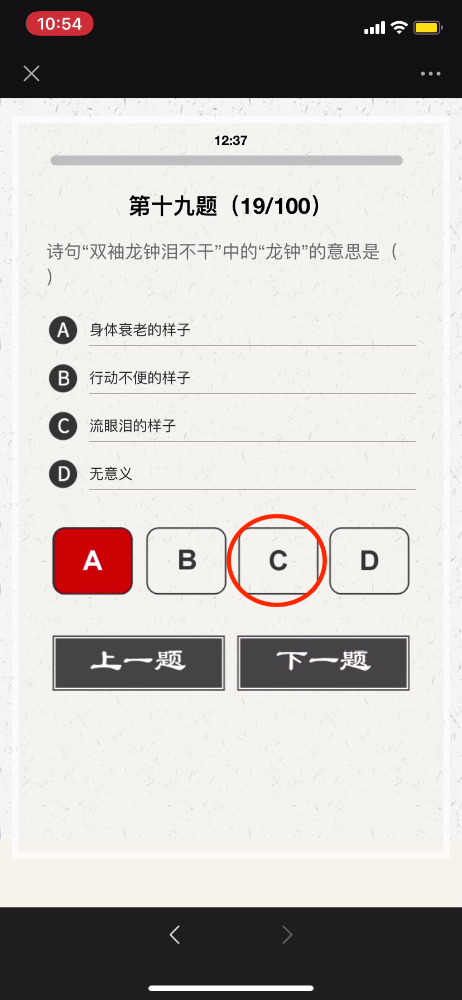

##### 《逢入京使》唐 - 岑参

```
故园东望路漫漫，双袖龙钟泪不干。
马上相逢无纸笔，凭君传语报平安。
```

---
#


##### [破阵子·为陈同甫赋壮词以寄之](https://baike.baidu.com/item/破阵子·为陈同甫赋壮词以寄之)
###### 【南宋】辛弃疾
```
醉里挑灯看剑，梦回吹角连营。
八百里分麾下炙，五十弦翻塞外声。沙场秋点兵。

马作的卢飞快，弓如霹雳弦惊。
了却君王天下事，赢得生前身后名。可怜白发生。
```

---
#


##### 王孟韦柳

```
盛唐王维、孟浩然、中唐韦应物、柳宗元的合称。
为唐代继承陶渊明田园诗而发展成独特的唐代山水田园诗歌流派的代表。
这四人的遭遇、诗风并非完全相同，但在山水田园诗歌创作上，都有较高
的独特成就，并且在艺术风格上有某种相同或相近之处。
```

---
#


##### [雪](https://so.gushiwen.org/shiwenv_95fac1155599.aspx)
###### 唐代：罗隐

```
尽道丰年瑞，丰年事若何。
长安有贫者，为瑞不宜多。
```

---
#


---
#


##### 陶渊明

陶渊明（352或365年—427年），名潜，字渊明，又字元亮，自号“五柳先生”，私谥“靖节” ，世称靖节先生，浔阳柴桑人。东晋末至南朝宋初期伟大的诗人、辞赋家。曾任江州祭酒、建威参军、镇军参军、彭泽县令等职，最末一次出仕为彭泽县令，八十多天便弃职而去，从此归隐田园。他是中国第一位田园诗人，被称为“古今隐逸诗人之宗”，有《陶渊明集》。

---
#


##### 《台城》
###### 唐朝 - 韦庄
```
江雨霏霏江草齐，六朝如梦鸟空啼。
无情最是台城柳，依旧烟笼十里堤。
```

```
《台城》是唐代诗人韦庄创作的一首凭吊六朝古迹的咏史怀古诗。此诗通过描绘美轮美奂
的江南春景反衬古城已经消失的现实，营造出一种物是人非的落寞气氛。
词句注释
⑴台城：也称苑城，即建康宫，在今南京市鸡鸣山南，原是三国时代吴国的后苑城。
⑵霏（fēi）霏：细雨纷纷状。江草齐：指江草与岸相齐。
⑶六朝：指在建康（今南京）建都的三国吴、东晋，南朝的宋、齐、梁、陈。
⑷“无情”句：即“台城柳是最无情”。
⑸烟：指柳树绿茵茵的，像清淡的烟雾一样。堤：河岸。
```

---
#


《核舟记》是明朝文学家魏学洢创作的一篇说明文。此文细致地描写了一件微雕工艺品——“核舟”的形象，其构思精巧，形象逼真，反映了中国古代雕刻艺术的卓越成就，表达了作者对王叔远精湛技术的赞美，以及对中国古代劳动人民的勤劳与智慧的高度赞扬。

```
舟首尾长约八分有奇，高可二黍许。
```

---
#


---
#

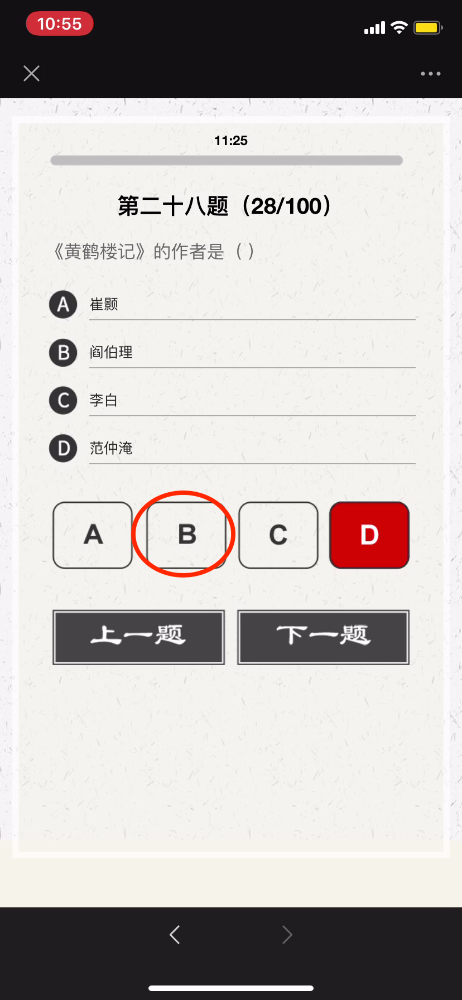

```
《黄鹤楼》是唐代诗人崔颢创作的一首七言律诗
《黄鹤楼记》是唐代阎伯理所作的一篇记
《黄鹤楼送孟浩然之广陵》李白
《岳阳楼记》是北宋文学家范仲淹创作的一篇散文
```

---
#


---
#


##### 《送韦城李少府》
###### 唐朝 - 张九龄
```
送客南昌尉，离亭西候春。
野花看欲尽，林鸟听犹新。
别酒青门路，归轩白马津。
相知无远近，万里尚为邻。
```

---
#


《渔父》出自《楚辞》
```
屈原既放，游于江潭，行吟泽畔，颜色憔悴，形容枯槁。
渔父见而问之曰：“子非三闾大夫与？何故至于斯？”
屈原曰：“举世皆浊我独清，众人皆醉我独醒，是以见放。”
...
```
---
#


##### 山中雪后
###### 清 - 郑燮
```
晨起开门雪满山，雪晴云淡日光寒。
檐流未滴梅花冻，一种清孤不等闲。
```

- 清孤：凄清孤独
- 等闲：寻常、一般。

---
#


##### 台城
###### 唐 - 刘禹锡
```
台城六代竞豪华⑵，结绮临春事最奢⑶
万户千门成野草⑷，只缘一曲后庭花⑸。
```

- 唐代诗人罗隐作有两首题为《台城》的诗作，其中一首为五言律诗，另一首为七言律诗。

---
#


[经史子集](https://baike.baidu.com/item/经史子集)
- 经：经书，是指儒家经典著作，易经、尚书、诗经、礼、乐、春秋等；
- 史：史书，即正史；
- 子：先秦百家著作，宗教；
- 集：文集，即诗词汇编。

还泛指我国古代典籍。

---
#

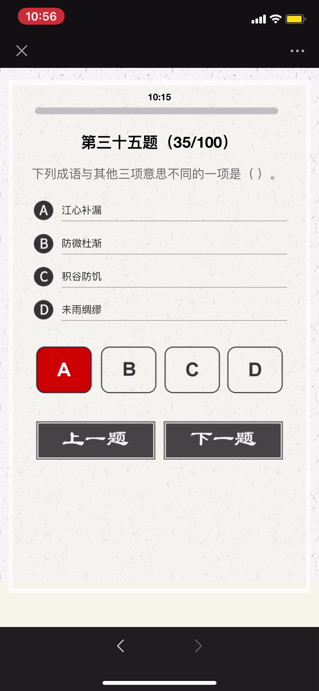

- 江心补漏：意思是船到江心才补漏洞，指临到紧急关头才设法补救，为时已晚。出自 元·关汉卿《救风尘》
- 防微杜渐：意思是指当错误的思想和行为刚有苗头或征兆时，就加以预防与制止，坚决不让它继续发展。出自《后汉书·丁鸿传》。
- 未雨绸缪：意思是趁着天没下雨，先修缮房屋门窗。比喻事先做好准备工作，预防意外的事情发生。绸缪：紧密缠缚，引申为修缮。

---
#


---
#


##### [清平乐·春归何处](https://so.gushiwen.org/shiwenv_315cf2d8892b.aspx)
###### 宋代：黄庭坚
```
春归何处？寂寞无行路。
若有人知春去处，唤取归来同住。
春无踪迹谁知？除非问取黄鹂。
百啭(zhuàn)无人能解，因风飞过蔷薇(qiáng wēi)。
```

- 因风：顺着风势。

---
#


---
#

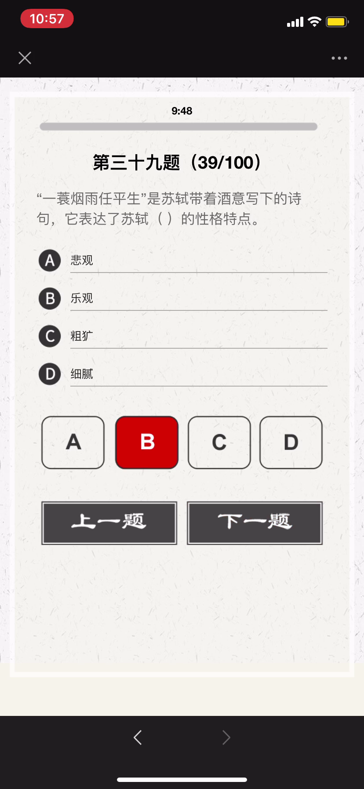

##### [定风波·莫听穿林打叶声](https://baike.baidu.com/item/定风波·莫听穿林打叶声/2807984)
###### 【北宋】苏轼

```
三月七日，沙湖道中遇雨。雨具先去，同行皆狼狈，余独不觉，已而遂晴，故作此词。
```

```
莫听穿林打叶声，何妨吟啸且徐行。
竹杖芒鞋轻胜马，谁怕？一蓑烟雨任平生。
料峭春风吹酒醒，微冷，山头斜照却相迎。
回首向来萧瑟处，归去，也无风雨也无晴。
```

---
#


见第18题

---
#


《左传·哀公》：“君子之谋也，始、衷、终皆举之，而后入焉。今我三不知而入之，不亦难乎!”

译文：谋划一件事情，对事情的开始、发展、结果这三方面都要考虑到，然后才向上报告。我对这三方面都不知道就向上报告，怎能不碰壁呢

---
#


---
#


##### 送柴侍御
###### 唐朝 - 王昌龄
```
沅水通波接武冈，送君不觉有离伤。
青山一道同云雨，明月何曾是两乡。
```

```
- 沅水：沅(yuán)江，发源于中国贵州省，流经湖南省入洞庭湖。
  这里指龙标，即今湖南省黔(qián)阳县 。
- 通波（流）：四处水路相通。
- 武冈：县名，在湖南省西部。
- 两乡：作者与柴侍御分处的两地。
```

---
#

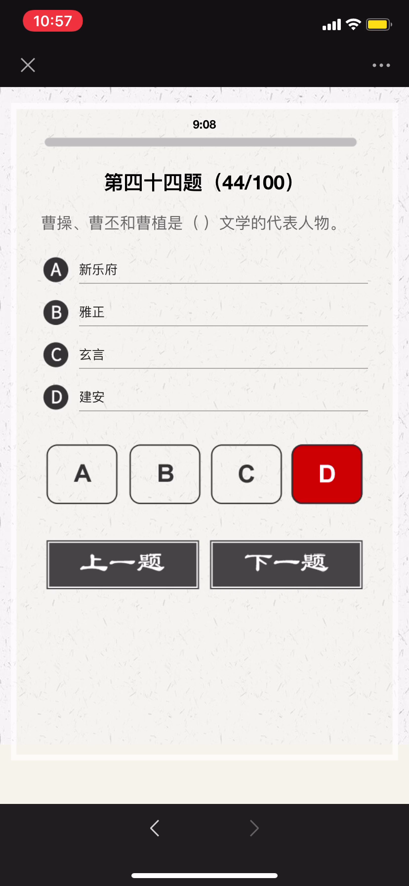

- 建安是汉献帝的年号。
- 建安文学：代表作家主要是曹氏父子（曹操、曹丕、曹植），建安七子（孔融、陈琳、王粲、徐干、阮瑀、应玚、刘桢）和蔡琰等。建安作家用自己的笔直抒胸襟，抒发渴望建功立业的雄心壮志，掀起了我国诗歌史上文人创作的第一个高潮。由于其时正是汉献帝建安年代，故后世称为建安文学，也称建安风骨。

---
#


---
#


##### [小雅·鹿鸣](https://so.gushiwen.org/shiwenv_8d7a192e8b32.aspx)
###### 先秦：佚名
```
呦呦鹿鸣，食野之苹。我有嘉宾，鼓瑟吹笙。吹笙鼓簧，承筐是将。人之好我，示我周行。
呦呦鹿鸣，食野之蒿。我有嘉宾，德音孔昭。视民不恌，君子是则是效。我有旨酒，嘉宾式燕以敖。
呦呦鹿鸣，食野之芩。我有嘉宾，鼓瑟鼓琴。鼓瑟鼓琴，和乐且湛。我有旨酒，以燕乐嘉宾之心。
```

---
#


##### 小重山·昨夜寒蛩不住鸣
###### 宋代：岳飞
```
昨夜寒蛩不住鸣。惊回千里梦，已三更。
起来独自绕阶行。人悄悄，帘外月胧明。

白首为功名。旧山松竹老，阻归程。
欲将心事付瑶琴。知音少，弦断有谁听？
```

- 寒蛩（qióng）：秋天的蟋蟀。

---
#

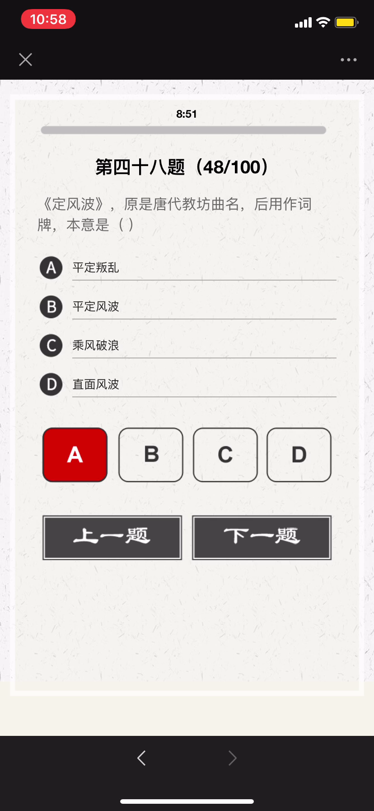

---
#


##### 李凭箜篌引
###### 唐代： 李贺
```
吴丝蜀桐张高秋，空山凝云颓不流。
江娥啼竹素女愁，李凭中国弹箜篌。
昆山玉碎凤凰叫，芙蓉泣露香兰笑。
十二门前融冷光，二十三丝动紫皇。
女娲炼石补天处，石破天惊逗秋雨。
梦入神山教神妪，老鱼跳波瘦蛟舞。
吴质不眠倚桂树，露脚斜飞湿寒兔。
```

```
- 李凭：当时的梨园艺人，善弹奏箜篌。
- 箜篌：古代弦乐器。又名空侯、坎侯。形状有多种。据诗中“二十三丝”，可知李凭弹的是竖箜篌。
- 引：一种古代诗歌体裁，篇幅较长，音节、格律一般比较自由，形式有五言、七言、杂言。
```

---
#


##### 三十六计：
```
金蝉脱壳、抛砖引玉、借刀杀人、以逸待劳、擒贼擒王、趁火打劫、
关门捉贼、浑水摸鱼、打草惊蛇、瞒天过海、反间计、笑里藏刀、
顺手牵羊、调虎离山、李代桃僵、指桑骂槐、隔岸观火、树上开花、
暗渡陈仓、走为上、假痴不癫、欲擒故纵、釜底抽薪、空城计、
苦肉计、远交近攻、反客为主、上屋抽梯、偷梁换柱、无中生有、
美人计、借尸还魂、声东击西、围魏救赵、连环计、假道伐虢(guó)。
```

---
#


```
春秋时期，晋国公子重耳为躲避祸乱而流亡他国长达十九年，大臣介子推始终追随左右、
不离不弃；甚至“割股啖君”。重耳励精图治，成为一代名君“晋文公”。但介子推不求利
禄，与母亲归隐绵山，晋文公为了迫其出山相见而下令放火烧山，介子推坚决不出山、
最终被火焚而死。晋文公感念忠臣之志，将其葬于绵山，修祠立庙，并下令在介子推
死难之日禁火寒食，以寄哀思，这就是“寒食节”的由来。
```

```
伯夷、叔齐：商末孤竹君的两位王子。相传孤竹君遗命立三子叔齐为君。 孤竹君死后，
叔齐让位给伯夷，伯夷不受；叔齐尊天伦，不愿打乱社会规则，也未继位，哥俩先后出
国前往周国考察。周武王伐纣，二人扣马谏阻。武王灭商后，他们耻食周粟，采薇而食，
饿死于首阳山。《论语．公冶长》：“伯夷叔齐不念旧恶，怨是用希。”

夷齐“兄弟让国，扣马谏伐，耻食周粟，饿死首阳”仁哲大义，是历代中华仁人志士、
诚信礼让、忠于祖国、抱节守志、清正廉明的典范。
```

```
苏武：西汉时期杰出的外交家，民族英雄。武帝时为郎。天汉元年（前100年）奉命以
中郎将持节出使匈奴，被扣留。匈奴贵族多次威胁利诱，欲使其投降；后将他迁到北海
边牧羊，扬言要公羊生子方可释放他回国。苏武历尽艰辛，留居匈奴十九年持节不屈。
```

---
#


##### 望月怀远
###### 【唐】张九龄
```
海上生明月，天涯共此时。
情人怨遥夜，竟夕起相思。
灭烛怜光满，披衣觉露滋。
不堪盈手赠，还寝梦佳期。
```

---
#


- 虽九死其尤未悔，成语，释义是这些都是我内心之所珍爱，就是让我九死（或多死）还是不后悔。
- 语出屈原《离骚》 ，“……长太息以掩涕兮，哀民生之多艰；余虽好修姱以羁兮，謇朝谇而夕替；既替余以蕙纕兮，又申之以揽芷；亦余心之所善兮，虽九死其犹未悔……”

```
表达作者为追求国家富强、坚持高洁品行而不怕千难万险、纵死不悔的忠贞情怀，
后来人们在表达坚持理想、为实现目标而奋斗时常引用这一名句表达心志。
```

---
#

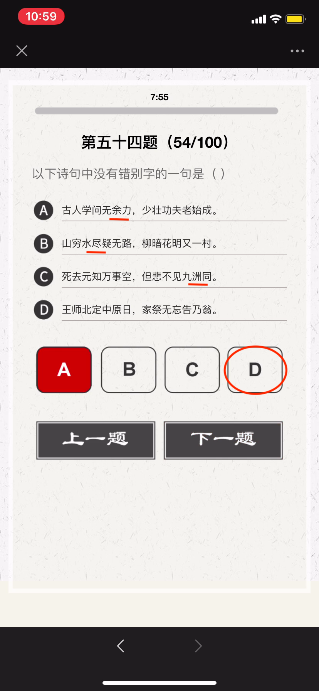

- 古人学问无遗力，少壮工夫老始成。
- 山重水复疑无路，柳暗花明又一村。
- 死去元知万事空，但悲不见九州同。
- 王师北定中原日，家祭无忘告乃翁。

---
#


```
长风破浪会有时，直挂云帆济沧海。
```

```
破阵乐 唐 - 张祜(hù)
秋风四面足风沙，塞外征人暂别家。
千里不辞行路远，时光早晚到天涯。
```

```
春日京中有怀 唐代：杜审言
今年游寓独游秦，愁思看春不当春。
上林苑里花徒发，细柳营前叶漫新。
公子南桥应尽兴，将军西第几留宾。
寄语洛城风日道，明年春色倍还人。
```

```
浪淘沙·其八 唐代：刘禹锡
莫道谗言如浪深，莫言迁客似沙沉。
千淘万漉(lù)虽辛苦，吹尽狂沙始到金。
```

---
#


- 二晏：北宋词人晏殊与其子晏几道，以其相映生辉的艺术成就影响了一代词风，被词话家们并称为“二晏”, 是中国历史上少数著名的父子文学家。
- 三苏，分别为苏洵、苏轼、苏辙，又有“一门三学士”之誉。

---
#


- 五音：指中国五声音阶中的角、徵、宫、商、羽，五个音级
- 五行：“土、金、木、火、水”
- 五律：五言律诗

---
#

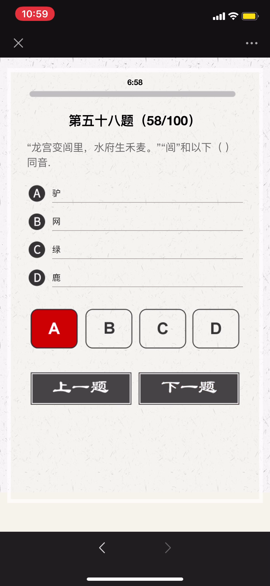

##### 自蜀江至洞庭湖口有感而作 
###### [唐] 白居易
```
江从西南来，浩浩无旦夕。长波逐若泻，连山凿如劈。
千年不壅溃，万姓无垫溺。不尔民为鱼，大哉禹之绩。
导岷既艰远，距海无咫尺。胡为不讫功，馀水斯委积。
洞庭与青草，大小两相敌。混合万丈深，淼茫千里白。
每岁秋夏时，浩大吞七泽。水族窟穴多，农人土地窄。
我今尚嗟叹，禹岂不爱惜。邈未究其由，想古观遗迹。
疑此苗人顽，恃险不终役。帝亦无奈何，留患与今昔。
水流天地内，如身有血脉。滞则为疽疣，治之在针石。
安得禹复生，为唐水官伯。手提倚天剑，重来亲指画。
疏河似翦纸，决壅同裂帛。渗作膏腴田，蹋平鱼鳖宅。
龙宫变闾里，水府生禾麦。坐添百万户，书我司徒籍。
```

---
#


##### 《逢入京使》 唐 - 岑参
```
故园东望路漫漫，双袖龙钟泪不干。
马上相逢无纸笔，凭君传语报平安。
```

##### 《墨梅》 元 - 王冕
```
吾家洗砚池头树，朵朵花开淡墨痕。
不要人夸好颜色，只留清气满乾坤。
```

##### [《所见》](https://baike.baidu.com/item/所见/2921061)  清 - 袁枚
```
牧童骑黄牛，歌声振林樾。
意欲捕鸣蝉，忽然闭口立。
```

---
#


##### [过故人庄](https://baike.baidu.com/item/过故人庄)
###### 【唐】孟浩然
```
故人具鸡黍，邀我至田家。
绿树村边合，青山郭外斜。
开轩面场圃，把酒话桑麻。
待到重阳日，还来就菊花。
```

---
#

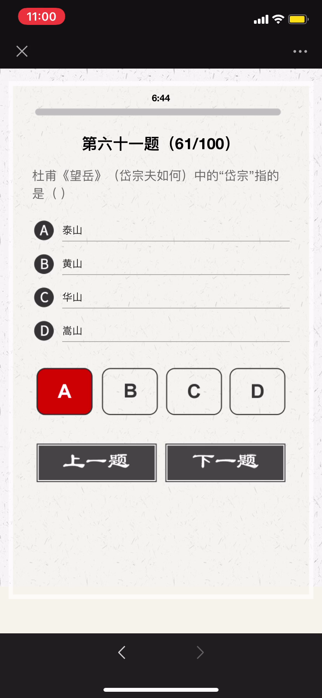

---
#


---
#


##### 晚春 唐 - 韩愈
```
草树知春不久归，百般红紫斗芳菲。(草树 一作：草木)
杨花榆荚无才思，惟解漫天作雪飞。
```

##### [钱塘湖春行](https://baike.baidu.com/item/钱塘湖春行) 【唐】白居易
```
孤山寺北贾亭西，水面初平云脚低。
几处早莺争暖树，谁家新燕啄春泥。
乱花渐欲迷人眼，浅草才能没马蹄。
最爱湖东行不足，绿杨阴里白沙堤。
```

---
#


##### 山中雪后
###### 清 - 郑燮
```
晨起开门雪满山，雪晴云淡日光寒。
檐流未滴梅花冻，一种清孤不等闲。
```

---
#


##### [书湖阴先生壁 其一](https://baike.baidu.com/item/书湖阴先生壁二首/296524)
###### 【北宋】王安石
```
茅檐长扫净无苔，花木成畦手自栽。
一水护田将绿绕，两山排闼送青来。
```

```
- 书：书写，题诗。湖阴先生：本名杨德逢，隐居之士，是王安石晚年居住金陵（今南京）紫金山时的邻居。
- 茅檐：茅屋檐下，这里指庭院。无苔：没有青苔。
- 成畦（qí ）：成垄成行。 畦：经过修整的一块块田地。
- 护田：这里指护卫环绕着园田。
- 排闼（tà）：开门。闼：小门。
- 送青来：送来绿色。
```

---
#


---
#

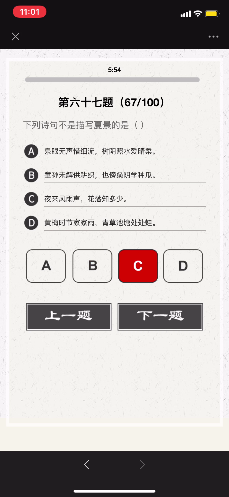

---
#


---
#


---
#


```
太宗朝，有王着学右军书，深得其法，侍书翰林。
```

①太宗：宋太宗赵光义976~997年在位。
②朝：一代君主的统治时期
③右军：指晋代著名书法家王羲之，书圣。
④翰林：皇帝的文学侍从官。

相传王羲之爱鹅，后以"右军"作为鹅的别名。

---
#


##### 《自题》
###### 清·曹雪芹
```
浮生著甚苦奔忙，盛席华筵终散场。
悲喜千般同幻梦，古今一梦尽荒唐。
慢言红袖啼痕重，更有情痴抱恨长!
字字看来皆是血，十年辛苦不寻常。
```

---
#


##### [夜雨寄北](https://so.gushiwen.org/shiwenv_e46c43d13b97.aspx)
###### 【唐】李商隐
```
君问归期未有期，巴山夜雨涨秋池。
何当共剪西窗烛，却话巴山夜雨时。
```

---
#


---
#


##### [采莲曲二首 其二](https://baike.baidu.com/item/采莲曲二首/)
###### 【唐】王昌龄
```
荷叶罗裙一色裁，芙蓉向脸两边开。
乱入池中看不见，闻歌始觉有人来。
```

---
#

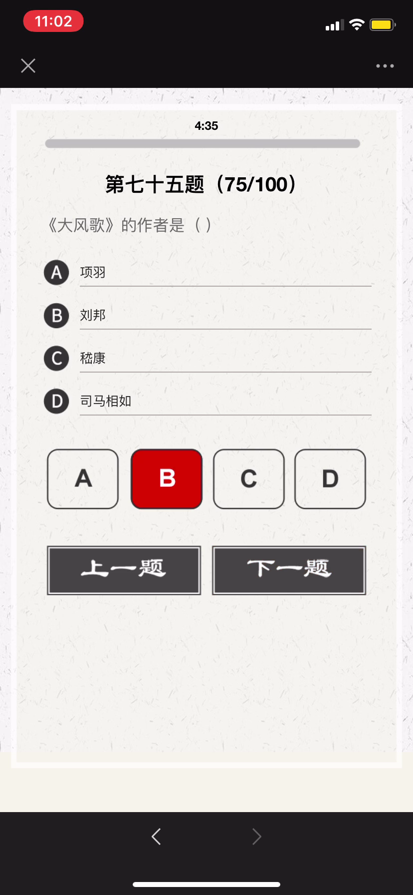

---
#


南朝宋国有谢灵运，是我国古代著名的山水诗作家。谢灵运为人清狂，恃才傲物，曾于饮酒时自叹道：“天下才共一石（一种容量单位，一石等于十斗），曹子建（即曹植）独得八斗，我得一斗，自古及今共分一斗。”
由此，后世便称才学出众者为“才高八斗”或“八斗之才”。

---
#


---
#


##### 饮湖上初晴后雨
###### 【宋】苏轼
```
水光潋滟晴方好，山色空濛雨亦奇。
欲把西湖比西子，淡妆浓抹总相宜。
```

---
#


##### 前出塞
###### 【唐】杜甫
```
挽弓当挽强，用箭当用长。
射人先射马，擒贼先擒王。
杀人亦有限，列国自有疆。
苟能制侵陵，岂在多杀伤。
```

---
#


##### 送杜十四之江南 / 送杜晃进士之东吴
###### 唐代：孟浩然
```
荆吴相接水为乡，君去春江正淼茫。(淼 同：渺)
日暮征帆何处泊，天涯一望断人肠。
```

---
#


```
宋·苏轼《寄吴德仁兼简陈季常》忽闻河东师子吼，拄杖落手心茫然。

河东狮吼，汉语成语，意思是比喻悍妒的妻子对丈夫大吵大闹。
几个关键人物：苏东坡、柳氏和陈季常。
```

```
河东先生：柳宗元，字子厚，汉族，河东（现山西运城永济一带）人，
唐宋八大家之一，唐代文学家、哲学家、散文家和思想家世称“柳河东”、 “河东先生”，
因官终柳州刺史，又称“柳柳州”。
柳宗元与韩愈并称为“韩柳”，与刘禹锡并称“刘柳”，与王维、孟浩然、韦应物并称“王孟韦柳”。
```

```
- 唐宋八大家，分别为唐代柳宗元、韩愈，和宋代欧阳修、苏洵、苏轼、苏辙、王安石、曾巩八位。
  “韩柳欧王曾三苏”
- 其中韩愈、柳宗元是唐代古文运动的领袖，
- 欧阳修、三苏（苏轼、苏辙、苏洵）等四人是宋代古文运动的核心人物，
- 王安石、曾巩是临川文学的代表人物。
```

---
#

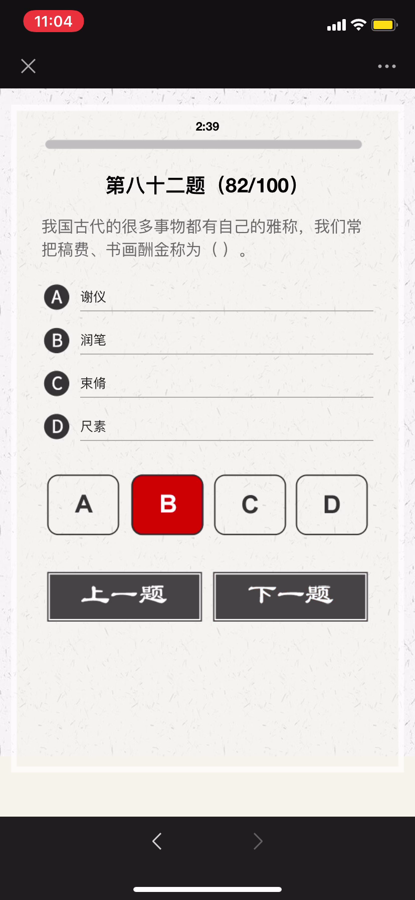

- 谢仪，意思是谢礼，酬金。
- “润笔”被泛指为请人家写文章、写字、作画的报酬。
- 尺素：书信别名
- 束脩：古代学生与教师初见面时，必先奉赠礼物，表示敬意，名曰“束脩”。早在孔子的时候已经实行。学费即是“束修数条”，束修就是咸猪肉，后来基本上就是拜师费的意思，可以理解为学费。
---
#


---
#


```
- 《金陵怀古四首》 是宋代文学家王安石的组诗作品。这四首诗主旨为感慨兴亡。
- 《山居秋暝》是唐代诗人王维的作品。此诗描绘了秋雨初晴后傍晚时分山村的旖旎风
光和山居村民的淳朴风尚，表现了诗人寄情山水田园并对隐居生活怡然自得的满足心情，
以自然美来表现人格美和社会美。
- 《石灰吟》是明代政治家、文学家于谦创作的一首七言绝句。此诗托物言志，采用象
征手法，字面上是咏石灰，实际借物喻人，托物寄怀，表现了诗人高洁的理想。
```

##### [石灰吟](https://baike.baidu.com/item/石灰吟)
###### 【明】于谦
```
千锤万凿出深山，烈火焚烧若等闲。
粉骨碎身全不怕，要留清白在人间。
```

---
#


---
#


##### 中秋月·十轮霜影转庭梧  宋 - 晏殊
```
十轮霜影转庭梧，此夕羁人独向隅。
未必素娥无怅恨，玉蟾清冷桂花孤。
```

- 十轮：十年

##### 上元夜 初唐 - 崔液
```
玉漏银壶且莫催，铁关金锁彻明开。
谁家见月能闲坐？何处闻灯不看来？
```

---
#


新乐府运动，诗歌革新运动，由唐代诗人白居易、元稹、张籍、李绅等所倡导，主张恢复古代的采诗制度，发扬《诗经》和汉魏乐府讽喻时事的传统，使诗歌起到“补察时政”，“泄导人情”的作用，强调以自创的新的乐府题目咏写时事， 故名新乐府。

---
#

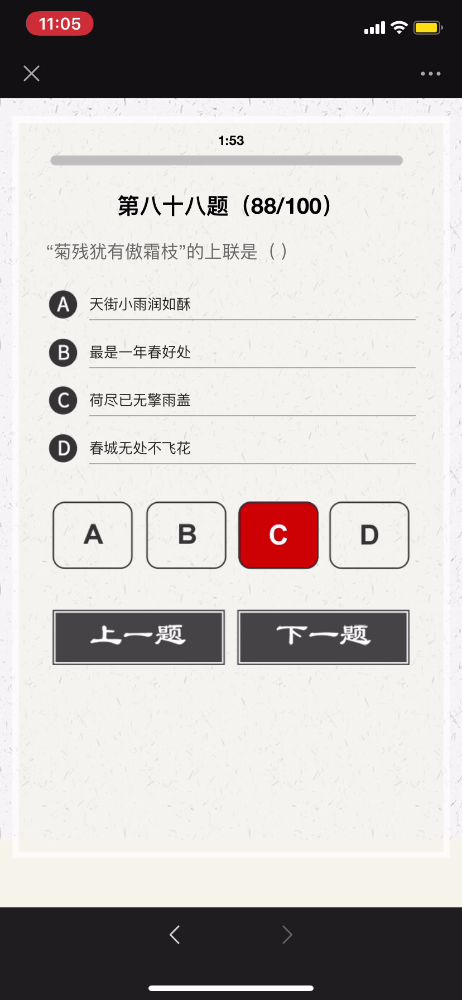

- 天街小雨润如酥，草色遥看近却无。
- 最是一年春好处，绝胜烟柳满皇都。
- 荷尽已无擎雨盖，菊残犹有傲霜枝。
- 春城无处不飞花，寒食东风御柳斜。

---
#

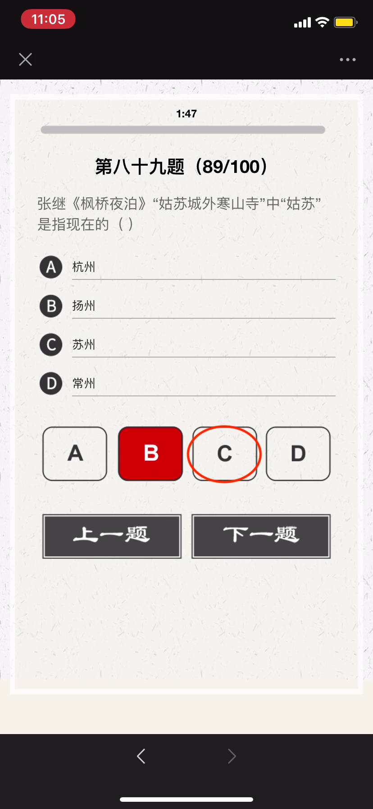

姑苏，正名：苏州，古称吴，简称苏，又称姑苏、平江等
姑苏是吴文化的发祥地，历史悠久，长期是江南地区的政治、经济、文化中心 。
春秋时期，这里是吴国的都城，至今还保留着许多有关西施、伍子胥等的古迹。

---
#


---
#


##### [杂诗 其一 节选](https://baike.baidu.com/item/杂诗/1688007)
###### 【东晋】陶渊明
```
人生无根蒂，飘如陌上尘。
分散逐风转，此已非常身。
落地为兄弟，何必骨肉亲！
得欢当作乐，斗酒聚比邻。
盛年不重来，一日难再晨。
及时当勉励，岁月不待人。
```

---
#


##### [过零丁洋](https://so.gushiwen.org/shiwenv_5796865dca4a.aspx)
###### 【南宋】文天祥
```
辛苦遭逢起一经，干戈寥落四周星。
山河破碎风飘絮，身世浮沉雨打萍。
惶恐滩头说惶恐，零丁洋里叹零丁。
人生自古谁无死？留取丹心照汗青。
```

- 零丁洋：零丁洋即”伶丁洋“。现在广东省珠江口外。1278年底，文天祥率军在广东五坡岭与元军激战，兵败被俘，囚禁船上曾经过零丁洋。

---
#


- 边塞诗又称出塞诗是唐代诗歌的主要题材。
- 初唐四杰之一的骆宾王是初唐写作边塞诗较多的诗人。
- 此后其他著名诗人如：杨炯、陈子昂、杜审言、陆游等人也创作边塞诗。边塞诗创作一时蔚为风气。
- 边塞诗代表人物是：高适，王昌龄， 岑参 ，李贺，李益。

---
#


- 十二地支 （古人用以记录时间的符号），
子、丑、寅、卯、辰、巳、午、未、申、酉、戌、亥

```
【子时】夜半bai，又名子夜、中夜：十二时辰的第一个时辰。（北京时间23时至01时）。
【丑时】鸡鸣，又名荒鸡：十二时辰的第二个时辰。（北京时间01时至03时）。
【寅时】平旦，又称黎明、早晨、日旦等：时是夜与日的交替之际。（北京时间03时至05时）。
【卯时】日出，又名日始、破晓、旭日等：指太阳刚刚露脸，冉冉初升的那段时间。
    （北京时间05时至07时）。
【辰时】食时，又名早食等：古人“朝食”之时也就是吃早饭时间，（北京时间07时至09时）。
【巳时】隅中，又名日禺等：临近中午的时候称为隅中。（北京时间09 时至11时）。
【午时】日中，又名日正、中午等：（北京时间11时至13时）。
【未时】日昳，又名日跌、日央等：太阳偏西为日跌。（北京时间13时至15时）。
【申时】哺时，又名日铺、夕食等：（北京时间15食至17时）。
【酉时】日入，又名日落、日沉、傍晚：意为太阳落山的时候。（北京时间17是至19时）。
【戌时】黄昏，又名日夕、日暮、日晚等：此时太阳已经落山，天将黑未黑。天地昏黄，
      万物朦胧，故称黄昏。（北京时间19时至21时）。
【亥时】人定，又名定昏等：此时夜色已深，人们也已经停止活动，安歇睡眠了。人定
     也就是人静。（北京时间21时至23时）。
```

---
#


---
#


---
#


- 郑谷，唐朝末期著名诗人。字守愚，江西宜春市袁州区人。唐僖宗时进士，官都官郎中，人称郑都官。又以《鹧鸪诗》得名，人称郑鹧鸪。其诗多写景咏物之作，表现士大夫的闲情逸致。

---
#


---
#


---
#


