## 2020 诗词大会
#### 选拔赛题目解析

---
#

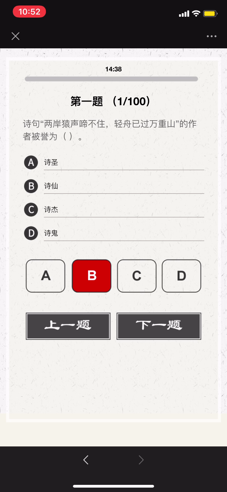

<!-- ## 早发白帝城
#### 【唐】李白 -->
```
朝辞白帝彩云间，千里江陵一日还。两岸猿声啼不住，轻舟已过万重山。
```

###### [参考](https://new.qq.com/omn/20181228/20181228A1KO6I.html?pgv_ref=aio2015&ptlang=2052)

```
- 诗仙：李白（701年－762年） ，字太白，号青莲居士，又号“谪仙人”，
  是唐代伟大的浪漫主义诗人，被后人誉为“诗仙”，与杜甫并称为“李杜”，
  为了与另两位诗人李商隐与杜牧即“小李杜”区别，杜甫与李白又合称“大李杜”。
  李白的乐府、歌行[xíng]及绝句成就为最高。在盛唐诗人中，王维、孟浩然长
  于五绝，王昌龄等七绝写得很好，兼长五绝与七绝而且同臻极境的，只有李白一人。
```

```
- 诗圣：杜甫（712年—770年），字子美，自号少陵野老。
- 诗魔：白居易（772年－846年），字乐天，号香山居士，又号醉吟先生。
  白居易与元稹共同倡导新乐府运动，世称“元白”，与刘禹锡并称“刘白”。
- 诗神：苏轼（1037年—1101年），字子瞻，又字和仲，号铁冠道人、东坡居士。
  北宋著名文学家、书法家、画家。
- 诗狂：贺知章（约659年— 约744年），唐代诗人、书法家。字季真，晚年自号“四明狂客”。
- 诗佛：王维（701年－761年），字摩诘，号摩诘居士。精通诗、书、画、音乐等，
  尤长五言，多咏山水田园，与孟浩然合称“王孟”，有“诗佛”之称。
- 诗鬼：李贺（约公元791年-约817年），字长吉，是中唐的浪漫主义诗人，
  与李白、李商隐称为唐代三李，是中唐到晚唐诗风转变期的一个代表者。
- 诗杰：王勃，与杨炯、骆宾王以及卢照邻三人并称为“初唐四杰”。
```

---
#

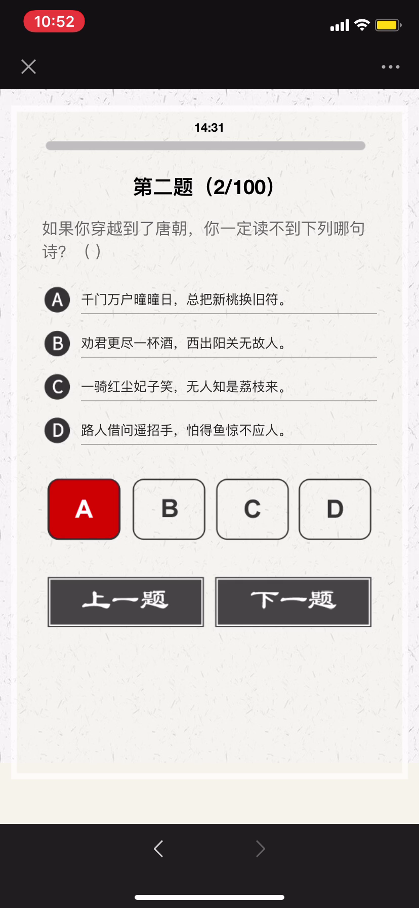

```
元日 -【宋】王安石
爆竹声中一岁除，春风送暖入屠苏。千门万户曈曈日，总把新桃换旧符。
```

```
送元二使安西(渭城曲) -【唐】王维
渭城朝雨浥轻尘，客舍青青柳色新。劝君更尽一杯酒，西出阳关无故人。
```

```
过华清宫 -【唐】杜牧
长安回望绣成堆，山顶千门次第开。一骑红尘妃子笑，无人知是荔枝来。
```

```
小儿垂钓 -【唐】胡令能
蓬头稚子学垂纶，侧坐莓苔草映身。路人借问遥招手，怕得鱼惊不应人。
```

---
#


<!-- #### 画鸡
###### 【明】 唐寅
```
头上红冠不用裁，满身雪白走将来。
平生不敢轻言语，一叫千门万户开。
``` -->

---
#


<!-- #### 咏柳
###### 【唐】贺知章
```
碧玉妆成一树高，万条垂下绿丝绦。
不知细叶谁裁出，二月春风似剪刀。
``` -->

---
#


---
#

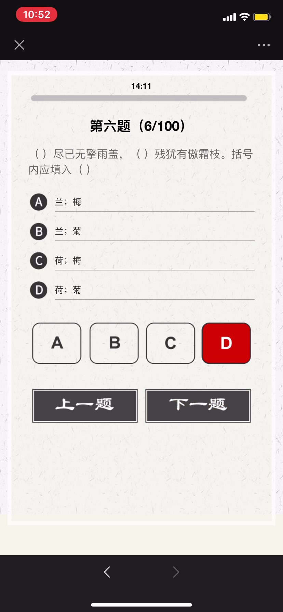

#### [赠刘景文](https://baike.baidu.com/item/赠刘景文/2822413) 【宋】苏轼
```
荷尽已无擎雨盖，菊残犹有傲霜枝。
一年好景君须记，最是橙黄橘绿时。
```

---
#


---
#

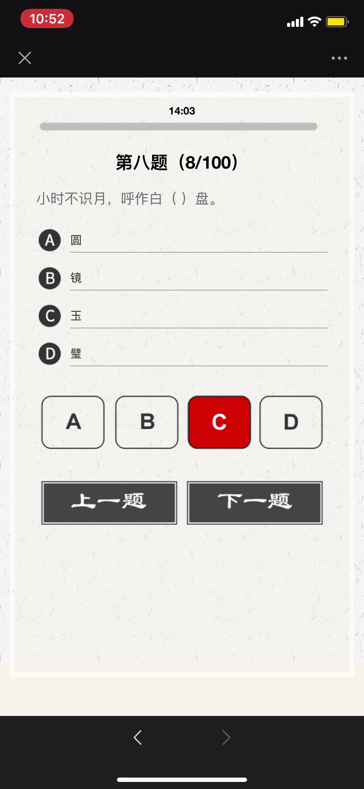

---
#


---
#

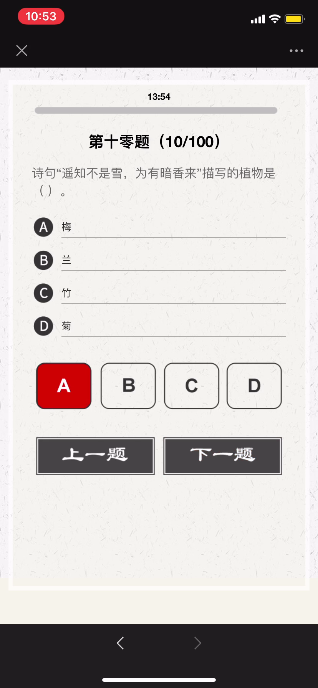

---
#

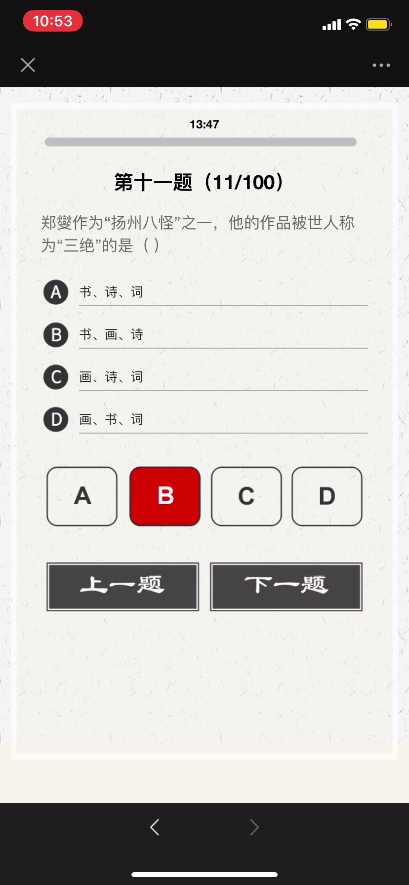

## 郑燮

```
郑板桥（1693年－1766年），原名郑燮，字克柔，号理庵，又号板桥，
人称板桥先生，江苏兴化人，祖籍苏州。清代书画家、文学家。
郑板桥一生只画兰、竹、石，自称“四时不谢之兰，百节长青之竹，
万古不败之石，千秋不变之人”。
其诗书画，世称“三绝”，是清代比较有代表性的文人画家。
```

#### 竹石 -【清】郑燮

```
咬定青山不放松，立根原在破岩中。
千磨万击还坚劲，任尔东西南北风。
```

---
#

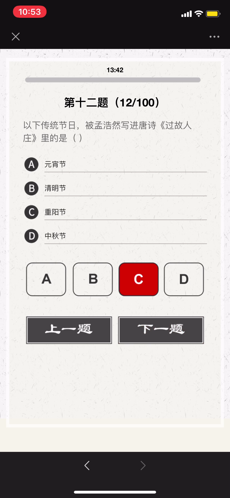

---
#


## 橘颂

《九章·橘颂》是战国时期楚国大诗人屈原的作品。这是一首托物言志的咏物诗，表面上歌颂橘树，实际是诗人对自己理想和人格的表白。

---
#

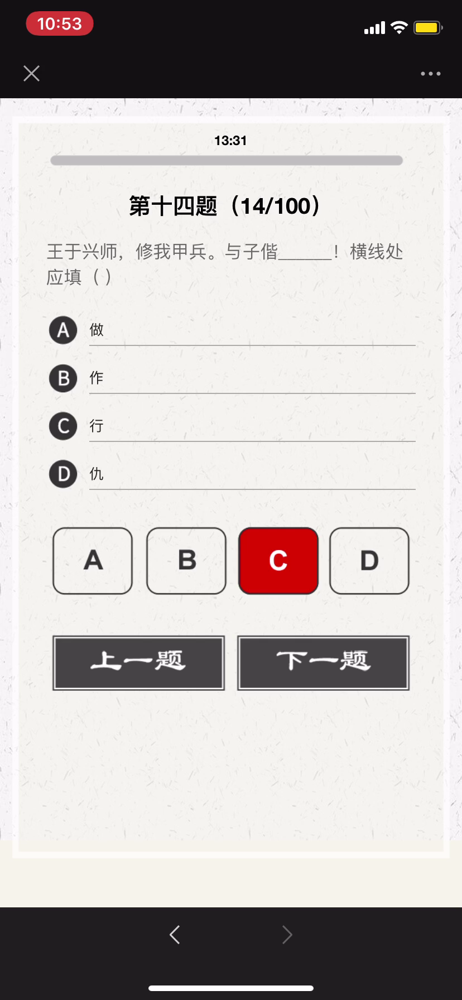

## 无衣
#### 先秦·佚名
```
岂曰无衣？与子同袍。王于兴师，修我戈矛。与子同仇！
岂曰无衣？与子同泽。王于兴师，修我矛戟。与子偕作！
岂曰无衣？与子同裳。王于兴师，修我甲兵。与子偕行！
```

---
#


#### 病起书怀 - 宋代 陆游

```
病骨支离纱帽宽，孤臣万里客江干。
位卑未敢忘忧国，事定犹须待阖棺。
天地神灵扶庙社，京华父老望和銮。
出师一表通今古，夜半挑灯更细看。
```

```
《病起书怀》为宋代诗人陆游被免官后于淳熙三年（1176年）四月在成都所作的诗作。
这首诗从衰病起笔，以挑灯夜读《出师表》结束，所表现的是百折不挠的精神和永不磨
灭的意志。其中“位卑”句不但使诗歌思想生辉，而且令这首七律警策精粹、灵光独具，
艺术境界拔人一筹。全诗表达了诗人的爱国情怀以及忧国忧民之心。
```

---
#


#### 西江月 宋代： 朱敦儒

```
元是西都散汉，江南今日衰翁。从来颠怪更心风。做尽百般无用。 
屈指八旬将到，回头万事皆空。云间鸿雁草间虫。共我一般做梦。
```

---
#


#### 冬夜读书示子聿(八首 其一) 
#### 宋代：陆游

```
古人学问无遗力，少壮工夫老始成。
纸上得来终觉浅，绝知此事要躬行。
```

示：训示、指示。
子聿(yù)：陆游的小儿子。

---
#

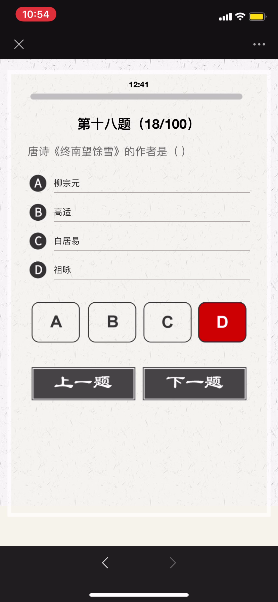

#### 终南望馀（yú）雪 唐代 - 祖咏

```
终南阴岭秀，积雪浮云端。
林表明霁（jì）色，城中增暮寒。
```

```
词句注释
⑴终南：终南山，在唐京城长安（今陕西西安）南面六十里处。馀（yú）雪：指未融化之雪。馀，即余。
⑵阴岭：北面的山岭，背向太阳，故曰阴。
⑶林表：林外，林梢。霁（jì）：雨、雪后天气转晴。
⑷暮寒：傍晚的寒气。
```

```
这是一首应试诗。《唐诗纪事》记载，祖咏年轻时去长安应考，文题是“终南望馀雪”，
必须写出一首六韵十二句的五言长律。祖咏看完后思考了一下，写出了四句就搁笔了。
他感到这四句已经表达完整，若按照考官要求写成六韵十二句的五言体，则有画蛇添足
的感觉。当考官让他重写时，他还是坚持了自己的看法，考官很不高兴。结果祖咏未被录取。
```

---
#

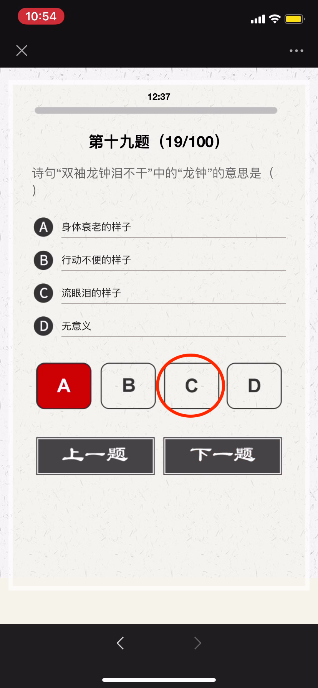

#### 《逢入京使》唐 - 岑参

```
故园东望路漫漫，双袖龙钟泪不干。
马上相逢无纸笔，凭君传语报平安。
```

---
#

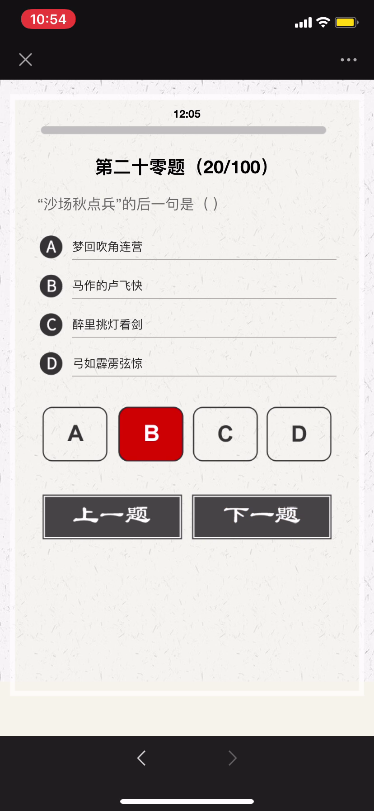

#### [破阵子·为陈同甫赋壮词以寄之](https://baike.baidu.com/item/破阵子·为陈同甫赋壮词以寄之)
#### 【南宋】辛弃疾
```
醉里挑灯看剑，梦回吹角连营。
八百里分麾下炙，五十弦翻塞外声。沙场秋点兵。

马作的卢飞快，弓如霹雳弦惊。
了却君王天下事，赢得生前身后名。可怜白发生。
```

---
#

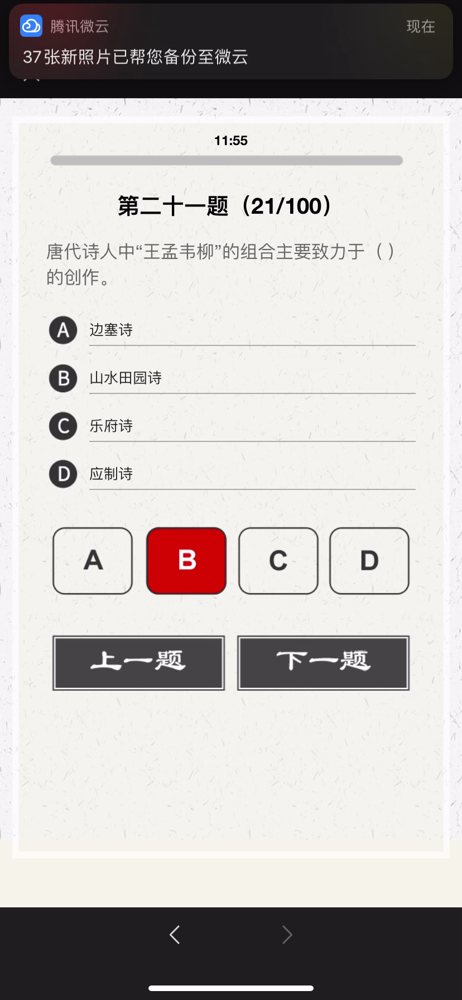

#### 王孟韦柳

```
盛唐王维、孟浩然、中唐韦应物、柳宗元的合称。
为唐代继承陶渊明田园诗而发展成独特的唐代山水田园诗歌流派的代表。
这四人的遭遇、诗风并非完全相同，但在山水田园诗歌创作上，都有较高
的独特成就，并且在艺术风格上有某种相同或相近之处。
```

---
#

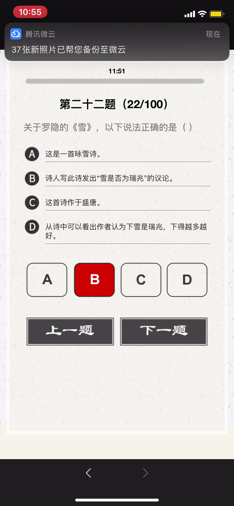

#### [雪](https://so.gushiwen.org/shiwenv_95fac1155599.aspx)
#### 唐代：罗隐

```
尽道丰年瑞，丰年事若何。
长安有贫者，为瑞不宜多。
```

---
#

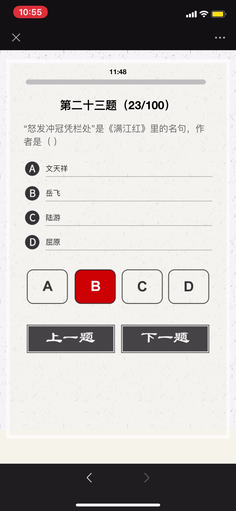

---
#

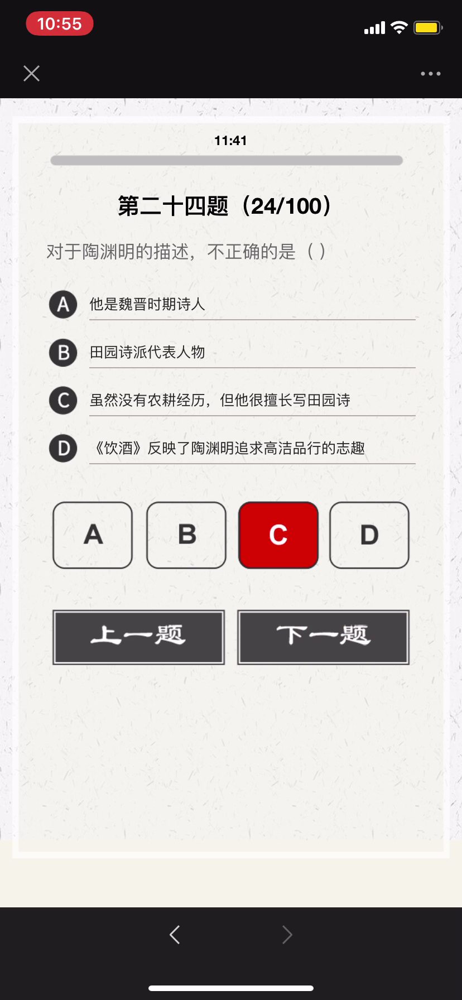

#### 陶渊明

陶渊明（352或365年—427年），名潜，字渊明，又字元亮，自号“五柳先生”，私谥“靖节” ，世称靖节先生，浔阳柴桑人。东晋末至南朝宋初期伟大的诗人、辞赋家。曾任江州祭酒、建威参军、镇军参军、彭泽县令等职，最末一次出仕为彭泽县令，八十多天便弃职而去，从此归隐田园。他是中国第一位田园诗人，被称为“古今隐逸诗人之宗”，有《陶渊明集》。

---
#


#### 《台城》
#### 唐朝 - 韦庄
```
江雨霏霏江草齐，六朝如梦鸟空啼。
无情最是台城柳，依旧烟笼十里堤。
```

```
《台城》是唐代诗人韦庄创作的一首凭吊六朝古迹的咏史怀古诗。此诗通过描绘美轮美奂
的江南春景反衬古城已经消失的现实，营造出一种物是人非的落寞气氛。
词句注释
⑴台城：也称苑城，即建康宫，在今南京市鸡鸣山南，原是三国时代吴国的后苑城。
⑵霏（fēi）霏：细雨纷纷状。江草齐：指江草与岸相齐。
⑶六朝：指在建康（今南京）建都的三国吴、东晋，南朝的宋、齐、梁、陈。
⑷“无情”句：即“台城柳是最无情”。
⑸烟：指柳树绿茵茵的，像清淡的烟雾一样。堤：河岸。
```

---
#

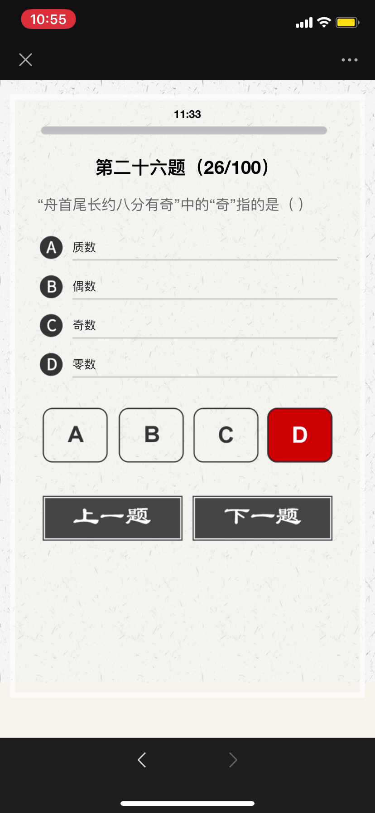

《核舟记》是明朝文学家魏学洢创作的一篇说明文。此文细致地描写了一件微雕工艺品——“核舟”的形象，其构思精巧，形象逼真，反映了中国古代雕刻艺术的卓越成就，表达了作者对王叔远精湛技术的赞美，以及对中国古代劳动人民的勤劳与智慧的高度赞扬。

```
舟首尾长约八分有奇，高可二黍许。
```

---
#

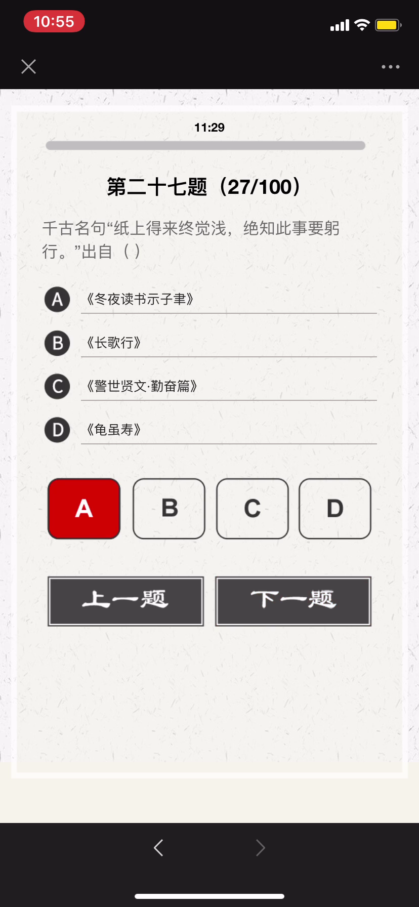

---
#

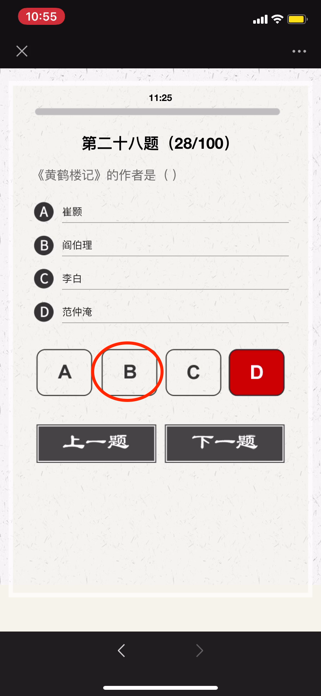

```
《黄鹤楼》是唐代诗人崔颢创作的一首七言律诗
《黄鹤楼记》是唐代阎伯理所作的一篇记
《黄鹤楼送孟浩然之广陵》李白
《岳阳楼记》是北宋文学家范仲淹创作的一篇散文
```

---
#


---
#

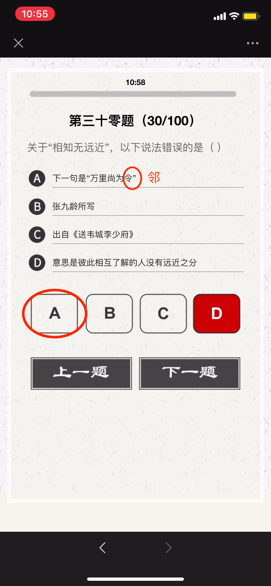

#### 《送韦城李少府》
##### 唐朝 - 张九龄
```
送客南昌尉，离亭西候春。
野花看欲尽，林鸟听犹新。
别酒青门路，归轩白马津。
相知无远近，万里尚为邻。
```

---
#

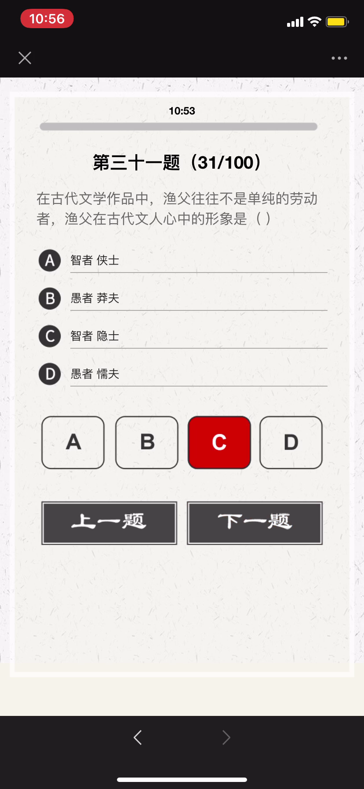

《渔父》出自《楚辞》
```
屈原既放，游于江潭，行吟泽畔，颜色憔悴，形容枯槁。
渔父见而问之曰：“子非三闾大夫与？何故至于斯？”
屈原曰：“举世皆浊我独清，众人皆醉我独醒，是以见放。”
...
```
---
#


#### 《山中雪后》
##### 郑燮
```
晨起开门雪满山，雪晴云淡日光寒。
檐流未滴梅花冻，一种清孤不等闲。
```

---
#

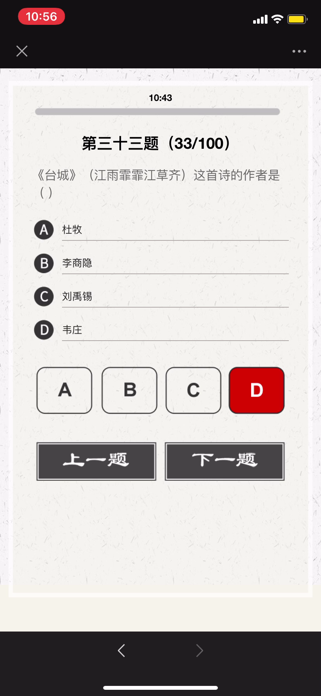

#### 台城
##### 唐 - 刘禹锡
```
台城六代竞豪华⑵，结绮临春事最奢⑶
万户千门成野草⑷，只缘一曲后庭花⑸。
```

- 唐代诗人罗隐作有两首题为《台城》的诗作，其中一首为五言律诗，另一首为七言律诗。

---
#

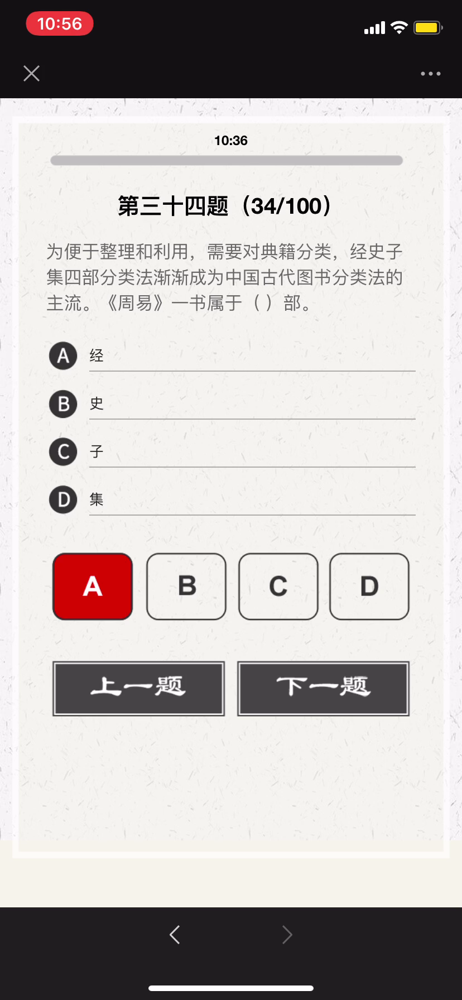

[经史子集](https://baike.baidu.com/item/经史子集)
- 经：经书，是指儒家经典著作，易经、尚书、诗经、礼、乐、春秋等；
- 史：史书，即正史；
- 子：先秦百家著作，宗教；
- 集：文集，即诗词汇编。

还泛指我国古代典籍。

---
#

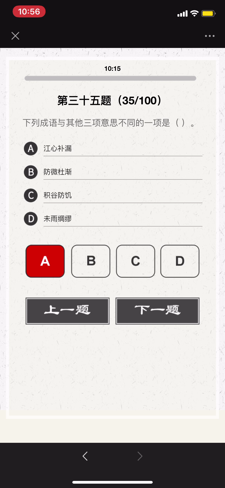

TODO

---
#

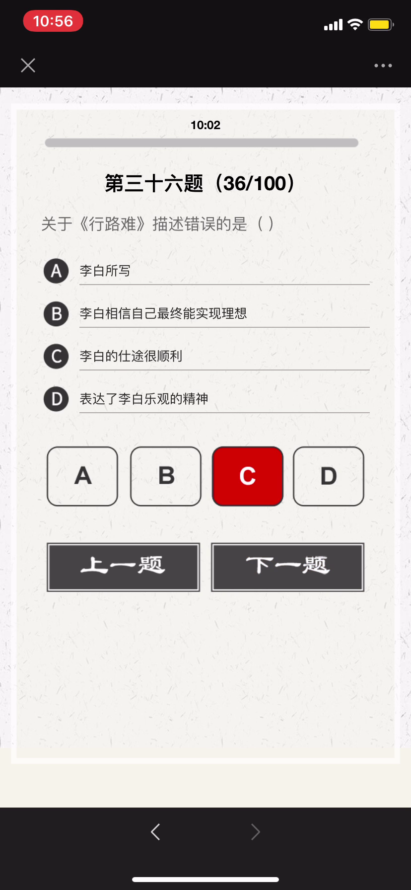

---
#


---
#


---
#

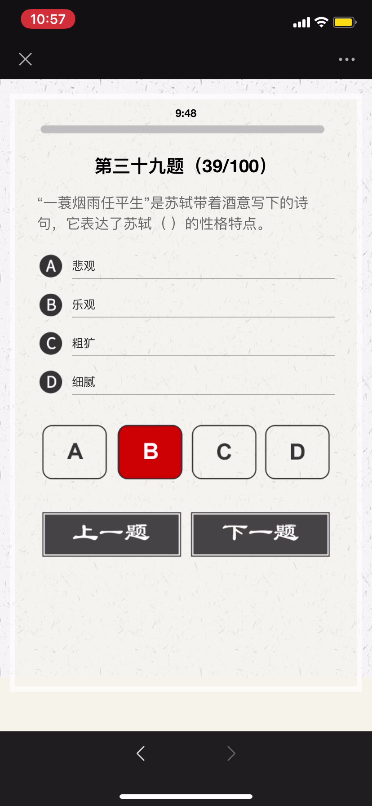

---
#


---
#

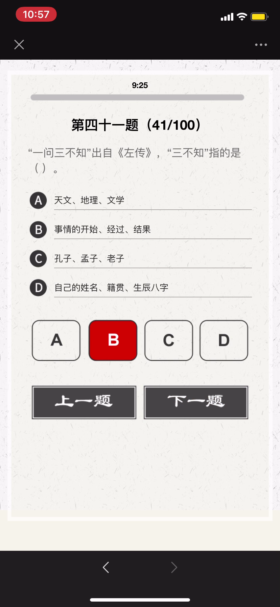

---
#

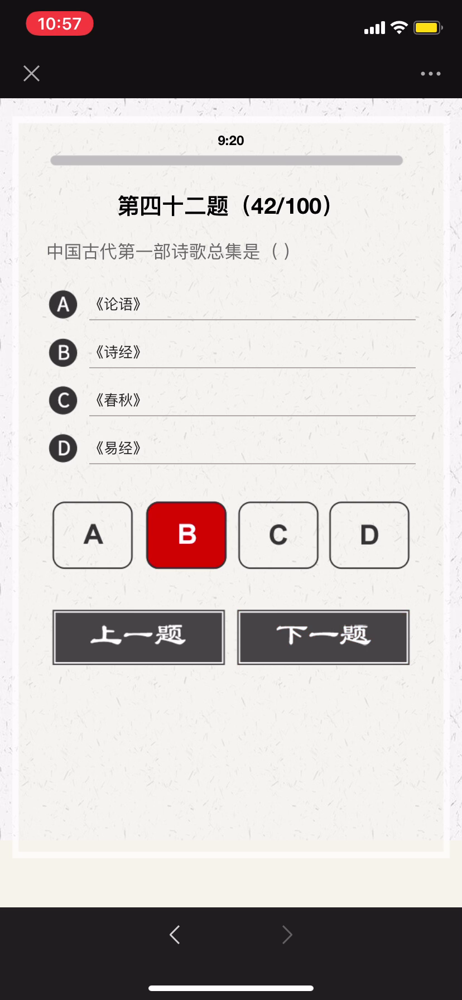

---
#

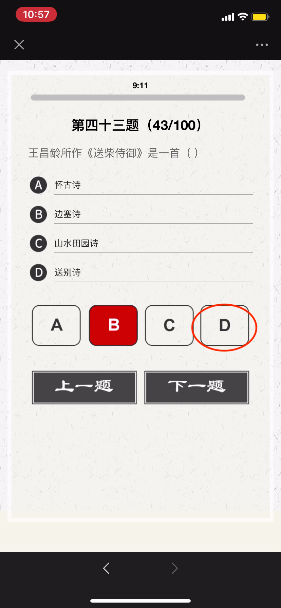

---
#


---
#

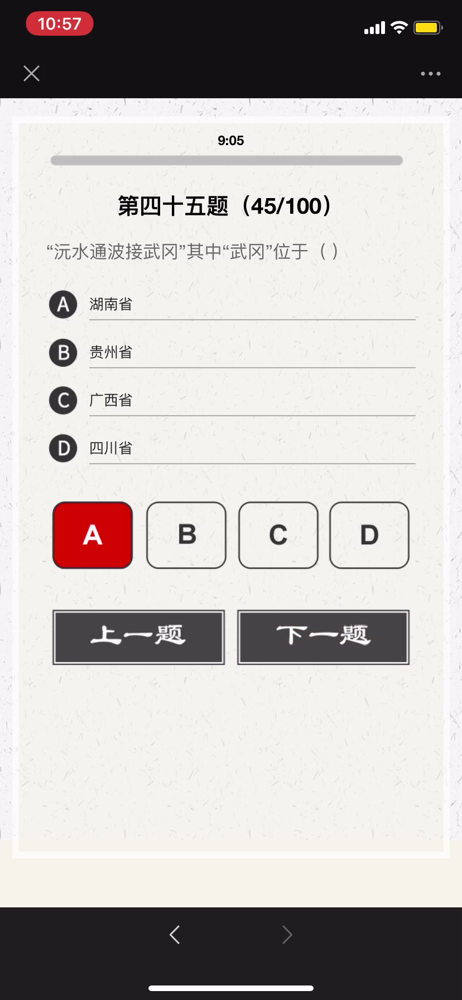

---
#


---
#


---
#

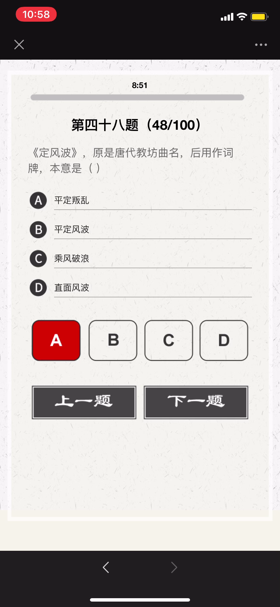

---
#

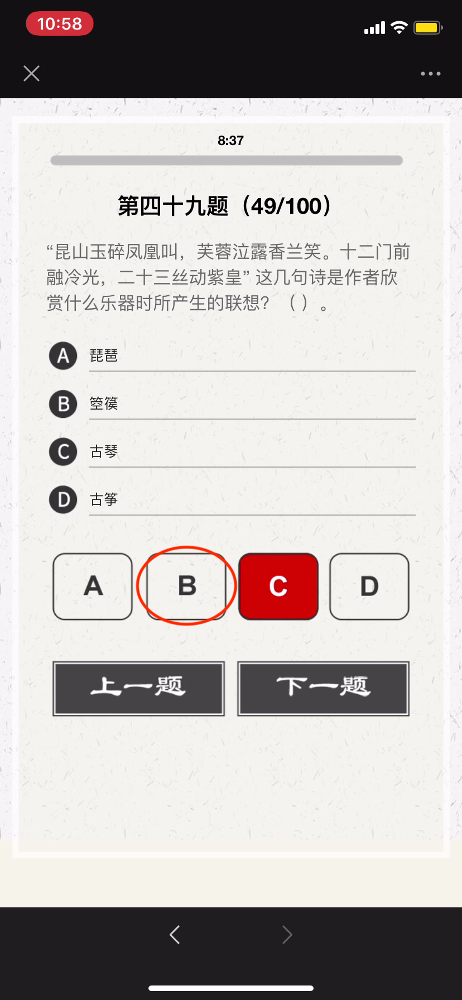

---
#

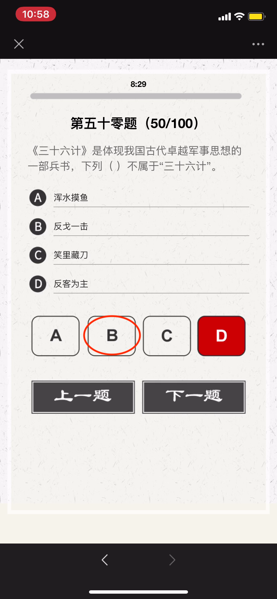
