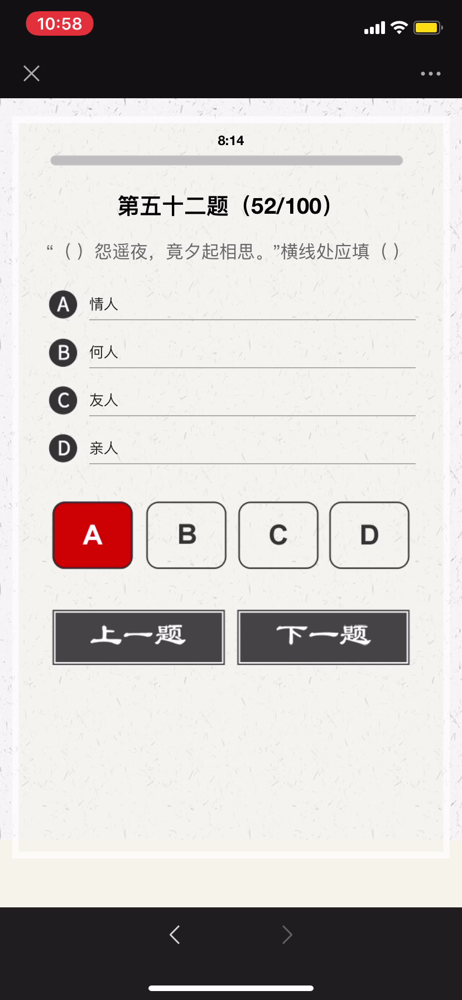
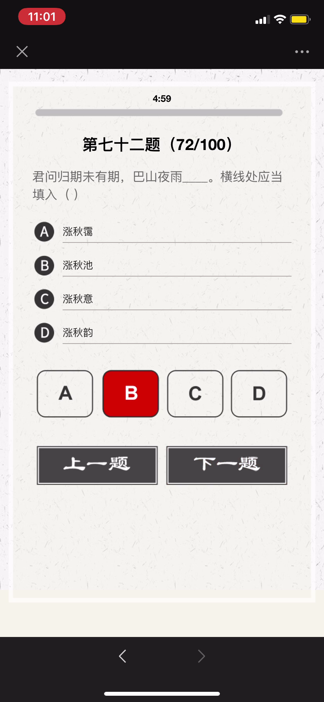
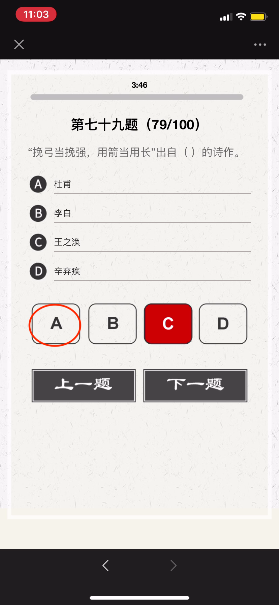
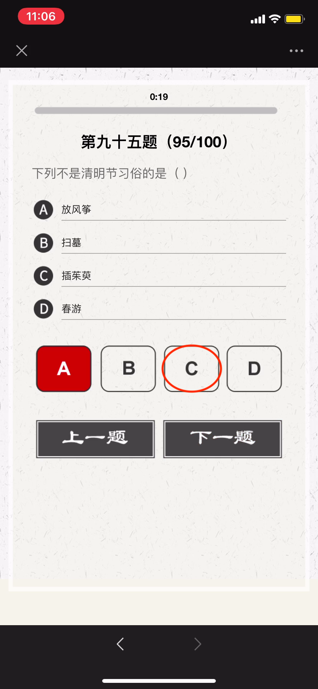

## 2020 诗词大会
#### 选拔赛冲刺 - 下

---
#


```
春秋时期，晋国公子重耳为躲避祸乱而流亡他国长达十九年，大臣介子推始终追随左右、
不离不弃；甚至“割股啖君”。重耳励精图治，成为一代名君“晋文公”。但介子推不求利
禄，与母亲归隐绵山，晋文公为了迫其出山相见而下令放火烧山，介子推坚决不出山、
最终被火焚而死。晋文公感念忠臣之志，将其葬于绵山，修祠立庙，并下令在介子推
死难之日禁火寒食，以寄哀思，这就是“寒食节”的由来。
```

```
伯夷、叔齐：商末孤竹君的两位王子。相传孤竹君遗命立三子叔齐为君。 孤竹君死后，
叔齐让位给伯夷，伯夷不受；叔齐尊天伦，不愿打乱社会规则，也未继位，哥俩先后出
国前往周国考察。周武王伐纣，二人扣马谏阻。武王灭商后，他们耻食周粟，采薇而食，
饿死于首阳山。《论语．公冶长》：“伯夷叔齐不念旧恶，怨是用希。”

夷齐“兄弟让国，扣马谏伐，耻食周粟，饿死首阳”仁哲大义，是历代中华仁人志士、
诚信礼让、忠于祖国、抱节守志、清正廉明的典范。
```

```
苏武：西汉时期杰出的外交家，民族英雄。武帝时为郎。天汉元年（前100年）奉命以
中郎将持节出使匈奴，被扣留。匈奴贵族多次威胁利诱，欲使其投降；后将他迁到北海
边牧羊，扬言要公羊生子方可释放他回国。苏武历尽艰辛，留居匈奴十九年持节不屈。
```

---
#



##### 望月怀远
###### 【唐】张九龄
```
海上生明月，天涯共此时。
情人怨遥夜，竟夕起相思。
灭烛怜光满，披衣觉露滋。
不堪盈手赠，还寝梦佳期。
```

---
#


- 虽九死其尤未悔，成语，释义是这些都是我内心之所珍爱，就是让我九死（或多死）还是不后悔。
- 语出屈原《离骚》 ，“……长太息以掩涕兮，哀民生之多艰；余虽好修姱以羁兮，謇朝谇而夕替；既替余以蕙纕兮，又申之以揽芷；亦余心之所善兮，虽九死其犹未悔……”

```
表达作者为追求国家富强、坚持高洁品行而不怕千难万险、纵死不悔的忠贞情怀，
后来人们在表达坚持理想、为实现目标而奋斗时常引用这一名句表达心志。
```

---
#


- 古人学问无遗力，少壮工夫老始成。
- 山重水复疑无路，柳暗花明又一村。
- 死去元知万事空，但悲不见九州同。
- 王师北定中原日，家祭无忘告乃翁。

---
#


```
长风破浪会有时，直挂云帆济沧海。
```

```
破阵乐 唐 - 张祜(hù)
秋风四面足风沙，塞外征人暂别家。
千里不辞行路远，时光早晚到天涯。
```

```
春日京中有怀 唐代：杜审言
今年游寓独游秦，愁思看春不当春。
上林苑里花徒发，细柳营前叶漫新。
公子南桥应尽兴，将军西第几留宾。
寄语洛城风日道，明年春色倍还人。
```

```
浪淘沙·其八 唐代：刘禹锡
莫道谗言如浪深，莫言迁客似沙沉。
千淘万漉(lù)虽辛苦，吹尽狂沙始到金。
```

---
#


---
#


- 五音：指中国五声音阶中的角、徵、宫、商、羽，五个音级
- 五行：“土、金、木、火、水”
- 五律：五言律诗

---
#


##### 自蜀江至洞庭湖口有感而作 
###### [唐] 白居易
```
江从西南来，浩浩无旦夕。长波逐若泻，连山凿如劈。
千年不壅溃，万姓无垫溺。不尔民为鱼，大哉禹之绩。
导岷既艰远，距海无咫尺。胡为不讫功，馀水斯委积。
洞庭与青草，大小两相敌。混合万丈深，淼茫千里白。
每岁秋夏时，浩大吞七泽。水族窟穴多，农人土地窄。
我今尚嗟叹，禹岂不爱惜。邈未究其由，想古观遗迹。
疑此苗人顽，恃险不终役。帝亦无奈何，留患与今昔。
水流天地内，如身有血脉。滞则为疽疣，治之在针石。
安得禹复生，为唐水官伯。手提倚天剑，重来亲指画。
疏河似翦纸，决壅同裂帛。渗作膏腴田，蹋平鱼鳖宅。
龙宫变闾里，水府生禾麦。坐添百万户，书我司徒籍。
```

---
#


##### 《逢入京使》 唐 - 岑参
```
故园东望路漫漫，双袖龙钟泪不干。
马上相逢无纸笔，凭君传语报平安。
```

##### 《墨梅》 元 - 王冕
```
吾家洗砚池头树，朵朵花开淡墨痕。
不要人夸好颜色，只留清气满乾坤。
```

##### [《所见》](https://baike.baidu.com/item/所见/2921061)  清 - 袁枚
```
牧童骑黄牛，歌声振林樾。
意欲捕鸣蝉，忽然闭口立。
```

---
#


---
#


---
#


---
#


##### 晚春 唐 - 韩愈
```
草树知春不久归，百般红紫斗芳菲。(草树 一作：草木)
杨花榆荚无才思，惟解漫天作雪飞。
```

##### [钱塘湖春行](https://baike.baidu.com/item/钱塘湖春行) 【唐】白居易
```
孤山寺北贾亭西，水面初平云脚低。
几处早莺争暖树，谁家新燕啄春泥。
乱花渐欲迷人眼，浅草才能没马蹄。
最爱湖东行不足，绿杨阴里白沙堤。
```

---
#


##### 山中雪后
###### 清 - 郑燮
```
晨起开门雪满山，雪晴云淡日光寒。
檐流未滴梅花冻，一种清孤不等闲。
```

---
#


##### [书湖阴先生壁 其一](https://baike.baidu.com/item/书湖阴先生壁二首/296524)
###### 【北宋】王安石
```
茅檐长扫净无苔，花木成畦手自栽。
一水护田将绿绕，两山排闼送青来。
```

```
- 书：书写，题诗。湖阴先生：本名杨德逢，隐居之士，是王安石晚年居住金陵（今南京）紫金山时的邻居。
- 茅檐：茅屋檐下，这里指庭院。无苔：没有青苔。
- 成畦（qí ）：成垄成行。 畦：经过修整的一块块田地。
- 护田：这里指护卫环绕着园田。
- 排闼（tà）：开门。闼：小门。
- 送青来：送来绿色。
```

---
#


---
#


---
#


---
#


---
#


TODO

---
#


---
#



---
#


---
#


---
#


---
#


---
#


---
#


---
#



---
#


---
#


---
#


---
#


---
#


---
#


---
#


---
#


---
#


---
#


---
#


---
#


---
#


---
#


---
#


---
#



---
#


---
#


---
#


---
#


---
#


