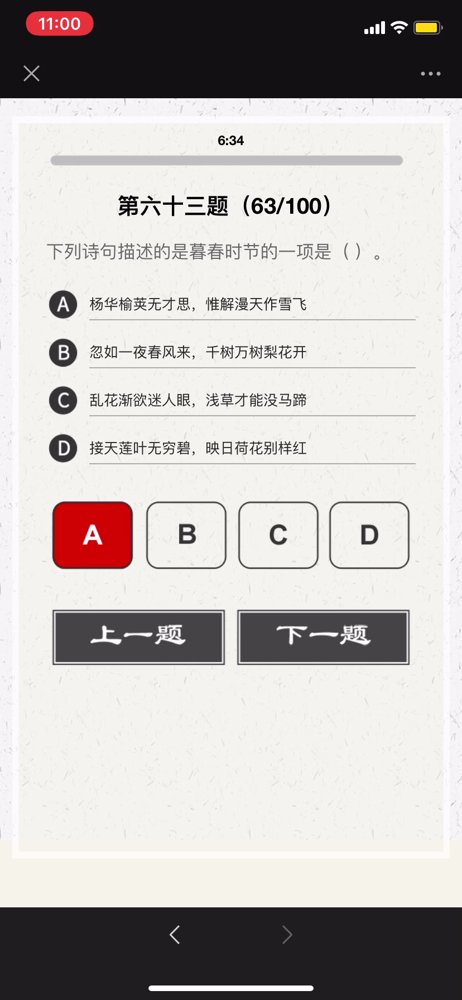
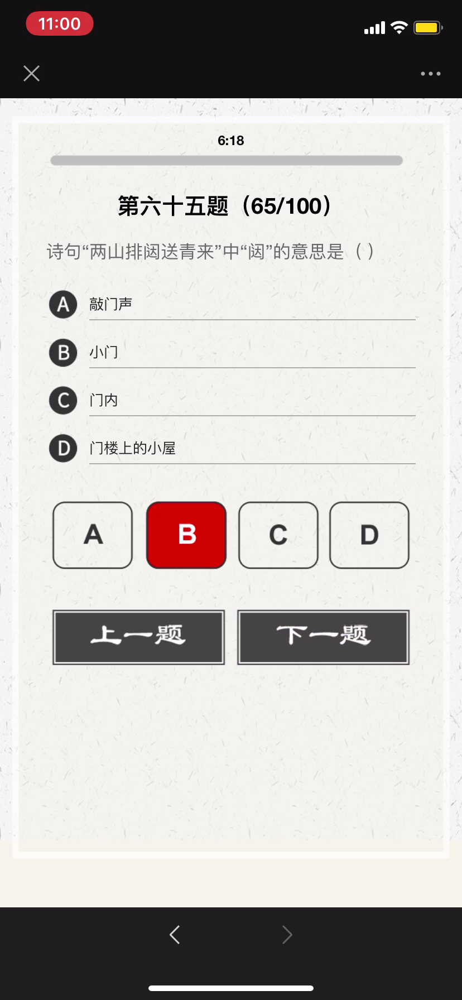
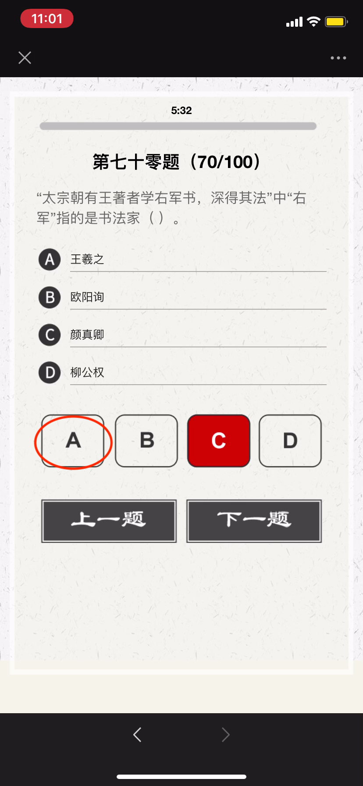
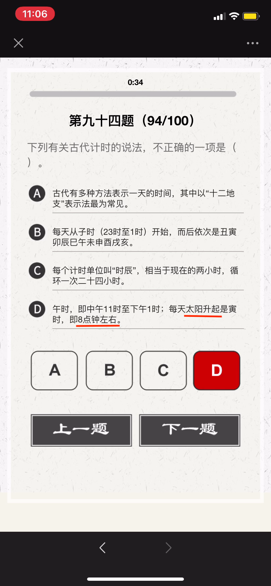
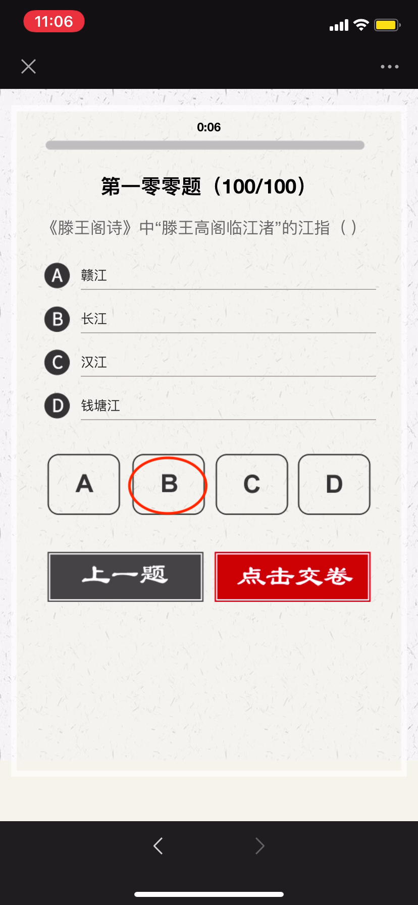

## 2020 诗词大会
#### 选拔赛冲刺 - 下

---
#


```
春秋时期，晋国公子重耳为躲避祸乱而流亡他国长达十九年，大臣介子推始终追随左右、
不离不弃；甚至“割股啖君”。重耳励精图治，成为一代名君“晋文公”。但介子推不求利
禄，与母亲归隐绵山，晋文公为了迫其出山相见而下令放火烧山，介子推坚决不出山、
最终被火焚而死。晋文公感念忠臣之志，将其葬于绵山，修祠立庙，并下令在介子推
死难之日禁火寒食，以寄哀思，这就是“寒食节”的由来。
```

```
伯夷、叔齐：商末孤竹君的两位王子。相传孤竹君遗命立三子叔齐为君。 孤竹君死后，
叔齐让位给伯夷，伯夷不受；叔齐尊天伦，不愿打乱社会规则，也未继位，哥俩先后出
国前往周国考察。周武王伐纣，二人扣马谏阻。武王灭商后，他们耻食周粟，采薇而食，
饿死于首阳山。《论语．公冶长》：“伯夷叔齐不念旧恶，怨是用希。”

夷齐“兄弟让国，扣马谏伐，耻食周粟，饿死首阳”仁哲大义，是历代中华仁人志士、
诚信礼让、忠于祖国、抱节守志、清正廉明的典范。
```

```
苏武：西汉时期杰出的外交家，民族英雄。武帝时为郎。天汉元年（前100年）奉命以
中郎将持节出使匈奴，被扣留。匈奴贵族多次威胁利诱，欲使其投降；后将他迁到北海
边牧羊，扬言要公羊生子方可释放他回国。苏武历尽艰辛，留居匈奴十九年持节不屈。
```

---
#


##### 望月怀远
###### 【唐】张九龄
```
海上生明月，天涯共此时。
情人怨遥夜，竟夕起相思。
灭烛怜光满，披衣觉露滋。
不堪盈手赠，还寝梦佳期。
```

---
#


- 虽九死其尤未悔，成语，释义是这些都是我内心之所珍爱，就是让我九死（或多死）还是不后悔。
- 语出屈原《离骚》 ，“……长太息以掩涕兮，哀民生之多艰；余虽好修姱以羁兮，謇朝谇而夕替；既替余以蕙纕兮，又申之以揽芷；亦余心之所善兮，虽九死其犹未悔……”

```
表达作者为追求国家富强、坚持高洁品行而不怕千难万险、纵死不悔的忠贞情怀，
后来人们在表达坚持理想、为实现目标而奋斗时常引用这一名句表达心志。
```

---
#


- 古人学问无遗力，少壮工夫老始成。
- 山重水复疑无路，柳暗花明又一村。
- 死去元知万事空，但悲不见九州同。
- 王师北定中原日，家祭无忘告乃翁。

---
#


```
长风破浪会有时，直挂云帆济沧海。
```

```
破阵乐 唐 - 张祜(hù)
秋风四面足风沙，塞外征人暂别家。
千里不辞行路远，时光早晚到天涯。
```

```
春日京中有怀 唐代：杜审言
今年游寓独游秦，愁思看春不当春。
上林苑里花徒发，细柳营前叶漫新。
公子南桥应尽兴，将军西第几留宾。
寄语洛城风日道，明年春色倍还人。
```

```
浪淘沙·其八 唐代：刘禹锡
莫道谗言如浪深，莫言迁客似沙沉。
千淘万漉(lù)虽辛苦，吹尽狂沙始到金。
```

---
#


- 二晏：北宋词人晏殊与其子晏几道，以其相映生辉的艺术成就影响了一代词风，被词话家们并称为“二晏”, 是中国历史上少数著名的父子文学家。
- 三苏，分别为苏洵、苏轼、苏辙，又有“一门三学士”之誉。

---
#


- 五音：指中国五声音阶中的角、徵、宫、商、羽，五个音级
- 五行：“土、金、木、火、水”
- 五律：五言律诗

---
#


##### 自蜀江至洞庭湖口有感而作 
###### [唐] 白居易
```
江从西南来，浩浩无旦夕。长波逐若泻，连山凿如劈。
千年不壅溃，万姓无垫溺。不尔民为鱼，大哉禹之绩。
导岷既艰远，距海无咫尺。胡为不讫功，馀水斯委积。
洞庭与青草，大小两相敌。混合万丈深，淼茫千里白。
每岁秋夏时，浩大吞七泽。水族窟穴多，农人土地窄。
我今尚嗟叹，禹岂不爱惜。邈未究其由，想古观遗迹。
疑此苗人顽，恃险不终役。帝亦无奈何，留患与今昔。
水流天地内，如身有血脉。滞则为疽疣，治之在针石。
安得禹复生，为唐水官伯。手提倚天剑，重来亲指画。
疏河似翦纸，决壅同裂帛。渗作膏腴田，蹋平鱼鳖宅。
龙宫变闾里，水府生禾麦。坐添百万户，书我司徒籍。
```

---
#


##### 《逢入京使》 唐 - 岑参
```
故园东望路漫漫，双袖龙钟泪不干。
马上相逢无纸笔，凭君传语报平安。
```

##### 《墨梅》 元 - 王冕
```
吾家洗砚池头树，朵朵花开淡墨痕。
不要人夸好颜色，只留清气满乾坤。
```

##### [《所见》](https://baike.baidu.com/item/所见/2921061)  清 - 袁枚
```
牧童骑黄牛，歌声振林樾。
意欲捕鸣蝉，忽然闭口立。
```

---
#


##### [过故人庄](https://baike.baidu.com/item/过故人庄)
###### 【唐】孟浩然
```
故人具鸡黍，邀我至田家。
绿树村边合，青山郭外斜。
开轩面场圃，把酒话桑麻。
待到重阳日，还来就菊花。
```

---
#


---
#


---
#



##### 晚春 唐 - 韩愈
```
草树知春不久归，百般红紫斗芳菲。(草树 一作：草木)
杨花榆荚无才思，惟解漫天作雪飞。
```

##### [钱塘湖春行](https://baike.baidu.com/item/钱塘湖春行) 【唐】白居易
```
孤山寺北贾亭西，水面初平云脚低。
几处早莺争暖树，谁家新燕啄春泥。
乱花渐欲迷人眼，浅草才能没马蹄。
最爱湖东行不足，绿杨阴里白沙堤。
```

---
#


##### 山中雪后
###### 清 - 郑燮
```
晨起开门雪满山，雪晴云淡日光寒。
檐流未滴梅花冻，一种清孤不等闲。
```

---
#



##### [书湖阴先生壁 其一](https://baike.baidu.com/item/书湖阴先生壁二首/296524)
###### 【北宋】王安石
```
茅檐长扫净无苔，花木成畦手自栽。
一水护田将绿绕，两山排闼送青来。
```

```
- 书：书写，题诗。湖阴先生：本名杨德逢，隐居之士，是王安石晚年居住金陵（今南京）紫金山时的邻居。
- 茅檐：茅屋檐下，这里指庭院。无苔：没有青苔。
- 成畦（qí ）：成垄成行。 畦：经过修整的一块块田地。
- 护田：这里指护卫环绕着园田。
- 排闼（tà）：开门。闼：小门。
- 送青来：送来绿色。
```

---
#


---
#


---
#


---
#


---
#



```
太宗朝，有王着学右军书，深得其法，侍书翰林。
```

①太宗：宋太宗赵光义976~997年在位。
②朝：一代君主的统治时期
③右军：指晋代著名书法家王羲之，书圣。
④翰林：皇帝的文学侍从官。

相传王羲之爱鹅，后以"右军"作为鹅的别名。

---
#


##### 《自题》
###### 清·曹雪芹
```
浮生著甚苦奔忙，盛席华筵终散场。
悲喜千般同幻梦，古今一梦尽荒唐。
慢言红袖啼痕重，更有情痴抱恨长!
字字看来皆是血，十年辛苦不寻常。
```

---
#


##### [夜雨寄北](https://so.gushiwen.org/shiwenv_e46c43d13b97.aspx)
###### 【唐】李商隐
```
君问归期未有期，巴山夜雨涨秋池。
何当共剪西窗烛，却话巴山夜雨时。
```

---
#


---
#


##### [采莲曲二首 其二](https://baike.baidu.com/item/采莲曲二首/)
###### 【唐】王昌龄
```
荷叶罗裙一色裁，芙蓉向脸两边开。
乱入池中看不见，闻歌始觉有人来。
```

---
#


---
#


南朝宋国有谢灵运，是我国古代著名的山水诗作家。谢灵运为人清狂，恃才傲物，曾于饮酒时自叹道：“天下才共一石（一种容量单位，一石等于十斗），曹子建（即曹植）独得八斗，我得一斗，自古及今共分一斗。”
由此，后世便称才学出众者为“才高八斗”或“八斗之才”。

---
#


---
#


##### 饮湖上初晴后雨
###### 【宋】苏轼
```
水光潋滟晴方好，山色空濛雨亦奇。
欲把西湖比西子，淡妆浓抹总相宜。
```

---
#


##### 前出塞
###### 【唐】杜甫
```
挽弓当挽强，用箭当用长。
射人先射马，擒贼先擒王。
杀人亦有限，列国自有疆。
苟能制侵陵，岂在多杀伤。
```

---
#


##### 送杜十四之江南 / 送杜晃进士之东吴
###### 唐代：孟浩然
```
荆吴相接水为乡，君去春江正淼茫。(淼 同：渺)
日暮征帆何处泊，天涯一望断人肠。
```

---
#


```
宋·苏轼《寄吴德仁兼简陈季常》忽闻河东师子吼，拄杖落手心茫然。

河东狮吼，汉语成语，意思是比喻悍妒的妻子对丈夫大吵大闹。
几个关键人物：苏东坡、柳氏和陈季常。
```

```
河东先生：柳宗元，字子厚，汉族，河东（现山西运城永济一带）人，
唐宋八大家之一，唐代文学家、哲学家、散文家和思想家世称“柳河东”、 “河东先生”，
因官终柳州刺史，又称“柳柳州”。
柳宗元与韩愈并称为“韩柳”，与刘禹锡并称“刘柳”，与王维、孟浩然、韦应物并称“王孟韦柳”。
```

```
- 唐宋八大家，分别为唐代柳宗元、韩愈，和宋代欧阳修、苏洵、苏轼、苏辙、王安石、曾巩八位。
  “韩柳欧王曾三苏”
- 其中韩愈、柳宗元是唐代古文运动的领袖，
- 欧阳修、三苏（苏轼、苏辙、苏洵）等四人是宋代古文运动的核心人物，
- 王安石、曾巩是临川文学的代表人物。
```

---
#


- 谢仪，意思是谢礼，酬金。
- “润笔”被泛指为请人家写文章、写字、作画的报酬。
- 尺素：书信别名
- 束脩：古代学生与教师初见面时，必先奉赠礼物，表示敬意，名曰“束脩”。早在孔子的时候已经实行。学费即是“束修数条”，束修就是咸猪肉，后来基本上就是拜师费的意思，可以理解为学费。
---
#


---
#


```
- 《金陵怀古四首》 是宋代文学家王安石的组诗作品。这四首诗主旨为感慨兴亡。
- 《山居秋暝》是唐代诗人王维的作品。此诗描绘了秋雨初晴后傍晚时分山村的旖旎风
光和山居村民的淳朴风尚，表现了诗人寄情山水田园并对隐居生活怡然自得的满足心情，
以自然美来表现人格美和社会美。
- 《石灰吟》是明代政治家、文学家于谦创作的一首七言绝句。此诗托物言志，采用象
征手法，字面上是咏石灰，实际借物喻人，托物寄怀，表现了诗人高洁的理想。
```

##### [石灰吟](https://baike.baidu.com/item/石灰吟)
###### 【明】于谦
```
千锤万凿出深山，烈火焚烧若等闲。
粉骨碎身全不怕，要留清白在人间。
```

---
#


---
#


##### 中秋月·十轮霜影转庭梧  宋 - 晏殊
```
十轮霜影转庭梧，此夕羁人独向隅。
未必素娥无怅恨，玉蟾清冷桂花孤。
```

- 十轮：十年

##### 上元夜 初唐 - 崔液
```
玉漏银壶且莫催，铁关金锁彻明开。
谁家见月能闲坐？何处闻灯不看来？
```

---
#


新乐府运动，诗歌革新运动，由唐代诗人白居易、元稹、张籍、李绅等所倡导，主张恢复古代的采诗制度，发扬《诗经》和汉魏乐府讽喻时事的传统，使诗歌起到“补察时政”，“泄导人情”的作用，强调以自创的新的乐府题目咏写时事， 故名新乐府。

---
#


- 天街小雨润如酥，草色遥看近却无。
- 最是一年春好处，绝胜烟柳满皇都。
- 荷尽已无擎雨盖，菊残犹有傲霜枝。
- 春城无处不飞花，寒食东风御柳斜。

---
#


姑苏，正名：苏州，古称吴，简称苏，又称姑苏、平江等
姑苏是吴文化的发祥地，历史悠久，长期是江南地区的政治、经济、文化中心 。
春秋时期，这里是吴国的都城，至今还保留着许多有关西施、伍子胥等的古迹。

---
#


---
#


##### [杂诗 其一 节选](https://baike.baidu.com/item/杂诗/1688007)
###### 【东晋】陶渊明
```
人生无根蒂，飘如陌上尘。
分散逐风转，此已非常身。
落地为兄弟，何必骨肉亲！
得欢当作乐，斗酒聚比邻。
盛年不重来，一日难再晨。
及时当勉励，岁月不待人。
```

---
#


##### [过零丁洋](https://so.gushiwen.org/shiwenv_5796865dca4a.aspx)
###### 【南宋】文天祥
```
辛苦遭逢起一经，干戈寥落四周星。
山河破碎风飘絮，身世浮沉雨打萍。
惶恐滩头说惶恐，零丁洋里叹零丁。
人生自古谁无死？留取丹心照汗青。
```

- 零丁洋：零丁洋即”伶丁洋“。现在广东省珠江口外。1278年底，文天祥率军在广东五坡岭与元军激战，兵败被俘，囚禁船上曾经过零丁洋。

---
#


- 边塞诗又称出塞诗是唐代诗歌的主要题材。
- 初唐四杰之一的骆宾王是初唐写作边塞诗较多的诗人。
- 此后其他著名诗人如：杨炯、陈子昂、杜审言、陆游等人也创作边塞诗。边塞诗创作一时蔚为风气。
- 边塞诗代表人物是：高适，王昌龄， 岑参 ，李贺，李益。

---
#



- 十二地支 （古人用以记录时间的符号），
子、丑、寅、卯、辰、巳、午、未、申、酉、戌、亥

```
【子时】夜半bai，又名子夜、中夜：十二时辰的第一个时辰。（北京时间23时至01时）。
【丑时】鸡鸣，又名荒鸡：十二时辰的第二个时辰。（北京时间01时至03时）。
【寅时】平旦，又称黎明、早晨、日旦等：时是夜与日的交替之际。（北京时间03时至05时）。
【卯时】日出，又名日始、破晓、旭日等：指太阳刚刚露脸，冉冉初升的那段时间。
    （北京时间05时至07时）。
【辰时】食时，又名早食等：古人“朝食”之时也就是吃早饭时间，（北京时间07时至09时）。
【巳时】隅中，又名日禺等：临近中午的时候称为隅中。（北京时间09 时至11时）。
【午时】日中，又名日正、中午等：（北京时间11时至13时）。
【未时】日昳，又名日跌、日央等：太阳偏西为日跌。（北京时间13时至15时）。
【申时】哺时，又名日铺、夕食等：（北京时间15食至17时）。
【酉时】日入，又名日落、日沉、傍晚：意为太阳落山的时候。（北京时间17是至19时）。
【戌时】黄昏，又名日夕、日暮、日晚等：此时太阳已经落山，天将黑未黑。天地昏黄，
      万物朦胧，故称黄昏。（北京时间19时至21时）。
【亥时】人定，又名定昏等：此时夜色已深，人们也已经停止活动，安歇睡眠了。人定
     也就是人静。（北京时间21时至23时）。
```

---
#


---
#


---
#


- 郑谷，唐朝末期著名诗人。字守愚，江西宜春市袁州区人。唐僖宗时进士，官都官郎中，人称郑都官。又以《鹧鸪诗》得名，人称郑鹧鸪。其诗多写景咏物之作，表现士大夫的闲情逸致。

---
#


---
#


---
#


