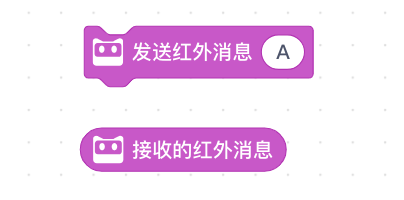
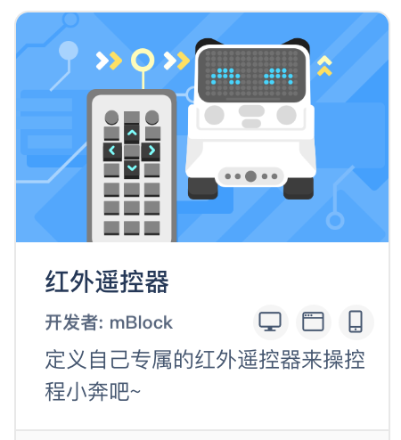
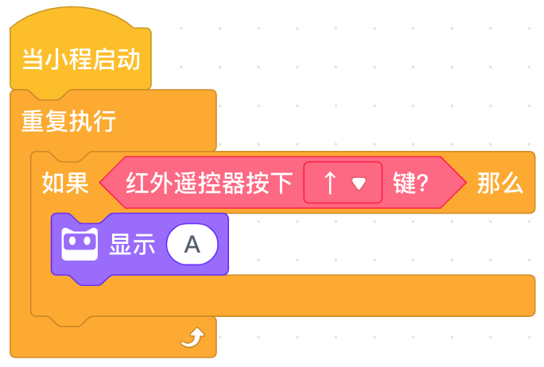
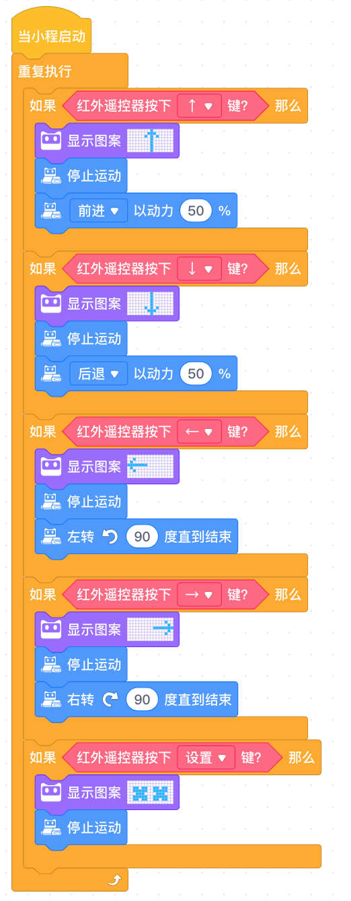

<!-- # 机器人编程入门学习 -->

# 第16课《红外遥控2》

## 内容简介:
学习红外遥控器工作原理，使用红外遥控器控制程小奔。

## 教学目标:
- 认识红外遥控器
- 红外遥控器工作原理
- 任务：使用红外遥控器控制程小奔

## 预备知识:
1. 了解条件积木的使用;
1. 知道如何寻找 Bug 并进行 Debug。

## 教学过程:

### 1. 旧知识回顾
- 红外线、电磁波、太阳光？

### 2. 新知识讲解

- 认识遥控器

  
  
- 程小奔接收遥控器信号

  

### 3. 项目挑战

- Step1：添加“红外遥控器”扩展组建
  
  

- Step2：程小奔接收红外消息，并显示信息；

  

- Step3：使用红外遥控器控制程小奔运动：直行、转弯、后退、停止、声光表情。

  

## 15-16课时总结

### 学习内容：
* 认识什么是红外线，了解广播信号工作原理
* 使用程小奔发射和接收红外信号
* 使用红外遥控器控制程小奔

### 课堂总结：
* 科普太阳光的组成；
* 使用程小奔本身的红外发射功能，发射红外信号，然后显示接收到的信息；
* 使用遥控器发射红外信号，程小奔收到信号后执行直行、左转、右转、后退、停止的命令。

### 作业：
* 使用遥控器让程小奔执行更多的命令。
