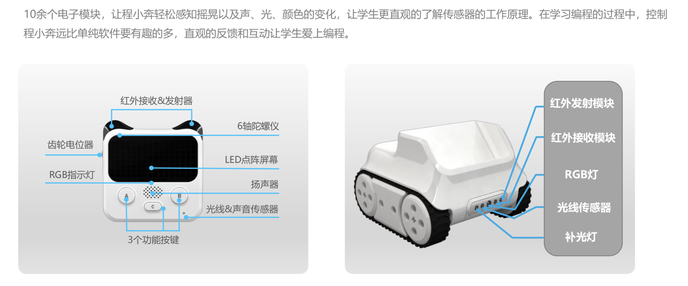
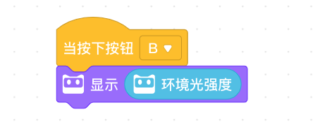
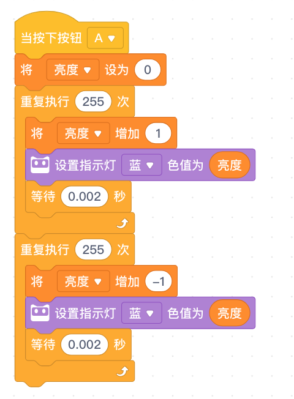

<!-- # 机器人编程入门学习 -->

# 第18课《智能家居》

## 内容简介:
使用声音传感器、光线传感器，完成智能家居的任务挑战。

## 教学目标:
1. 声音传感器的使用
1. 光线传感器的使用
1. 获取程小奔电量
1. 呼吸灯实现算法

## 预备知识:
1. 了解条件积木的使用;
1. 了解循环积木的使用;
1. 知道如何寻找 Bug 并进行 Debug。

## 教学过程:

### 1. 新知识讲解——智能家居

- 教师提问及引导:
  - 你身边的智能家居有哪些？
  - 你希望的智能家居能帮你做哪些事情？

    TODO：配图-智能家居
    <!--  -->

- 回顾程小奔结构：

  

- 光线传感器的作用

- 检测到物体 代码块

### 3. 项目挑战

- 任务1：噪音测量仪(按钮A事件)
  - 认识声音传感器，读取`响度`；

    

- 任务2：测光仪(按钮B事件)
  - 认识光线传感器，读取`环境光强度`；

    

<!-- - 任务3：程小奔电量值(按钮C事件)
  - 绘制电量柱；

     -->

- 任务3：呼吸灯

  

- 作业：
  - 看家卫士：当检测到`响度`大于某值，发出报警；
  - 小夜灯：当检测到`环境光强度`小于某值，亮灯和全屏；否则灭灯。