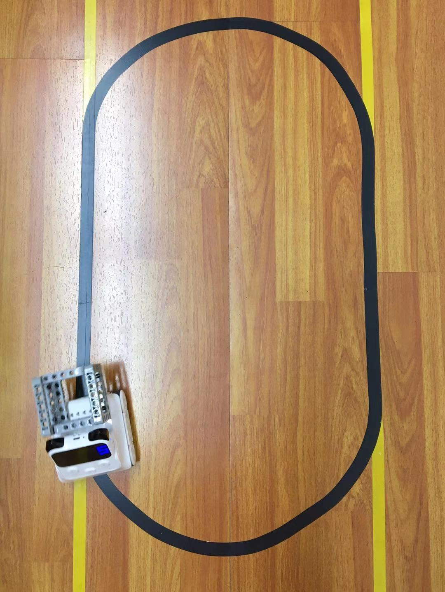

<!-- # 机器人编程入门学习 -->

# 第18课《自动巡线》

## 内容介绍
通过接收不同强度的反射光，完成小车的巡线任务。

## 教学目标:
1. 了解巡线机器人的应用;
2. 认识不同灰度的反射强度;
3. 理解程小奔的巡线原理，完成巡线任务。

## 课堂准备:
1. 不同灰度的卡纸
2. 黑色胶带

## 预备知识:
1. 知道颜色传感器和 RGB LED 灯;
2. 知道如何控制程小奔;

## 教学过程:

### 1. 旧知识回顾

### 2. 新知识讲解

- 今天我们要学习的是，如何程小奔进行巡线?让它能够识别线路，沿着线路前进。今天要用到的是小奔上的颜色红外传感器和 RGB-LED灯。

  

- 认识反射光：让小奔检测反射光强度的值，并显示在小程的屏幕上。

  

- 采集色卡上的反射光强度
  - 要求:记录不同卡片的反射光数值，填写在对应地颜色下方。

    

- 采集黑线上的数据
  - 采集 RGB-LED 灯在黑线边缘的反射光强度值。当大于这个值时， 程小奔需要往左拐;当小于这个值时，需要往右拐。

    

- 教师模拟程小奔巡线运动

- 教师演示案例
  - 在桌上贴出一个一字型的地图和一个圆形的地图，编写程序让程小奔沿着黑线行走。

    
    

- 机器人自动巡线算法
  - 算法：通过颜色红外传感器感受反射光强度，并以此作为条件，来判断小车是左转还是右转，进而确定左轮和右轮的动力值，以实现小车巡线的效果。

### 3. 项目挑战

- 完成自动巡线功能
  - `反射光强度`临界值测量
  - 加强对自动巡线算法的理解

## 17-18课时总结

### 学习内容：
* 遥控器按键的自定义
* 认识颜色红外传感器，获取反射光强度
* 机器人自动巡线的算法

### 课堂总结：
* 通过对红外遥控器按键的自定义，让程小奔完成多样化动作，从而完成对桌上足球的敏捷操作。
* 通过判断`反射光强度`，实现小车巡线的效果。

### 作业：
* 
* 
