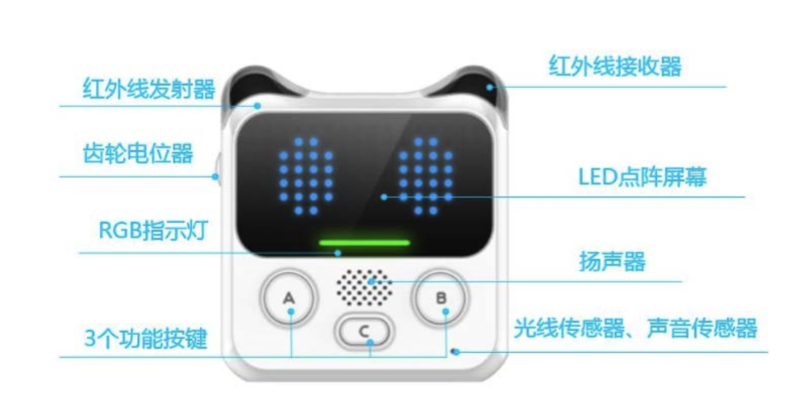
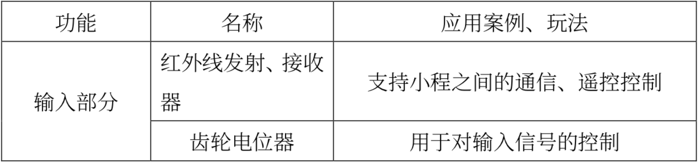
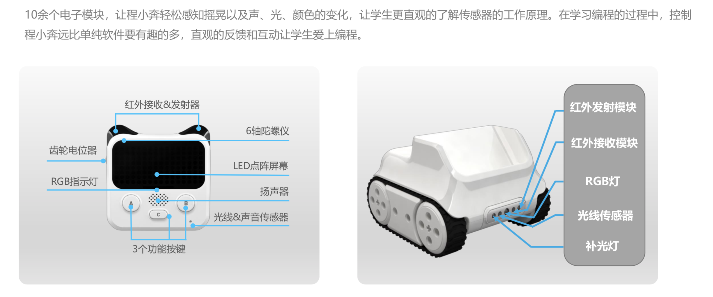
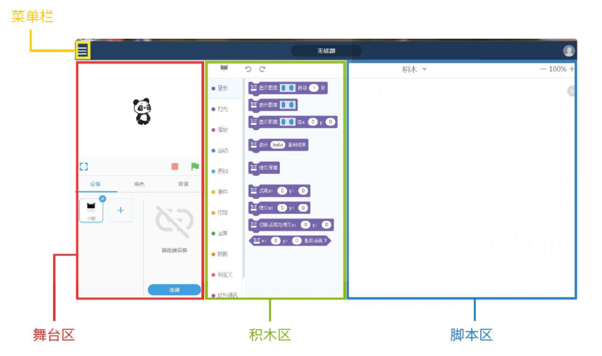

<!-- # 机器人编程入门学习 -->

# 第1课《程小奔的秘密》

## 内容简介:
理解程序及程序的作用，认识程小奔及慧编程的基本使用方法。

## 教学目标:
1. 理解程序的定义及作用;
1. 认识程小奔及其功能;
1. 掌握慧编程的基本操作步骤。 
1. 学会上传程序。

## 课堂准备:
1. 学生每人一个程小奔和配套数据线; 
1. 学生每人一台装有慧编程的平板或电脑，并提前安装好《慧编程》软件;
1. 慧编程 电脑端下载地址：http://www.mblock.cc/zh-home/software/， 须同时安装 mBlock5（慧编程）和 mLink;
1. 慧编程 ipad 上下载：苹果商店直接搜索 “慧编程”即可;
1. 另外请确保平板电脑电量充足哦！

## 预备知识:
1. 认识计算机及掌握计算机的基础操作; 
2. 具备一定的认知能力。
 
## 教学过程:

### 1. 情境引入——破解程小奔的秘密

- 向学生介绍:   
教师可通过视频展示，或者提前上传程序至程小奔中，展示功能，比如避障、巡线、悬崖勒马等。  

- 向学生提问:  
  - 除了程小奔以外，你们在生活中还见过哪些机器人?那些机器 人又都是来做什么的呢?  
  - 那么你们又知道机器人为什么可以听从我们的命令?  

### 2. 新知识讲解——程序

- 教师讲述:  
程序是一种可以让我们控制机器人，让机器人能够识别的计算机 语言。我们想要机器人执行的动作、功能等通过编程，形成特定的程序，再将程 序上传到机器人中，那么机器人就会按照我们程序中的设定执行动作了。

  

- 教师提问:  
  所以你们知道控制程小奔的秘密了吗?   
  学生可能回答:因为程小奔里有我们编写的程序。

### 3. 教师演示案例

#### 教师讲述:  
  你们想要自己编写程序并上传到程小奔吗?那么在尝试编程之前，我们得先认识认识我们可爱又功能强大的程小奔。  

  

  程小奔是一个可编程教育机器人，通过它我们可以掌握编程的基础知识与技能，锻炼逻辑思维和计算思维。

  

#### 教师讲述:  
  程小奔是由小程和小奔共同组合而成的，接下来我们就分别认识 一下他们。
  - 小程：具有丰富传感器和可编程模块的主控大脑，既可单独使用，又可以加上小车底盘“小奔”实现更多功能。拿出你们桌上的小程，我们一起来看看 小程拥有哪些传感器。  

    
    
    

  - 小奔：是小程的“座驾”，有了小奔之后，可以躲避障碍物，以及进行颜色识别、地图巡线等多种功能。

    
    

#### 小提示:  
  教师可用先让同学们自己发现。  
  也可以介绍一遍后，故意遗漏开关，充电口等重要部位，让同学们自己发现。  

#### 认识慧编程软件

- 教师活动:  
  - 要求学生打开慧编程软件，并针对界面进行功能区介绍。；   
  - 介绍积木区的分类，指出常用代码块在那个分类区；
  - 扩展模块的添加；
  - 文件的新建和保存。  

    

  1. 菜单栏: 切换中英文界面、打开和保存文件、示例程序、帮助等功能都
可以在这里找到。
  1. 舞台区: 除了呈现作品之外，设备的连接与上传，添加角色与背景等功 能都在这个区域进行。
  1. 积木区: 提供编程所需的积木，可以按照分类及颜色查找需要的积木。 
  1. 脚本区: 程序的编写区域，可以用将积木拖放到这个区域来编写程序。

### 4. 项目挑战

#### 任务一：让程小奔动起来

  1. 连接电脑或PAD:  
    拿出程小奔，使用 USB 数据线将小程与电脑连接，然后打开程小奔电源开关。  
    教师协助同学们完成程小奔的连接。
  
  1. 按照下图的示例程序，找出相应的编程积木(在扩展模块中)，并完成拼接。
      

  1. 将写好的程序上传至小程主控中， 教师协助。  
  1. 将程小奔放置桌面中间，观察程小奔。

#### 任务二：程小奔的表情控制
  同学们自主创作，然后展示作品，十分钟时间左右。
