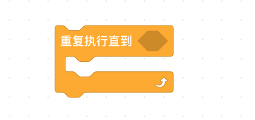

<!-- # 机器人编程入门学习 -->

# 第20课《点球大战》

## 内容简介:
结合自动巡线，完成点球大战的任务。

## 教学目标:
1. 综合运用

## 教学过程:

### 1. 新知识讲解

- 学习新的循环语句

  

### 2. 项目挑战

- 任务：巡线 + 侦测障碍物 + 射门
  - 如何退出无限循环？
  - 碰到障碍物停下
  - 射门

## 19-20课时总结

### 学习内容：
* 
* 

### 课堂总结：
* 通过对红外遥控器按键的自定义，让程小奔完成多样化动作，从而完成对桌上足球的敏捷操作。

### 作业：
* 