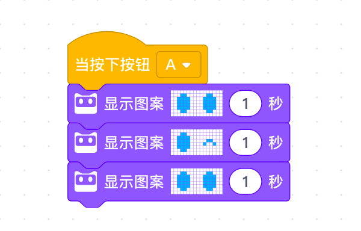
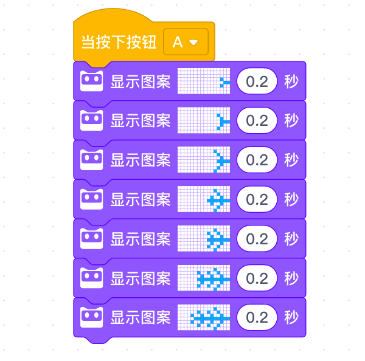

<!-- # 机器人编程入门学习 -->

# 第3课《动画制作师》

## 内容简介:
理解序列的概念，并使用编程完成动画制作。

## 教学目标:
1. 理解序列的概念;
1. 制定一套步骤，完成一个动画。

## 预备知识:
1. 知道基本的编程概念;
1. 掌握慧编程的基本操作方式。

## 教学过程:

### 1. 旧知识回顾
- 什么是事件?
- 生活中有哪些事件?
- 上节课使用到了哪些事件?

### 2. 新知识讲解——序列
- 教师提问: 你们知道如何将西瓜放入冰箱里面吗?
- 生活中还有哪些事情也需要遵循一套步骤才能顺利完成?
- 小贴士: 所举案例必须按顺序才能完成，没有其他顺序的可能性。
- 介绍一下如何保存项目文件。
- 引入循环模块，重复执行动画。

### 3. 情境引入

- 我是机器人游戏：教师充当机器人角色，需要从教室的某个位置走到黑板处，然后画出笑脸。邀请学生给机器人(教师)根据上述的机器人动作任务按照实际 需要的行动路线下达行动指令(如前进、左转、后退等)，并要求将指令写在纸 上。然后教师根据指令完成特定动作。

- 介绍小程点阵屏的结构特点：16x8点阵  

- 介绍动画片的制作原理  

### 4. 教师演示案例

- 眨眼睛  
    

- 成长的大树  
    

- 爬行的蚯蚓  
    

### 5. 项目挑战

- 任务一：弹跳的小球，设计一个小圆球（一个点也可）从屏幕一侧弹跳到另一侧；  

- 任务二：贪吃蛇，用弹跳的小球改造成贪吃蛇动画；  

- 任务三：自主创作一个动画;  

- 任务四：使用循环模块，重复执行动画，比较两种循环模块的区别。