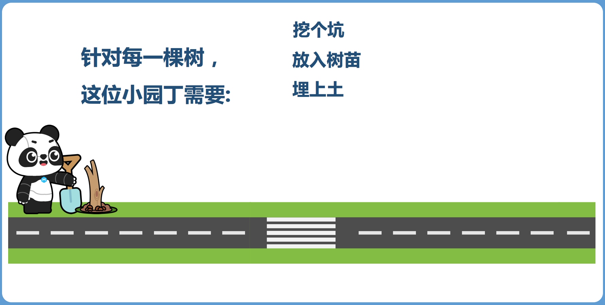
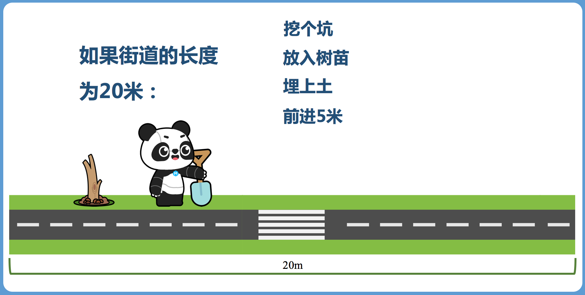
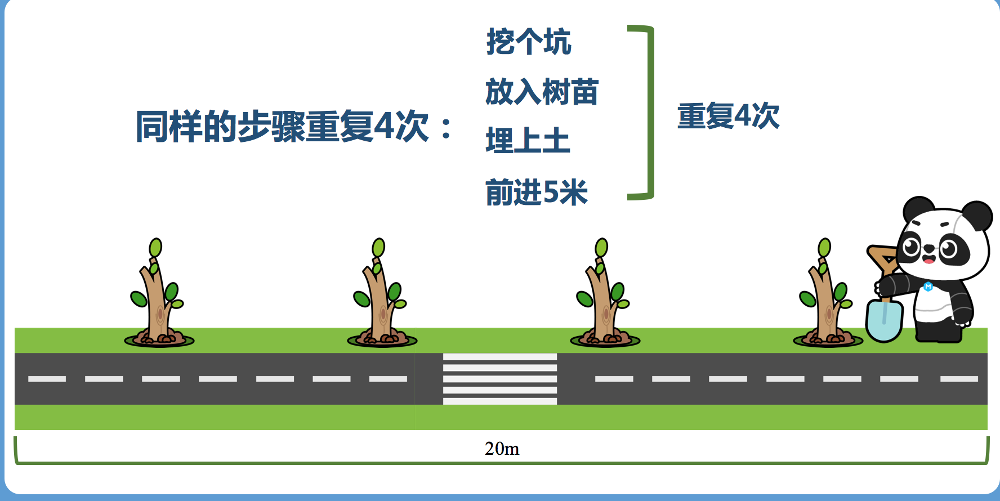
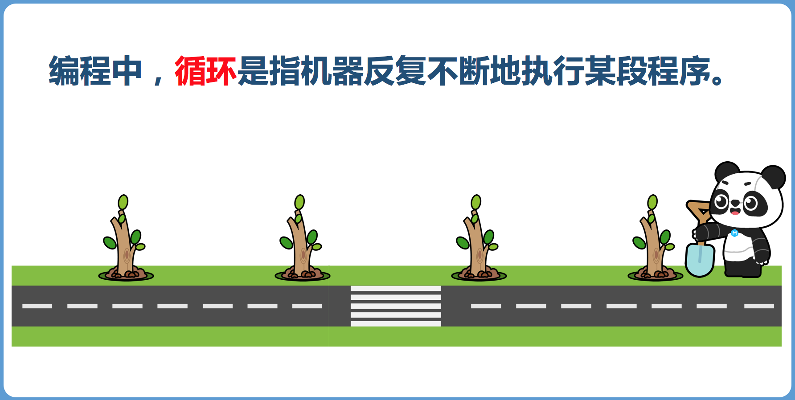
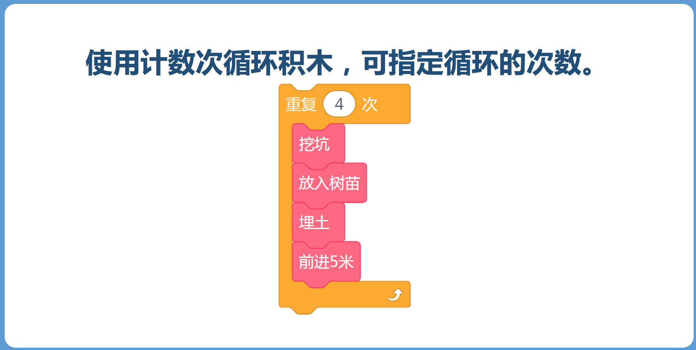
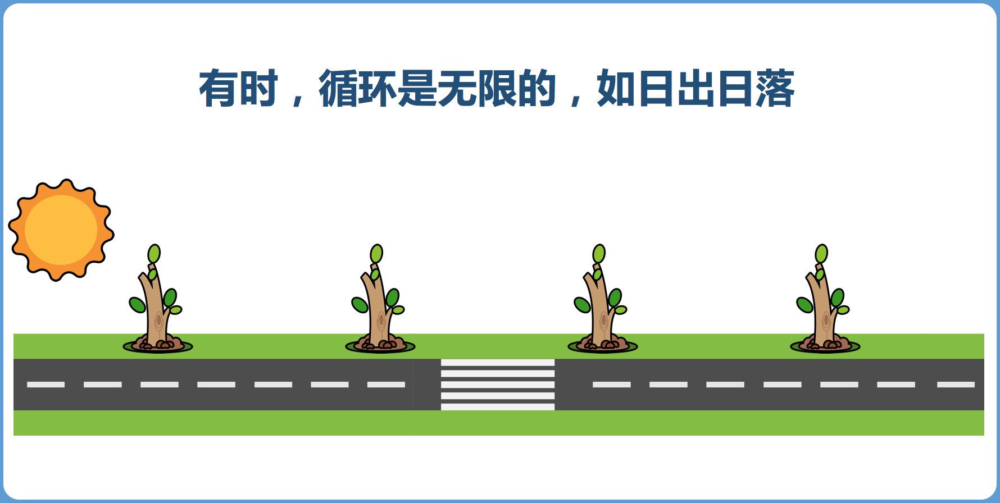
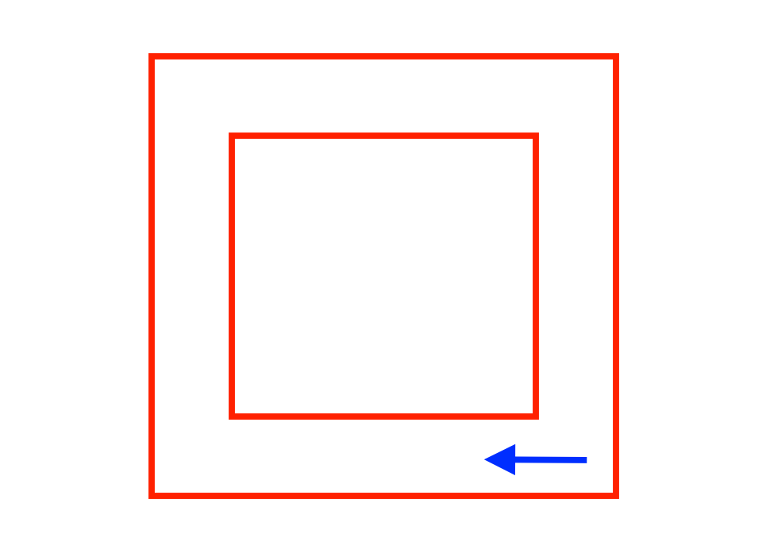

<!-- # 机器人编程入门学习 -->

# 第7课《认识循环》

## 内容简介:
使用计数次循环积木设计绕箱子游戏。

## 教学目标:
1. 理解循环的定义;
2. 掌握计数次循环积木的使用;
3. 使用计数次循环积木，设计绕箱子游戏。

## 预备知识:
1. 知道基本的编程概念。

## 教学过程:

### 1. 旧知识回顾
- 什么是变量?
- 变量的三个用法：赋值、信息修改和比较。
- 数字炸弹的实现原理？

### 2. 新知识讲解
  - 今天学习的知识点是循环。

    
    
    
    
    
    
    

### 3. 项目挑战

- 任务一：绕箱子 (矩形线路行驶，调试，修正角度，先不使用循环，结束回到起点)；  
  - 先让同学们分组讨论，然后分享程序设计的步骤；
  - 假设同学们自己就是程小奔，让他们讲述如何实现绕箱子运动。  

    

- 任务二：使用循环修改绕箱子程序，使其更简单。
