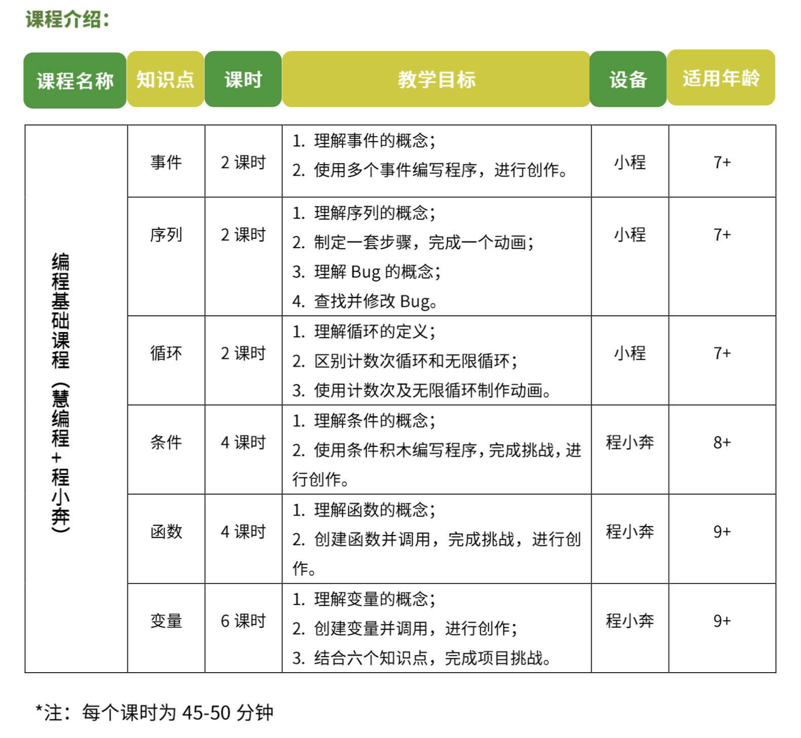

# 机器人编程入门

<!-- # 机器人编程入门学习 -->

## 教学大纲

## 教学步骤

## 课程介绍

### [第1课《程小奔的秘密》](./第1课《程小奔的秘密》.md)

### [第2课《事件和运动控制》》](./第2课《事件和运动控制》.md)

### [第3课《动画制作师》](./第3课《动画制作师》.md)

### [第4课《寻找虫子》](./第4课《寻找虫子》.md)

### [第5课《数学计算器》](./第5课《数学计算器》.md)

## 比赛项目(备选)

1. 倒车入库 (直行，左转90度，后退，练习调试程序，找Bug)。

1. 绕箱子 (安装矩形线路行驶，练习调试程序找Bug，修正角度以适应现场情况)；
