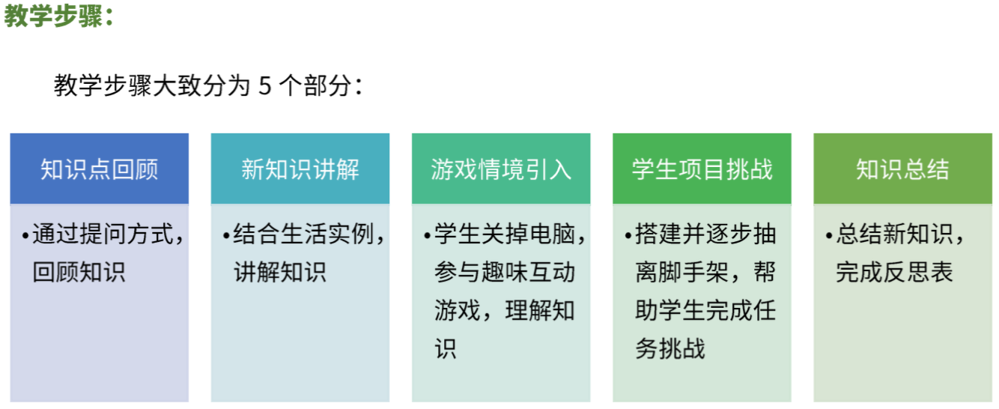
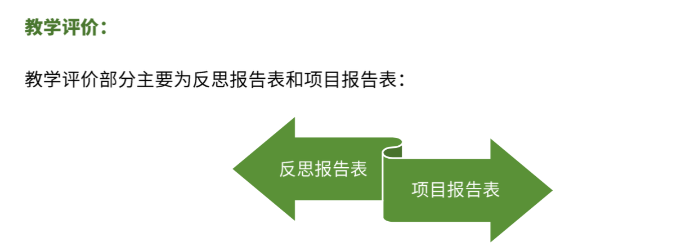

# 机器人编程入门

<!-- # 机器人编程入门学习 -->

## 教学大纲

## 教学步骤

## 课程介绍

### [第1课《程小奔的秘密》](./第1课《程小奔的秘密》)

### [第2课《事件和运动控制》》](./第2课《事件和运动控制》》)

### [第3课《动画制作师》](./第3课《动画制作师》)

### [第4课《寻找虫子》](./第4课《寻找虫子》)

### 