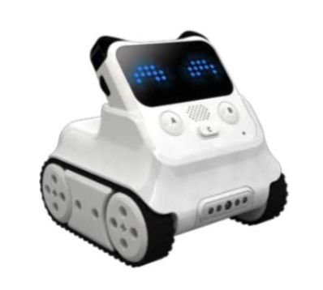
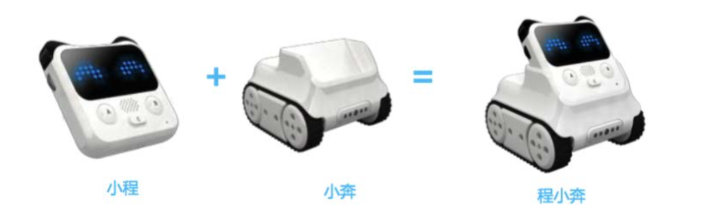
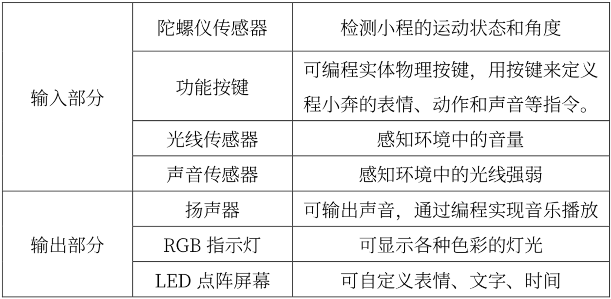
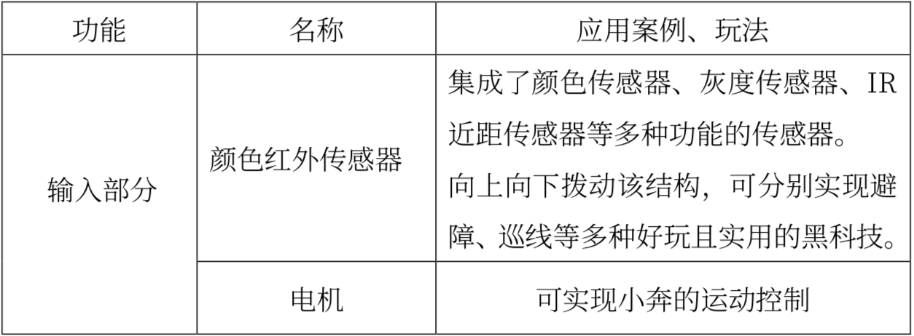

# 机器人编程入门学习

## 第 1 课《程小奔的秘密》

### 内容简介:
理解程序及程序的作用，认识程小奔及慧编程的基本使用方法。

### 教学目标:
1. 理解程序的定义及作用;
2. 认识程小奔及其功能;
3. 掌握慧编程的基本操作步骤。 
4. 学会上传程序。

### 课堂准备:
1. 白板和白板笔(或黑板和粉笔);
2. 学生每人一个或两到三人一个小程和蓝牙适配器(或配套数据线); 
3. 学生每人一台或两到三人一台装有慧编程的电脑。

### 预备知识:
1. 认识计算机及掌握计算机的基础操作; 
2. 具备一定的认知能力。
 
### 教学过程:
#### 1. 情境引入——破解程小奔的秘密  
- 向学生介绍:  
老师手中拥有一个神奇的程小奔，小巧的身躯却拥有十分强大的功能。  
教师可通过视频展示，或者提前上传程序至程小奔中，展示功能，比如避障、巡线、悬崖勒马等。  

- 向学生提问:  
  除了程小奔以外，你们在生活中还见过哪些机器人?那些机器 人又都是来做什么的呢?  
  随机抽取学生，并回答刚才的问题。  
  学生可能回答:送餐机器人、物流机器人、安保机器人  
  再提问: 那么你们又知道机器人为什么可以听从我们的命令?  
  由学生进行自由讨论，并给出答案。  
  学生可能回答: 遥控控制、设定了程序  

#### 2. 新知识讲解——程序
- 教师讲述:  
程序是一种可以让我们控制机器人，让机器人能够识别的计算机 语言。我们想要机器人执行的动作、功能等通过编程，形成特定的程序，再将程 序上传到机器人中，那么机器人就会按照我们程序中的设定执行动作了。

- 教师提问:  
所以你们知道控制程小奔的秘密了吗?   
学生可能回答:因为程小奔里有我们编写的程序。

#### 3. 教师演示案例
- 教师讲述:  
你们想要自己编写程序并上传到程小奔吗?那么在尝试编程之前，
我们得先认识认识我们可爱又功能强大的程小奔。  

程小奔是一个可编程教育机器人，我们可以通过软件和硬件的结合产生许多 新奇的玩法。不仅好玩有趣，程小奔还是我们学习编程的好帮手，通过它我们可 以掌握编程的基础知识与技能，锻炼逻辑思维和计算思维。程小奔支持 AI(人 工智能)和 IoT(物联网)等高科技功能，通过它可以开启人工智能及物联网的神秘大门。  

- 教师讲述:  
程小奔是由小程和小奔共同组合而成的，接下来我们就分别认识 一下他们。
  - 1) 小程:具有丰富传感器和可编程模块的主控大脑，既可单独使用，又可 以加上小车底盘“小奔”实现更多功能。拿出你们桌上的小程，我们一起来看看 小程拥有哪些传感器。

  - 2) 小奔是小程的“座驾”，有了小奔之后，可以躲避障碍物，以及进行颜 色识别、地图巡线等多种功能。

  
  

#### 4. 学生模仿或创作
认识完程小奔，我们尝试通过编程让程小奔动起来吧!