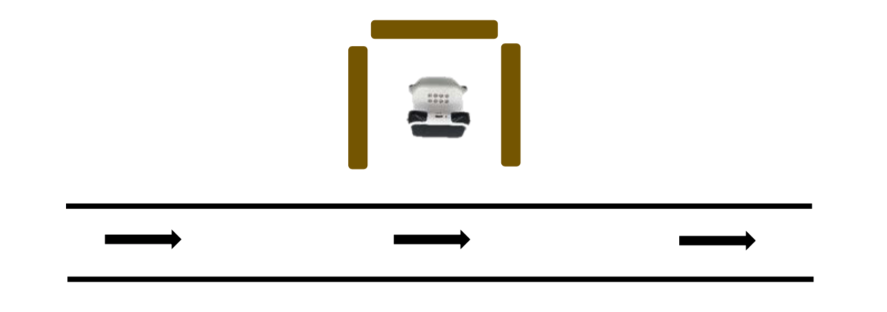

<!-- # 机器人编程入门学习 -->

# 第10课《赛车之旅2-穿越隧道》

## 内容简介:
使用多个条件积木或嵌套使用计数次循环与条件积木，结合运算符积木完成两个任务的挑战。

## 教学目标:
1. 学会在程序中使用多个条件积木;
1. 学会嵌套使用条件与计数次循环积木，简化程序; 
1. 学会使用比较操作符积木，根据数值比较结果进行条件判断。

## 预备知识:
1. 了解条件积木的使用;
1. 了解计数次循环积木的使用;
1. 知道如何寻找 Bug 并进行 Debug。

## 教学过程:

### 1. 旧知识回顾
- 什么是条件?
- 生活中哪些事情是我们需要进行判断并作出决定的条件?
- 条件积木有什么特点?
- 上节课的挑战任务中我们主要用了什么样的条件判断?

#### 学生可能回答: 
1. 对不同的情形进行判断并作出决定，满足条件则执行动作，不满足则跳过或忽略;
1. 下雨然后决定是否穿雨衣; 
1. 条件语句中有一个六边形的凹槽，我们需要把判断的条件积木卡在这个凹槽里;
1. 程小奔判断检测到的颜色是否为绿色(以及前方是否能够检测到物体)。

### 2. 程小奔的赛车之旅

- 上节课是利用条件积木帮助程小奔完成了第一阶段的赛车之旅，今天，比赛还在继续， 首先，在比赛的过程中，程小奔不断进入维修站进行维修和加油。 而每一次进入维修站的方式也许都不同，有可能车头朝左、朝右或朝前:

  

- 教师提问及引导:
  - 1)三种停靠方式随机出现，如果程小奔加好油后想顺利 找到出口，它该如何做?
  - 2)我们如何以不变应万变，只编写一个程序就能够帮 助程小奔应对以上任何一种情况呢?
  - 教师提示，为大家提供了以下三种积木，每种积木数量随意使用。

    

  - 3)如何让程序变得更加简洁呢? 教师可提示使用计数次循环积木。
    
    

- 学生可能回答:
  - 第一种方式，车头朝左，程小奔向左转 90 度;
  - 第二种方式，车头朝右，程小奔向右转 90 度;
  - 第三种方式，车头朝前，程小奔旋转 180 度或者朝左(右) 旋转 90 度两次;

- 学生思考，最后得出结论，使用三个条件判断，每个都是如果检测到前方有物体就向右转 90 度直到结束;

### 3. 项目挑战

- 任务一：离开维修站
  - 在比赛的过程中，程小奔需要不断进入维修站进行维修和加油。它每一次进入维修站的方式可能不同，你能编写一个程序，让它无论以什么样的方式停靠，都能准确地离开维修站，进入赛道吗?

  - 用书本或其他物品围绕程小奔，模拟程小奔停靠在维修站里。程小奔停靠的位置会议图中三种方式随机出现。
  
    

  - 编写程序，当按下按钮 A，如果程小奔侦测到前方有障碍物，会持续旋转，直到找到出口。
    - 你将用到的条件积木可能不止 1 个。

  - 出口前方是赛道。如果找到出口，程小奔前进离开维修站，然后左转，全力向前奔跑。

    

  - 建议程序：

    

  - 改进程序“如果前方有物体就向右转 90 度”重复三次。

    

## 9-10课时总结

### 学习内容：
* 
* 

### 课堂总结：
* 

### 作业：
* 思考程小奔闯迷宫设计方案