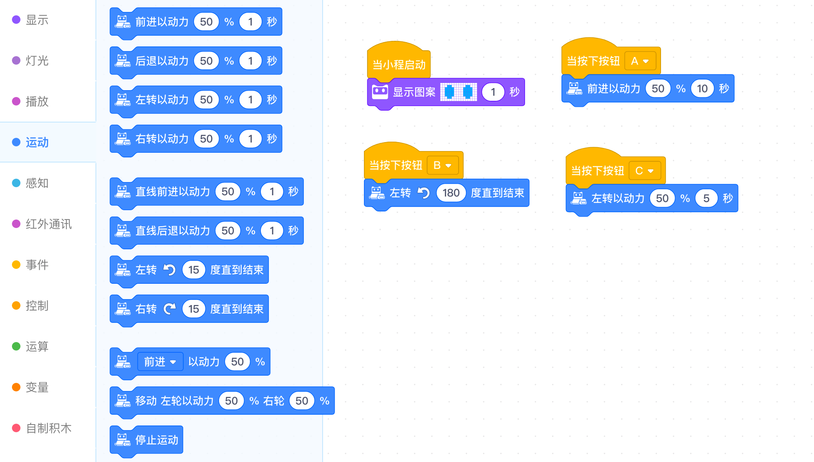

<!-- # 机器人编程入门学习 -->

# 第2课《事件和运动控制》

## 内容简介:
学会使用事件积木编写程序，并设计不同的按钮控制表情和运行。

## 教学目标:
1. 理解事件的定义;
1. 掌握事件积木的使用;
1. 使用事件积木，设计自己独具创意的按钮表情;
1. 掌握运动积木，使程小奔动起来。

## 预备知识:
1. 认识程小奔; 
1. 认识慧编程软件的基本操作界面;
1. 知道如何拖拽编程积木。

## 教学过程:

### 1. 旧知识回顾
  - 程小奔的表情控制；
  - 程小奔的`启动`事件。

### 2. 新知识讲解——事件，运动

  

### 3. 项目挑战

- 任务一：  
  - 当按下按钮 A，播放声音“开关”，小程睁开眼睛; 
  - 当按下按钮 B，播放声音“开关”，小程微笑; 
  - 当按下按钮 C，播放声音“开关”，小程沮丧。   

- 任务二：直行，掉头，直行回到原地；

- 任务三：倒行，掉头，倒行回到原地；

- 任务四：结合表情声音控制，自行设计方案，并展示。

## 1-2课时总结

### 学习内容：
* 程小奔机器人的基本构造，程小奔身上的传感器以及他们的作用。
* 程小奔的表情控制，声音播放控制。
* 事件的操作：启动，A按钮，B按钮，C按钮。
* 基本运动编程模块的操作：前进，后退，转弯，转圈。

### 课堂总结：
* 同学们对课堂任务的完成都非常出色，在老师的指引下，都能迅速完成具有自己想法和特色的作品。而且都能够清楚的描述自己的程序做了什么事情。

### 作业：
* 利用今天所学的内容，自编一个小故事，用程序操作程小奔来实现。下一节课开始演示给大家。
