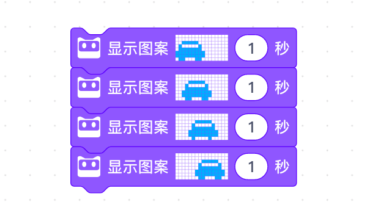
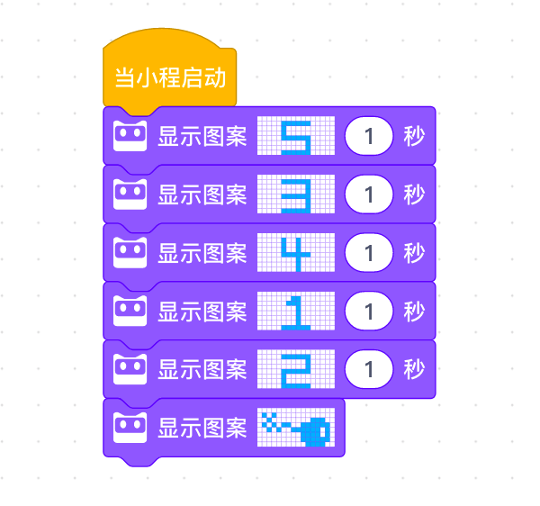

<!-- # 机器人编程入门学习 -->

# 第4课《寻找虫子》

## 内容简介:
理解 Bug 的概念及学会查找并修改 Bug。

## 教学目标:
1. 理解Bug 的概念; 
2. 学会查找并修改 Bug。

## 预备知识:
1. 知道基本的编程概念;
1. 掌握慧编程的基本操作方式。

## 教学过程:

### 1. 旧知识回顾
- 什么是序列?
- 生活中哪些事情是遵循序列的?

### 2. 新知识讲解——Bug
- 什么是 Bug  
    Bug 的原意为“虫子”，它是在程序设计中会导致程序不能正确运行的漏洞。就像语文老师在批改我们作 文时，时常会在我们的文章中圈出错别字。因为有这些错别字可能会导致我们的 文章不顺畅，不正确。Bug 就像作文中错别字一样。

- Bug 源于一个真实的故事

### 3. 故事情境引入——“Debug 之母”
计算机在发明的最初阶段，是一个非常大的机器，而不是我们现在用 的这种便携式的电脑。在使用这种巨型计算机时期，有一次，电脑不能正常运作了，而整个程序设计师团队都无法找到引起故障的原因。直到一位女程序员，葛丽丝·穆雷·霍普(英 语:Grace Murray Hopper)，发现原来是一只飞蛾意外飞入了一台电脑内部而 引起故障。把这个飞蛾移除，错误便解除了。这个错误是第一个被发现的计算机错误，从那以后，人们逐渐开始用‘Bug’ 来称呼计算机中的错误，而葛丽丝·霍普也被称为是 “Debug 之 母”。

### 4. 项目挑战

- 任务一：找出以下程序中的 bug，并修改  
  
   - 提示：车钥匙被偷了，无法启动，找找车钥匙吧(缺少事件)。

- 任务二：不会计时的炸弹  
  
  - 提示：计时的积木块顺序错误。

- 任务三：蚯蚓与虫子  
  
  - 提示：小蚯蚓在爬行的过程中出现了一只大虫子， 删除这只大虫子，小蚯蚓才能够正常爬行(将虫子图案改为原本的蚯蚓爬行姿 势)

## 3-4课时总结

### 学习内容：
* 序列
* Bug

### 课堂总结：
* 同学们对课堂任务的完成都非常出色。

### 作业：
* 利用今天所学的内容，。下一节课开始演示给大家。
