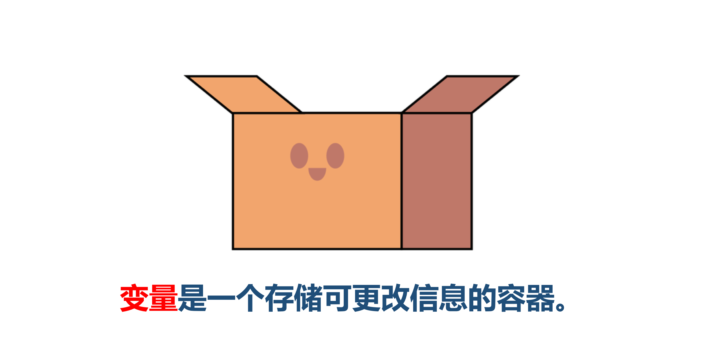
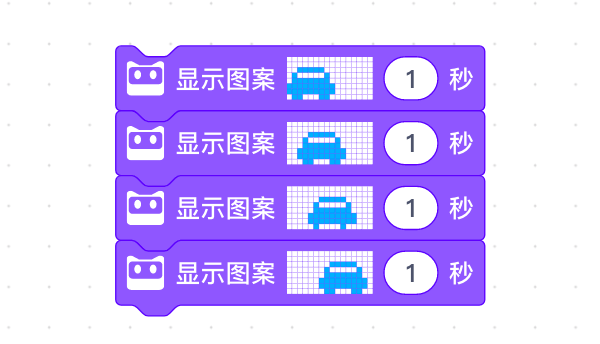
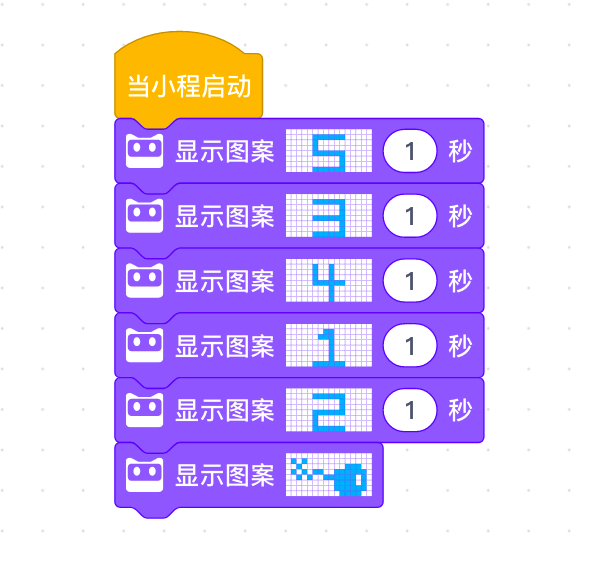
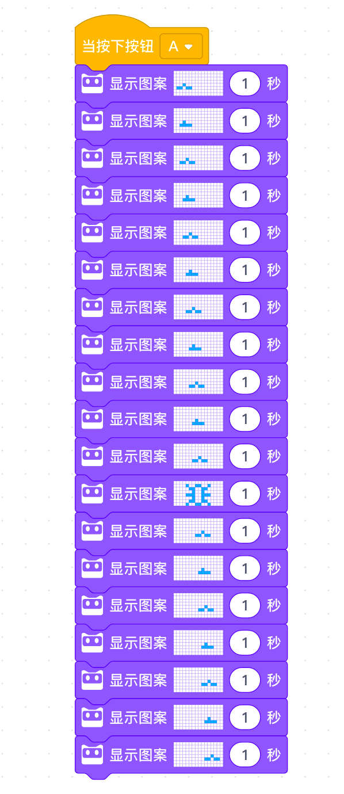

<!-- # 机器人编程入门学习 -->

# 第5课《数学计算器》

## 内容简介:
理解变量的概念，学会使用变量进行数学运算。

## 教学目标:
1. 理解变量的概念; 
2. 使用变量设计弹跳计数器；
3. 理解变量的比较，使用变量实现数学运算。

## 预备知识:
1. 了解事件积木的使用和序列的概念;
1. 知道如何寻找 Bug 并进行 Debug。

## 教学过程:

### 1. 旧知识回顾
- 什么是序列?
- 你是如何找Bug的?

### 2. 新知识讲解——变量
- 什么是 变量
    结合数学中的图形题目讲解。

### 3. 通过编程实现一个图形题目

### 4. 项目挑战

- 任务一：弹跳计数器  
  

- 任务二：简单的数学运算  
  

- 任务三：加法/减法 计算器  
  
  - 提示：。

## 3-4课时总结

### 学习内容：
* 
* 

### 课堂总结：
* 

### 作业：
* 
