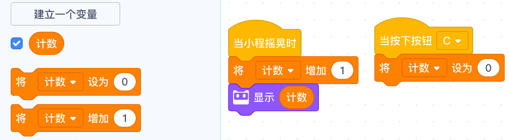
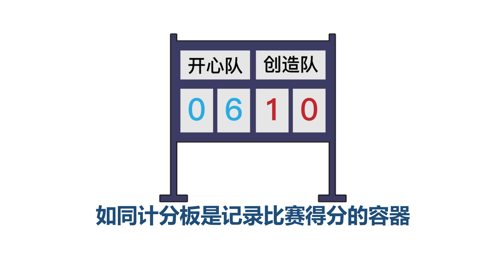
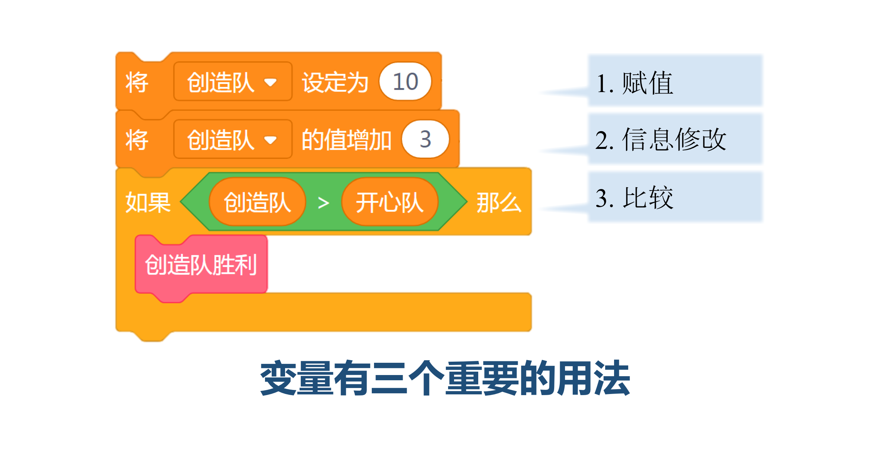

<!-- # 机器人编程入门学习 -->

# 第5课《认识变量》

## 内容简介:
理解变量的概念，学会使用变量进行数学运算。

## 教学目标:
1. 理解变量的概念; 
2. 创建变量并调用，进行创作。

## 预备知识:
1. 了解事件积木的使用和序列的概念;
1. 知道如何寻找 Bug 并进行 Debug。

## 教学过程:

### 1. 旧知识回顾
- 什么是序列?
- 什么是Bug和Debug？
- 如果检查Bug？

### 2. 新知识讲解——循环

#### 什么是变量

- 变量是一个储存可更改信息的容器。一个变量可以想象成一个盒子，你能在里面存放一个值并随时替换。如同计分板是记录比赛得分的容器。随着比赛的进行，你可以随时更换计分板上的分数。专业地讲，它是被命名的计算机内存区域。当创建一个变量时，计算机会开辟一块内存区域存储它，并给这块内存区域一个变量名。通过使用变量名，程序可随时读取和修改内存区域里的数据。  

    

- 简洁贴切的变量名有利于变量的使用。例如，将计分板命名为“红队”，那么变量“红队”代表的是红队比赛得分。当红队投入一个三分球，相应的，计分板上的数字发生改变，新的值替代旧的值。  

    

- 变量有三个重要用法：  

    

  - 第一是赋值，你可以将一个数值赋予给变量。例如，创建变量 “红队”用以存储红队比赛得分，首先将变量的初始值设置为0；  
  - 第二是信息修改，你可以对变量进行加减乘除，修改原本存储在变量中的值，然后在程序中调用运算的结果。例如，如果红队投篮成功，则将“红队”的值增加2；  
  - 第三是进行数值比较，你可以读取当前变量的数值，通过比较运算符进行条件判断，例如，如果红队得分大于蓝队得分，红队取胜。

#### 生活中常遇到的变量
- 游戏中角色的生命值
- 数学图形题目中的图形：圆形，三角形，方形；  
- 方程中的未知数：x，y，z，a，b，c 等。

### 3. 教师演示案例

- 弹跳计数器  

  

### 4. 项目挑战

- 任务一：模仿设计弹跳计数器，并演示；  

- 任务二：如何将计数器归零？  

- 任务三：加速前进  
  - 程小奔的速度最开始为0，即程小奔停留在原地。
  - 当按下按钮A，速度不断增加，每次增加20，重复5次。最后速度增加到100。
  - 要求显示当前的速度值。

    

  - 讨论：  
    - 如果是让程小奔从100减速，最后停止，程序应该如何调整？  
    - 将前进的动力设置为负值，观察程小奔将如何运动？  
 