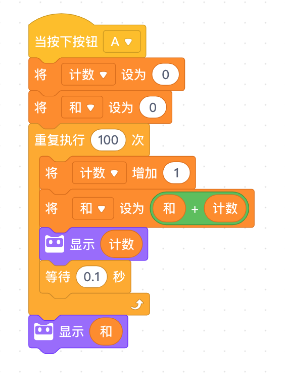
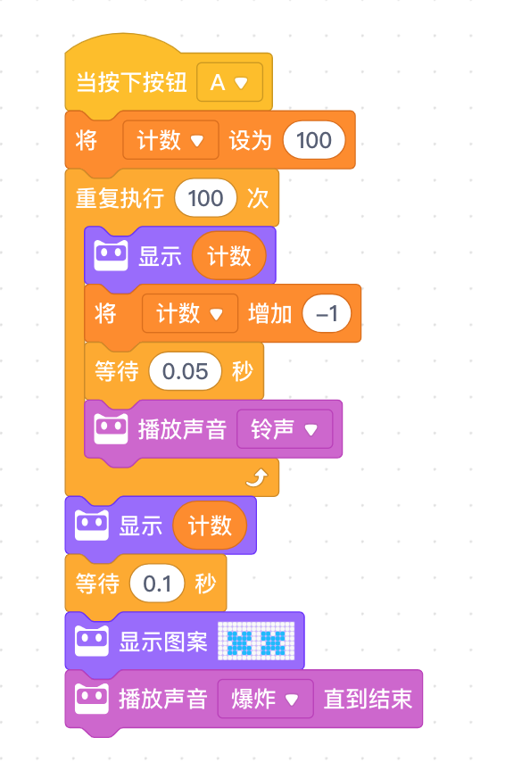
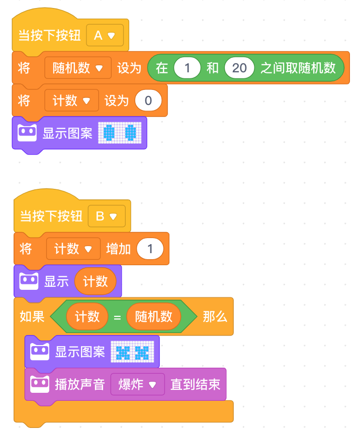

<!-- # 机器人编程入门学习 -->

# 第6课《定时炸弹》

## 内容简介:
使用变量进行比较运算实现程小奔的数字运算。

## 教学目标:
1. 理解变量的概念; 
2. 创建变量并调用，进行创作；
3. 学习随机数的应用；
4. 认识条件语句。

## 预备知识:
1. 知道如何创建与使用变量。

## 教学过程:

### 1. 知识回顾
- 什么是变量?
- 变量的三个用法：赋值、信息修改和比较。

### 2. 项目挑战

- 任务一：程小奔学习算数2
  - 计算从 1到100 的和。教师引导：
    - 计数循环 的应用
    - 重点解释表达式 `和 = 和 + 计数` 的理解

      

- 任务二：定时炸弹  
  游戏规则: 小程倒计时 100。
  - 当程小奔启动时，“计数”变量的初始值被设为 100。  
  - 当按下按钮 A，“时间”开始倒计时。等待 0.1 秒后“计数”变量减 1。  
  - 计时结束，即“计数”值为零后，炸弹爆炸。LED 点阵上显示炸弹，小程发出爆炸的声音。
    
    

- 任务三：认识随机数  
  - 当按下按钮 A，显示一个随机数

- 任务四：爆炸的数字  
游戏规则: 按下 A按钮，小程随机产生一个数字。按下 B按钮， 让屏幕上的数字加 1。当屏幕上的数字等于随机产生的数值，炸弹爆炸。

  - 创建两个变量: 炸弹和数字。“炸弹”代表随机产生的会爆炸的数字。 “数字”代表从 0 开始，随着游戏的进行不断增加的数。当两个变量相同时，炸弹爆炸。  
  - 当程小奔启动时，两个变量的初始值皆为 0。  
  - 当按下按钮 A，“炸弹”的数值被设定为 1-20 间的一个随机数。同时，小程带上墨镜，播放声音“准备” 
  - 两人轮流按下按钮 B，当按钮被按下，变量“数字”增加 1。新的数值显示在 LED 点阵上。
  - 如果变量“数字”的值等于“炸弹”的值，屏幕上出现炸弹，并播放声音。
  - 需要使用到比较操作符积木和条件积木，判断两个变量是否相等。  

    

## 5-6课时总结

### 学习内容：
* 学习变量的应用，使用变量进行比较运算，数字加法运算；
* 学习随机数的应用；
* 认识条件语句；
* 完成任务：计数1到100的和、倒计时炸弹、数字炸弹游戏。

### 课堂总结：
* 今天同学们学习了编程中比较抽象的概念--变量。这几个课堂任务都是环环相扣，难度逐级增加的，随机数、条件语句、数学运算都是今天新接触的内容，课堂内容稍微多了一点，同学们都能够跟得上步伐，顺利的完成作品。

### 作业：
* 将课堂上完成的作品（计数1到100的和、倒计时炸弹、数字炸弹游戏）在自己的程小奔上展示给爸爸妈妈看，并解释程序的设计原理。
