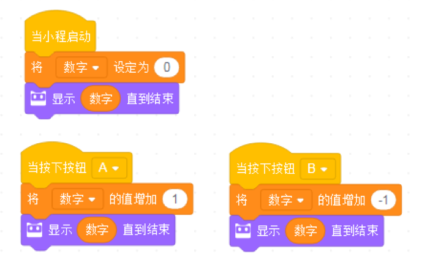
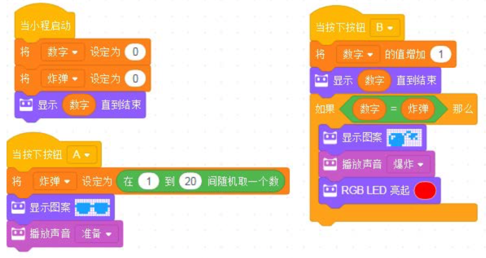

<!-- # 机器人编程入门学习 -->

# 第6课《数学计算器》

## 内容简介:
使用变量进行比较运算实现程小奔的数字运算。

## 教学目标:
1. 理解变量的概念; 
2. 创建变量并调用，进行创作。

## 预备知识:
1. 知道如何创建与使用变量。

## 教学过程:

### 1. 知识回顾
- 什么是变量?
- 变量的三个用法：赋值、信息修改和比较。

### 4. 项目挑战

- 任务一：程小奔学习算数：
  - 当程小奔启动时，“数字”的值被设置为0；
  - 当按下按钮A数字加1；
  - 当按下按钮B，数字减1。  

    

- 任务二：计算从 1 到 100 的和。 
  - 提示：使用循环模块 

- 任务三：定时炸弹  
游戏规则: 小程倒计时。期间，拿到小程的人要说一个动物的名字，如果炸弹爆炸，游戏结束。  

  - 当程小奔启动时，“时间”变量的初始值被设为 30。  
  - 当按下按钮 A，“时间”开始倒计时。等待 1 秒后“时间”变量减 1。  
  - 倒计时期间，拿到小程的人说一个动物的名字，然后将小程传递给下一个人。动物名 不能重复。  
  - 计时结束，即“时间”值为零后，炸弹爆炸。LED 点阵上显示炸弹，小程发出爆炸的 声音，RGB LED 亮起红色。

- 任务四：爆炸的数字  
游戏规则: 按下按钮，小程随机产生一个数字。两人石头剪刀布，输的人按下按钮， 让屏幕上的数字减 1。当屏幕上的数字等于随机产生的数值，炸弹爆炸。

  - 游戏需要创建两个变量: 炸弹和数字。变量“炸弹”代表随机产生的会爆炸的数字。 变量“数字”代表从 0 开始，随着游戏的进行不断增加的数。当两个变量相同时，炸弹爆炸。  
  - 当程小奔启动时，两个变量的初始值皆为 0。  
  - 当按下按钮 A，“炸弹”的数值被设定为 1-20 间的一个随机数。同时，小程带上墨镜，播放声音“准备” 
  - 两人玩石头剪刀布，输的人按下按钮 B。当按钮被按下，变量“数字”增加 1。新的数值显示在 LED 点阵上。
  - 如果变量“数字”的值等于“炸弹”的值，屏幕上出现炸弹，并播放声音。你可能需
要使用到比较操作符积木和条件积木，判断两个变量是否相等。  
  - 挑战: 更改“炸弹”的随机范围。  

    

## 5-6课时总结

### 学习内容：
* 
* 

### 课堂总结：
* 

### 作业：
* 
