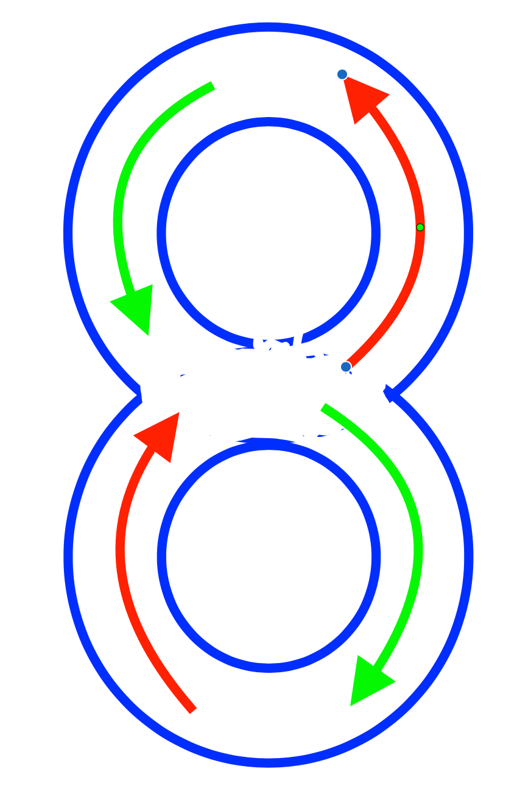
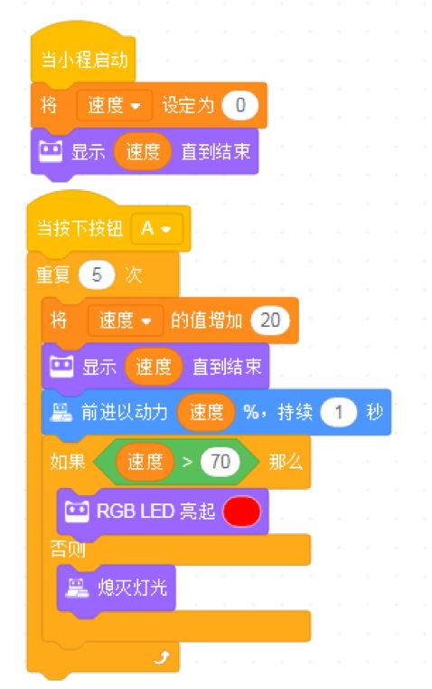

<!-- # 机器人编程入门学习 -->

# 第8课《赛车之旅1-弯道竞速》

## 内容简介:
车辆设计弯道行驶程序设计。

## 教学目标:
1. 了解弯道行驶的原理;
1. 使用代码块，设计完成绕8字任务。

## 预备知识:
1. 知道如何寻找 Bug 并进行 Debug。

## 教学过程:

### 1. 旧知识回顾
- 什么是循环?
- 什么是计数次循环?

### 2. 新知识讲解    
- 弯道行驶的原理：两轮速度不一样
  - 向左转原理
  - 向右转原理
- 8字形弯道行驶  

### 4. 项目挑战

- 任务一：绕 8 字弯道行驶  

  

  - 提示，有两种方案：
    - 1. 从 8 字底部出发；
    - 1. 从 8 字中间(腰部)出发。

## 7-8课时总结
### 学习内容：
* 计数循环的应用
* 车辆弯道行驶原理

### 课堂总结：
* “循环”在前面的学习中同学们已经有过接触，今天的课程是通过课堂任务，让同学们进一步学习和使用循环代码块。先是通过序列模式实现了“绕箱子”游戏，然后通过重构，引入循环代码块，使程序变得简洁。
* 绕8字任务中，同学们了解了车辆弯道行驶的原理，并且通过反复调试，实现了程小奔绕8字弯道行驶。

### 作业：
* 程小奔加速前进  
  - 程小奔的速度最开始为0；
  - 当按下按钮A，速度不断增加，每次增加20，重复5次，最后速度增加到100；
  - 以100速度运行5秒钟停下；
  - 要求显示当前的速度值；
  - 要求用到“变量”和“循环”。

    

  <!-- - 讨论：  
    - 如果是让程小奔从100减速，最后停止，程序应该如何调整？  
    - 将前进的动力设置为负值，观察程小奔将如何运动？ -->
 