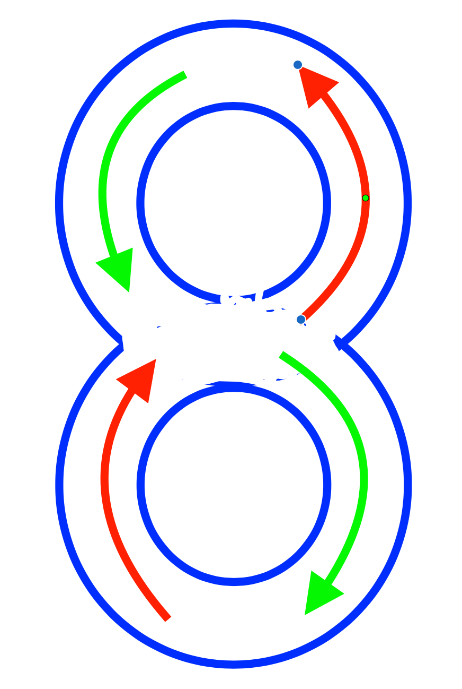

<!-- # 机器人编程入门学习 -->

# 第8课《赛车之旅1-弯道竞速》

## 内容简介:
使用无限循环积木设计弯道行驶。

## 教学目标:
1. 理解循环的定义;
2. 掌握无限次循环积木的使用;
3. 使用无限次循环积木，设计自己独具创意的动画。

## 预备知识:
1. 了解循环的概念;
1. 了解计数次循环积木的使用;
1. 知道如何寻找 Bug 并进行 Debug。

## 教学过程:

### 1. 旧知识回顾
- 什么是循环?
- 什么是计数次循环?
- 生活中计数次循环的事情发生?

### 2. 新知识讲解
  - 教师告知有些事情的循环是有一定的次数的，而有些则是无限永久循环的，例如日出日落;  

    
    
  - 弯道行驶的原理  
  - 8字行弯道行驶  

### 4. 项目挑战

- 任务一：8字行弯道行驶 (先不使用循环，结束回到起点)；  

  

- 任务二：使用无限循环修改绕8字行弯道行驶，使其一直保持运行。

## 7-8课时总结

### 学习内容：
* 
* 

### 课堂总结：
* 

### 作业：
* 