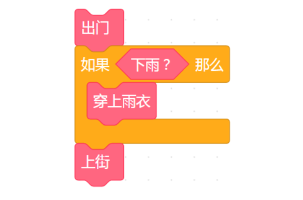
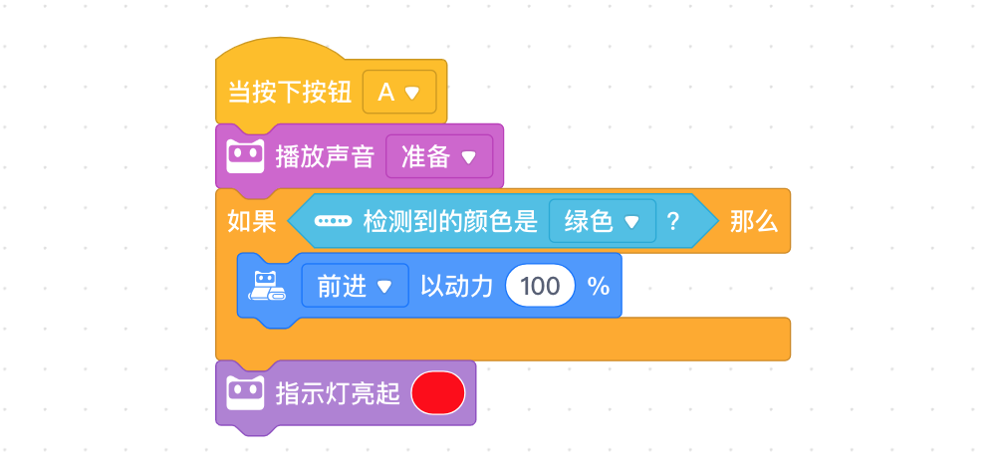
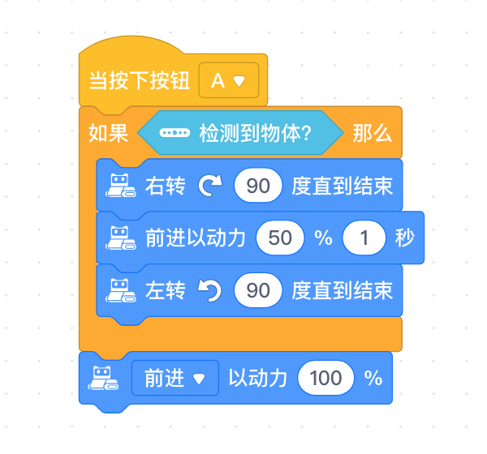

<!-- # 机器人编程入门学习 -->

# 第9课《认识条件》

## 内容简介:
理解条件的概念。使用条件积木对识别的颜色和前方的障碍物进行检测，编写程序，完成挑战。

## 教学目标:
1. 掌握条件的概念;
2. 掌握条件积木的初步使用;

## 预备知识:
1. 知道如何寻找 Bug 并进行 Debug。

## 教学过程:

### 1. 旧知识回顾
- 什么是循环？
- 什么是计数次循环?
- 什么是计数次循环?
- 什么时候重复积木是有用的？

  - 循环是指反复不断地循环执行某段程序。计数次循环是指重复特定的次数，而无限循环是指永久重复。当某段代码需要重复指定次数或永久重复时，重复积木式有用的。重复积木可以让程序变得简洁有效。

### 2. 新知识讲解——条件
  - 本节课的知识点为条件。条件的判断在我们的生活中常常遇到。例如，假如你想上街买酱油，可能会先走出门，然后判断是否下雨。如果下雨，拿起雨伞，然后上街；如果不下雨，忽略雨伞，直接上街。  
  - 条件就是指我们对不同的情形进行判断并作出决定，满足条件则执行动作，不满足则跳过或忽略。询问学生生活中其他的条件。
  - 在编程中，使用条件积木对不同的情况进行判断。  

    

    

### 3. 项目挑战
故事情节: 程小奔参加了赛车比赛。比赛即将开始，如果看到绿色的旗帜程小奔就向前极速奔驰。  
教师演示本节课第一个挑战。

- 任务一：绿旗挥动出发
  - 当按下按钮 A，程小奔在起跑线做好准备(播放准备的声音)。
  - 如果颜色传感器检测到颜色是绿色，程小奔以最快的速度前进。
  - 条件判断结束后，RGB LED 亮起红色。  

    

  - 在示范程序的过程中，教师提醒学生:
    - 条件语句中有一个六边形的凹槽，我们需要把判断的条件(`检测到的颜色是绿色?`) 卡合在这个凹槽里;
    - 积木`RGBLED亮起红色`需要放在条件语句外，可以帮助 判断程序是否执行结束。

  - 挑战: 
    1. 设计程小奔全力奔跑时的表情和声音;
    1. 如果程小奔感应到红色则后退。

  - 完成挑战后，学生将结果展示给老师和同学。

- 任务二：绕过障碍物
  - 将一个障碍物放在程小奔的面前;
  - 当按下按钮 A，如果检测到物体，程小奔向右转 90 度，前进，左转 90 度，然后以非常快的速度继续前进。
  - 如果没有侦测到有障碍物，程小奔保持最快的速度向前行驶。
    
    

  - 在学生完成任务的过程中，教师提醒学生:
    - 确保条件积木内使用的是具备时间限制的前进和旋转积木；
    - “前进以动力 100%”的积木在条件积木外。

  - 挑战：
    1. 从障碍物的另一侧绕过，即先左转，后右转。
    1. 添加程小奔遇到障碍物时的表情和声音。
