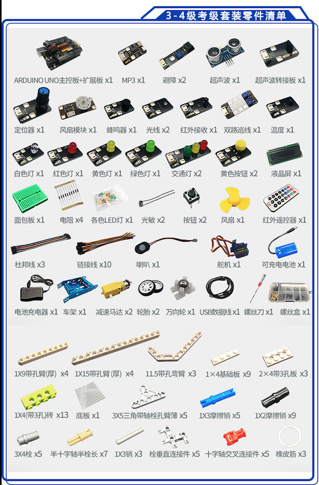
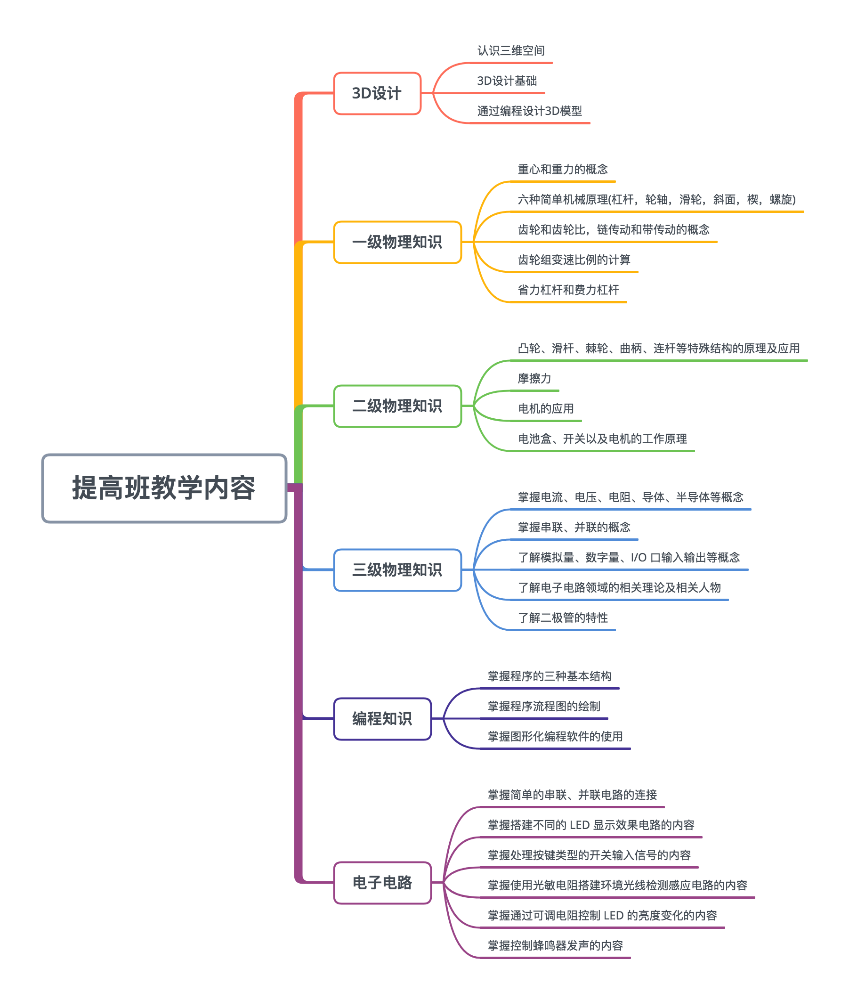

# 全国青少年**机器人**等级考试 vs 全国青少年**编程技术**等级评测

## 等级考试组委会介绍

- [教育部关于印发《教育信息化2.0行动计划》的通知](http://bc.yaie.net/article/item-67.html)

- [中国电子学会](https://www.cie.org.cn)

  

## [青少年科技类等级考试](http://www.kpcb.org.cn/h-col-127.html)

  - 
  - 
  - 
  - 

# 机器人等级考试

### [考试介绍](http://www.qceit.org.cn/bos/20190408204005293.html?d=2019-8-21-11-55-26)
  
  

  

  

  

  

  

  

### 机器人等级考试官网 [http://www.qceit.org.cn](http://www.qceit.org.cn)

  

### [机器人技术等级考试标准](http://9140106.s21d-9.faiusrd.com/0/ABUIABA9GAAgssi44AUovMH3ywI?f=全国青少年机器人技术等...pdf&v=1544430642)

  

  

### [模拟题-下载](http://www.robotest.cn/article/index-19.html)

- [模拟题:一级](http://www.robotest.cn/article/item-308.html)

# 全国青少年软件编程等级考试

### [考试介绍](http://www.qceit.org.cn/bos/20190408204004650.html?d=2019-8-21-11-55-26)

- 全国青少年软件编程等级考试标准（预备1级-4级）

- 全国青少年软件编程等级考试标准（正式1级-10级）

### [考试标准](http://9140106.s21d-9.faiusrd.com/0/ABUIABA9GAAg8qvs5AUoiNKvmAM?f=全国青少年软件编程等级...pdf&v=1553667570)

- 考试时间

  - 

### [模拟题-下载](http://bc.yaie.net/article/index-40.html)

# 全国青少年三维创意设计等级考试

### [考试介绍](http://www.qceit.org.cn/bos/20190408204006654.html?d=2019-8-21-11-55-26)

# [NIO 信息学奥数](http://www.noi.cn)

- [信息学奥赛-官网介绍](http://www.noi.cn/newsview.html?id=66&hash=9CB0C5&type=5)

- [信息学奥赛-百科介绍](https://baike.baidu.com/item/信息学奥赛/1147921)

  

  
  
# iabc 机器人编程课程体系

## 课堂花絮

