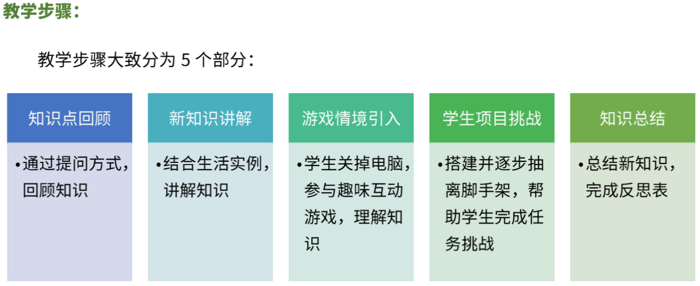
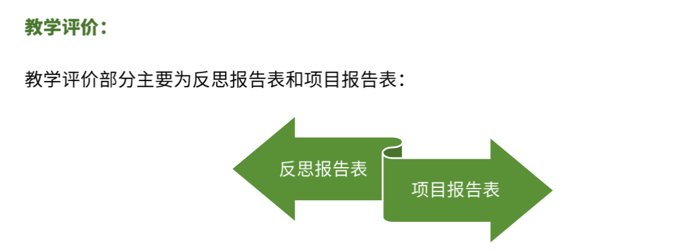

<!-- # 机器人编程入门学习 -->
<link rel="stylesheet" type="text/css" href="./style.css" />

# 机器人编程入门

## 教学大纲

## 教学步骤

## 课程介绍

### [第1课《程小奔的秘密》](./第1课《程小奔的秘密》.md)

- 让程小奔动起来
- 程小奔的表情控制

### [第2课《事件和运动控制》](./第2课《事件和运动控制》.md)

- 事件控制
- 运动控制
- 结合事件、运动、表情、声音，自行设计方案，并展示

### [第3课《动画制作师》](./第3课《动画制作师》.md)

- 弹跳的小球
- 贪吃蛇
- 自主创作一个动画
- 使用循环模块，重复执行动画

### [第4课《寻找虫子》](./第4课《寻找虫子》.md)

- 找Bug - 车钥匙被偷了
- 找Bug - 不会计时的炸弹
- 找Bug - 蚯蚓与虫子
- 倒车入库

### [第5课《认识变量》](./第5课《认识变量》.md)

- 任务1：弹跳计数器
- 任务2：将计数器归零
- 任务3：显示从 1到100 的数字

### [第6课《定时炸弹》](./第6课《定时炸弹》.md)

- 任务1：程小奔学习算数
- 任务2：定时炸弹
- 任务3：认识随机数，制作“爆炸的数字”游戏

### [第7课《认识循环》](./第7课《认识循环》.md)

- 任务1：绕箱子(不用循环)
- 任务2：使用循环重构绕箱子程序

### [第8课《弯道竞速》](./第8课《弯道竞速》.md)

- 任务1：8字行弯道行驶
- 作业：程小奔加速前进

### [第9课《认识条件》](./第9课《认识条件》.md)

- 任务1：绿旗挥动，出发
- 任务2：绕过障碍物

### [第10课《驶出维修站》](./第10课《驶出维修站》.md)

- 任务1：维修站出库
- 作业：思考程小奔闯迷宫设计方案

### [第11课《Scratch游戏编程》](./第11课《Scratch游戏编程》.md)

- 学习使用Scratch虚拟角色编程
- 实现一个类似切水果的小游戏

### [第12课《虚实结合》](./第12课《虚实结合》.md)

- 认识陀螺仪传感器，读取程小奔翻滚角度值
- 使用程小奔的翻滚角度控制虚拟角色的倾斜

### [第13课*《太空大战1》](./第13课《太空大战1》.md)

### [第14课*《太空大战2》](./第14课《太空大战2》.md)

### [第15课《红外遥控1》](./第15课《红外遥控1》.md)

- 认识什么是红外线
- 红外遥控工作原理
- 任务：程小奔发射和接收红外信号

### [第16课《红外遥控2》](./第16课《红外遥控2》.md)

- 任务：使用红外遥控器控制程小奔：直行、转弯、声光表情

### [第17课《自动巡线》](./第17课《自动巡线》.md)

### [第18课《智能家居》](./第18课《智能家居》.md)

- 任务：程小奔变身看家卫士，当检测到物体靠近、或有异响时发出报警，当天黑时自动亮灯。
  - 当检测到物体时；
  - 认识声音传感器，读取“响度”，绘出音量柱；
  - 结合光线传感器，读取“环境光强度”；
  - 呼吸灯的原理和实现
- 作业：
  - 回家演示看家卫士

### [第19课《桌上足球》](./第19课《桌上足球》.md)

- 任务：红外遥控程小奔，完成桌上二人足球赛
  - 要求：能够控制程小奔前进、后退、左转、右转、射门；配合声光表情。

### [第20课《点球大战》](./第20课《点球大战》.md)

- 规则：巡线到指定位置，检测到物体(乒乓球)停下，然后点球射门。
- 比赛规则讲解和赛前指导
- 点球大战比赛，颁奖

<!--
### [第13课《程小奔闯迷宫》](./第13课《程小奔闯迷宫》.md)

### [第16课《悬崖勒马》](./.md)

### [第17课《呼吸灯》](./第17课《呼吸灯》.md)
- 呼吸灯原理
- 结合光线传感器，读取“环境光强度”，实现小夜灯功能，当环境光强度小于20时，打开灯。

### [第20课《点球大战2》](./.md)
- 点球大战比赛，颁奖

## 夏令营比赛项目

### [《点球大战》](./.md)
- 比赛
- 颁奖 
-->
