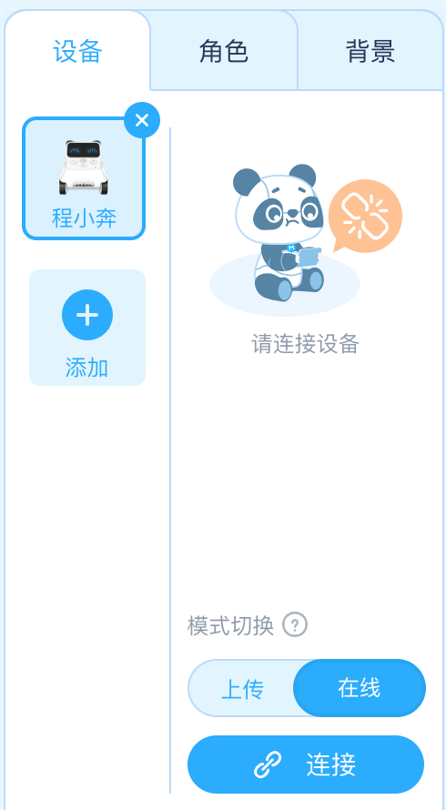
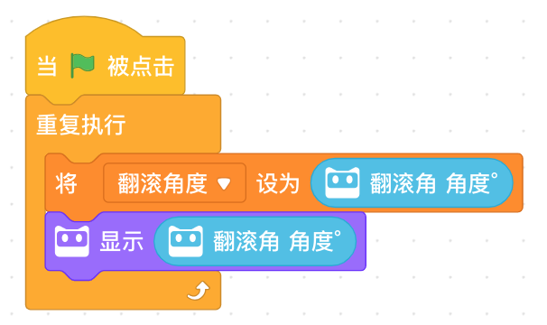
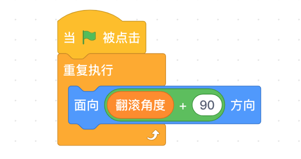

<!-- # 机器人编程入门学习 -->
<link rel="stylesheet" type="text/css" href="./style.css" />

# 第12课《虚实结合-舞台角色互动》

## 内容简介

使用程小奔控制游戏中的虚拟角色。

## 教学目标

1. 认识陀螺仪传感器：程小奔的翻滚角度；
1. 使用程小奔控制虚拟角色。

## 预备知识

1. 了解条件积木的使用;
1. 知道如何寻找 Bug 并进行 Debug。

## 教学过程

### 1. 旧知识回顾

- 如何添加虚拟角色？
- 点击角色发出声音？

### 2. 新知识讲解

- 了解慧编程的 “上传模式” 和 “在线模式”
  - 两种模式下，启动事件的区别：在线模式下，都有“点击绿旗”事件
  - 本节课程使用 “在线模式”  

    

- 原理：
  - 程小奔的翻滚角度通过全局变量，传递给游戏中的角色。

### 3. 项目挑战

- Step1：读取程小奔陀螺仪传感器的值，翻滚角度

  

- Step2：将 “翻滚角 角度”保存到变量

    

- Step3：角色的脚本，使用变量值

  

## 11-12课时总结

## 学习内容

- 认识Scratch编程语言
- 认识陀螺仪传感器，获取程小奔的翻滚角度值；
- 使用程小奔控制虚拟角色。

### 课堂总结

- 今天学习了通过Scratch编程对虚拟角色的控制，并使用Scratch编程实现了一个类似切水果的小游戏。
- 通过程小奔的翻滚(陀螺仪传感器)，控制虚拟角色的倾斜。

### 作业

- 回家演示今天的小游戏；
- 思考如何通过程小奔的A、B、C按钮控制游戏角色的行为。
