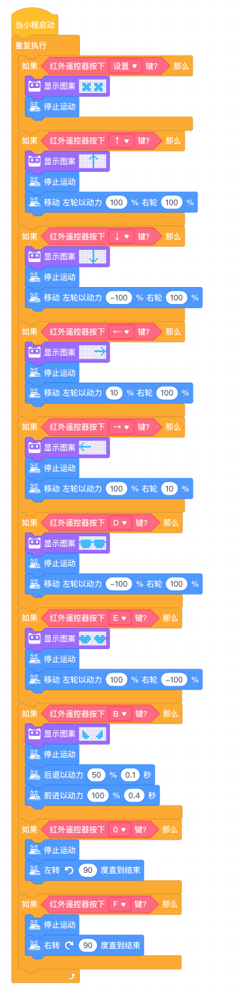

<!-- # 机器人编程入门学习 -->
<link rel="stylesheet" type="text/css" href="./style.css" />

# 第19课《桌上足球》

## 内容介绍

通过对红外遥控器功能的自定义，让程小奔完成多样化动作，从而完成对桌上足球对敏捷操作。

## 教学目标

1. 自定义红外遥控器功能键；
1. 使用程小奔操控桌上足球，完成运球、射门。

## 课堂准备

1. 足球场地、乒乓球、球门🥅

## 预备知识

1. 知道如何用红外遥控器操控程小奔。

## 教学过程

### 1. 旧知识回顾

### 2. 新知识讲解

- 用红外遥控器控制程小奔：
  - `停止` 必须是第一个条件语句，以及时相应停止事件。
  - 上箭头：直行
  - 左箭头：左转(90度)
  - 右箭头：右转(90度)
  - 下箭头：后退
  - B / 设置：射门(后退+冲刺)
  - D：快速左旋转
  - E：快速右旋转
  - 自定义其他快捷键
  - 教师演示示例程序，同学们可自由发挥，使自己的程小奔更加灵活运动。

- 提示：
  - 每个遥控按钮事件开始之前，为了缓冲惯性，需要都加上 `停止运动`；
  - `停止运动` 必须放在第一个条件位置，才能迅速让程小奔响应停止。

  
