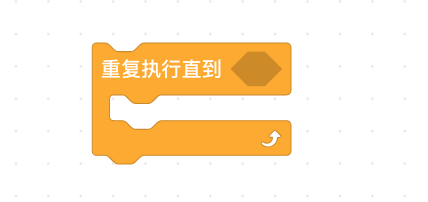
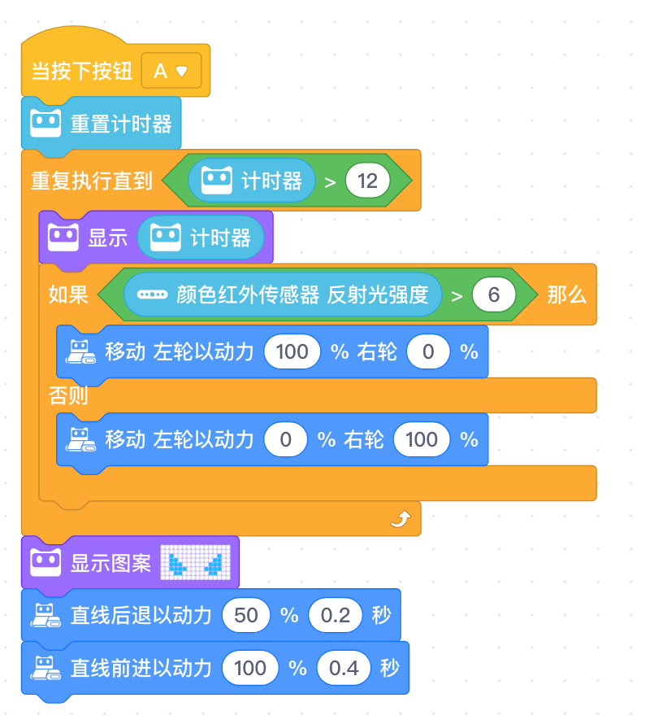

<!-- # 机器人编程入门学习 -->
<link rel="stylesheet" type="text/css" href="./style.css" />

# 第20课《点球大战》

## 内容简介

结合自动巡线，完成点球大战的任务。

## 教学目标

1. `计时器`的用法
1. 代码块 `重复执行直到<*>` 的用法
1. 巡线终止 + 射门 综合运用

## 教学过程

### 1. 新知识讲解

- 学习新的循环语句

  

### 2. 项目挑战

- 任务：自动巡线 + 射门
  - 如何退出无限循环？使用 `计时器`
  - 如何射门？ 程小奔 `冲刺`

## 19-20课时总结

## 学习内容

- 红外遥控器多功能自定义
- `计时器`的用法
- 代码块 `重复执行直到<*>` 的用法
- 巡线 + 射门 综合运用

### 课堂总结

- 机器人足球比赛：通过对红外遥控器功能的自定义，让程小奔完成多样化动作，从而完成对桌上足球的敏捷操作。
- 点球大战：巡线 + 射门，难点是如何让巡线的机器人停下来。

### 作业

- 在家测试“点球大战”代码，需要现场测试出：
  - `反射光强度` 临界值，
  - 巡线终止位置处的 `计时器` 时间。
- 请同学们养成随时 `保存` 和合理 `重命名` 的习惯。
