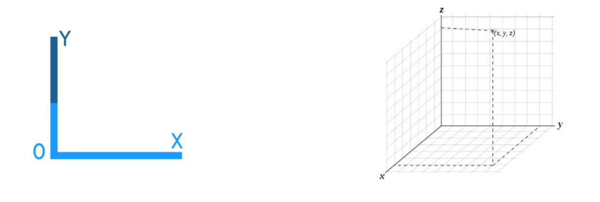
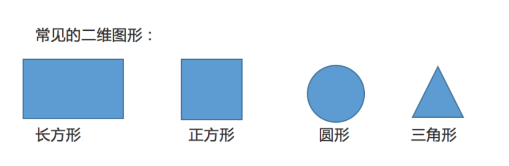
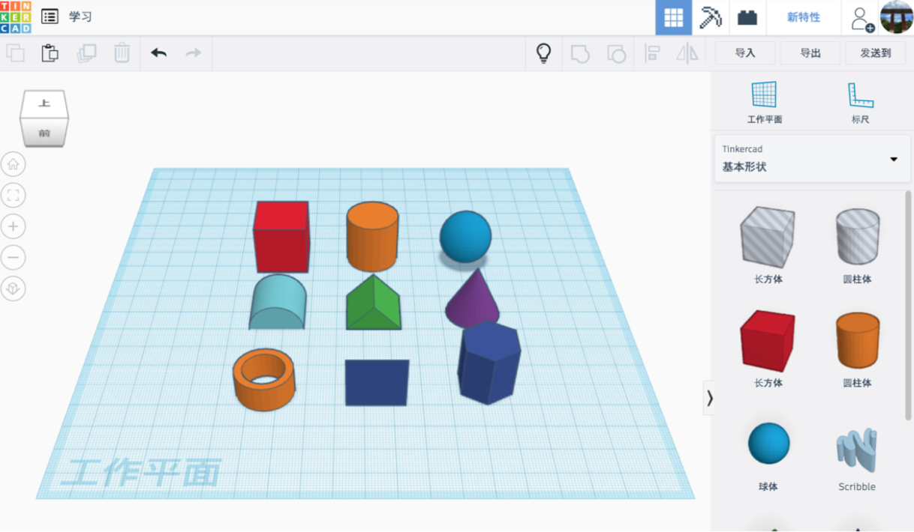
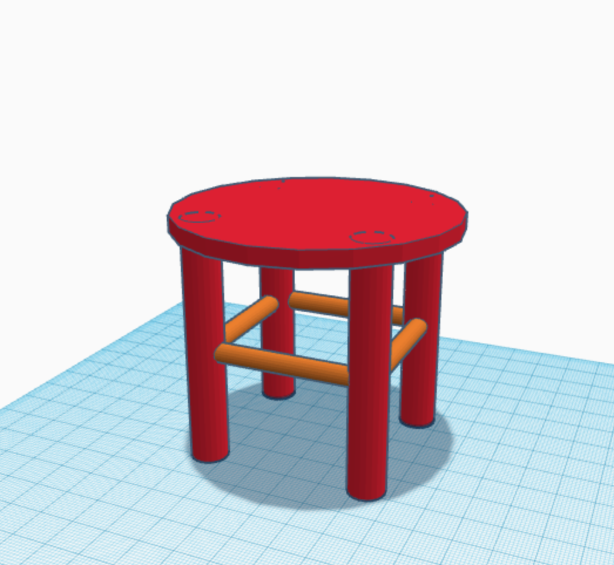
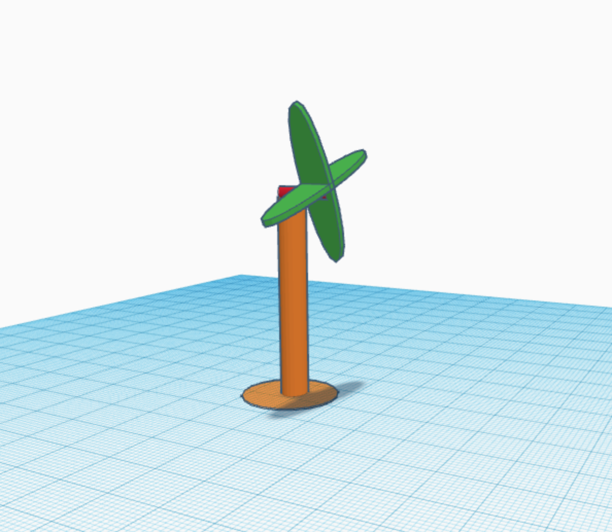
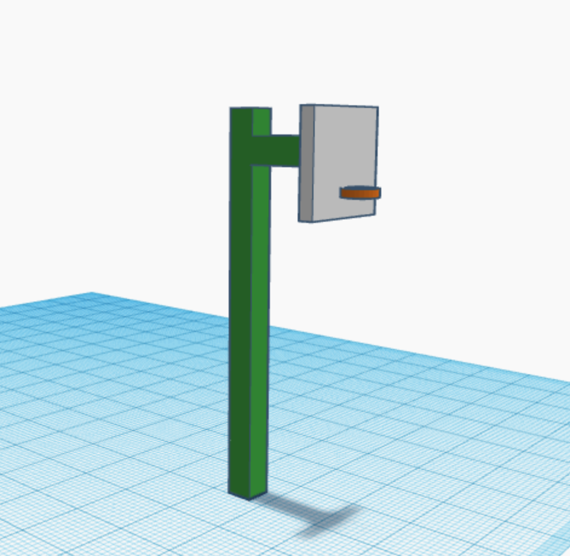

<!-- # 机器人编程提高班 -->
<link rel="stylesheet" type="text/css" href="./style.css" />

# 第1课 3D设计-小凳子

## 内容简介

理解三维空间，认识Tinkercad 3D设计的基本方法。

## 教学目标

1. 理解三维空间；
1. 认识 Tinkercad 3D设计的基本方法。

## 课堂准备

1. 笔记本电脑，安装Chrome浏览器;
1. 注册好Tinkercad账号。

## 预备知识

1. 认识计算机及掌握计算机的基础操作.

## 教学过程

### 1. 认识三维空间

- 三维空间，日常生活中可指由长、宽、高三个维度所构成的空间，二维空 间则只有长和宽二个维度，下图是二维空间和三维空间的对比。

  

- 我们平时所学的长方形、正方形、圆形、三角形等等，则属于二维图形。

  

- 在我们生活中经常见到的三维实体有，长方体、正方体、球体、圆柱体、 圆锥体等等，在 3D 设计中，这几种实体也是常用的，以长方体为例:长方体的大小有三个因素决定:长度、宽度和高度，分别对应三维空间的 x 轴、y 轴和 z 轴，在我们 3D 设计中，这些实体也是常用的基础素材。

  

### 2. Tinkercad

### 关于 Tinkercad (打开PPT)

- 

### 认识 Tinkercad (打开 tinkercad.com)

### 3. 教师演示案例

#### [小凳子](https://www.tinkercad.com/things/dGzA6szjvp7)

  
### 4. 项目挑战

#### 任务一：[风车](https://www.tinkercad.com/things/b8HYf2ai6kk)

#### 任务二：[篮球架](https://www.tinkercad.com/things/iItD9I8nyZx)

