# iABC公开课: Tinkercad Codeblocks 从入门到精通

> #### [Tinkercad 免费帐号创建指南](http://mp.weixin.qq.com/s?__biz=MzA5NjE5MjEzNA==&amp;mid=2648655326&amp;idx=1&amp;sn=d387539f899eb935b97717b88b6f5b68&amp;chksm=88983637bfefbf2179c2c650f7fe8d2a392593b4e449fdda1480a3198cfb1dfa341efe1812c5&amp;scene=21#wechat_redirect)

### [1. Codeblocks 入门介绍](A01.md) 
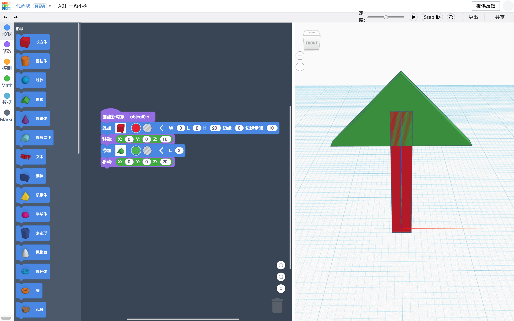

### [2 多边形](A02.md)  
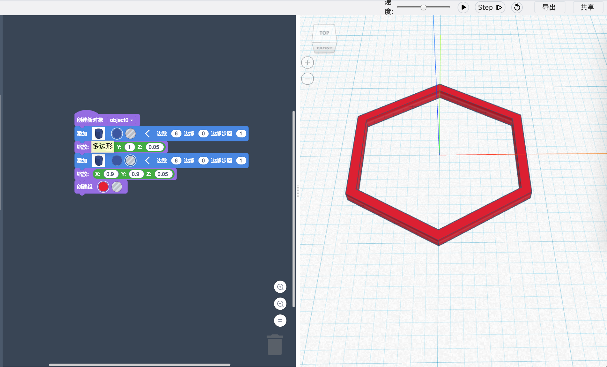

### [3 笑脸](A03.md)  
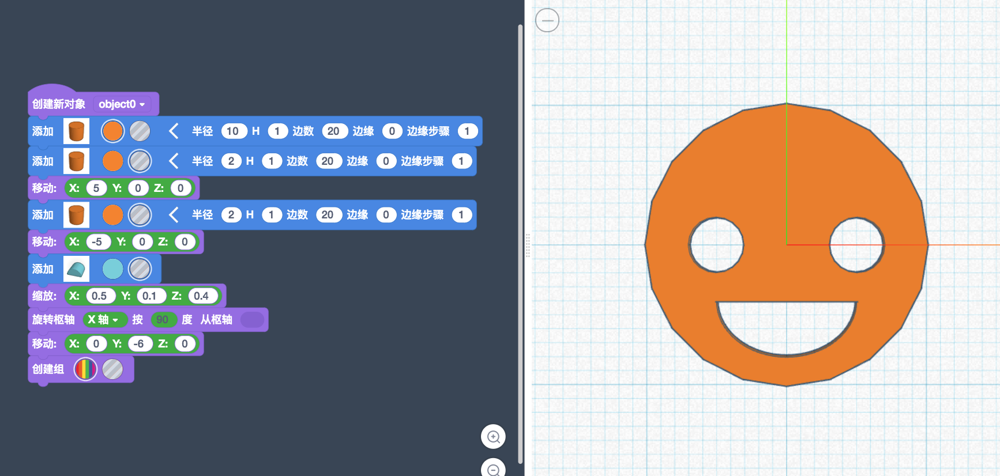

### [4 小方桌](A04.md)  
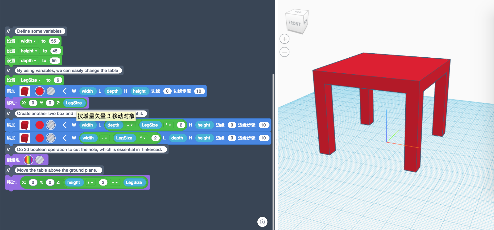

### [5 众木成林](A05.md)  
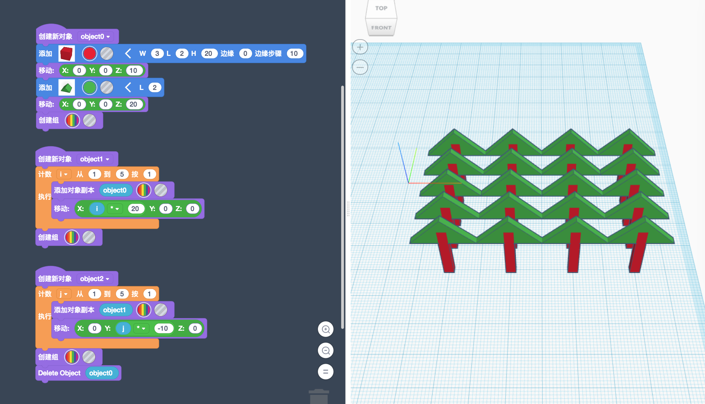

### [6 发射炮弹](A06.md)  
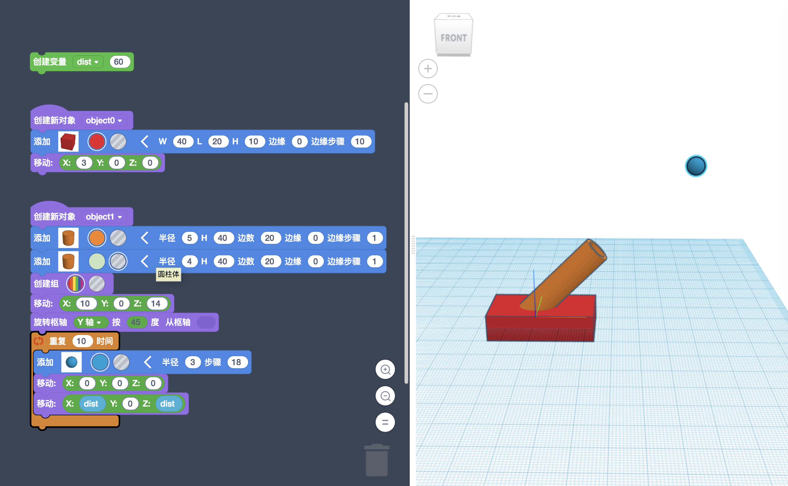

### [7 风车转转](A07.md)  
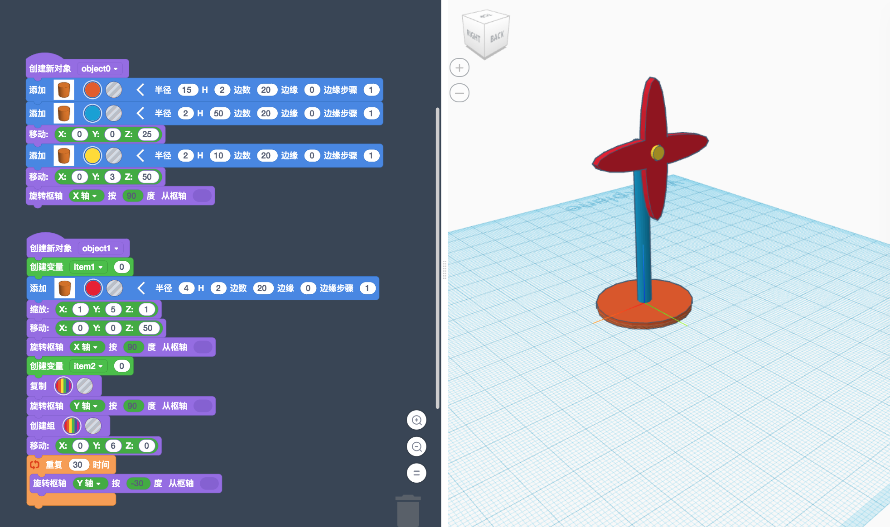

### [8 三阶魔方](A08.md)  
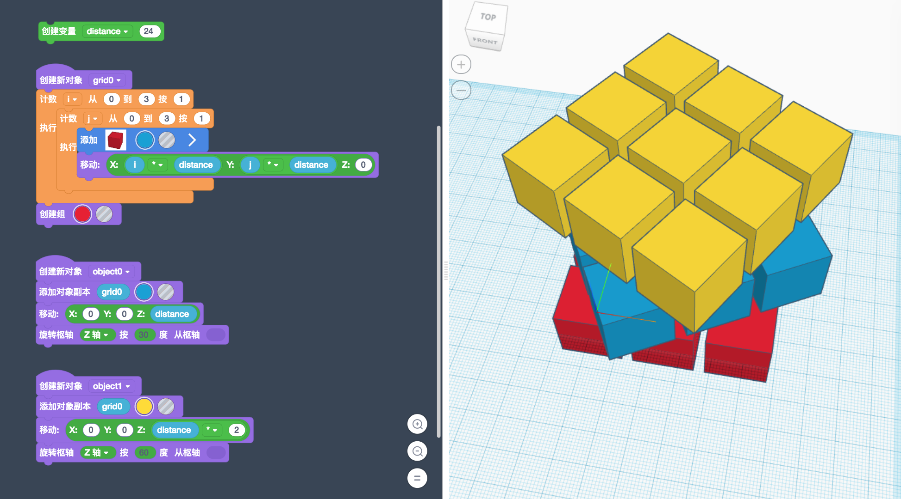

### [9 魔方大厦](A09.md)  
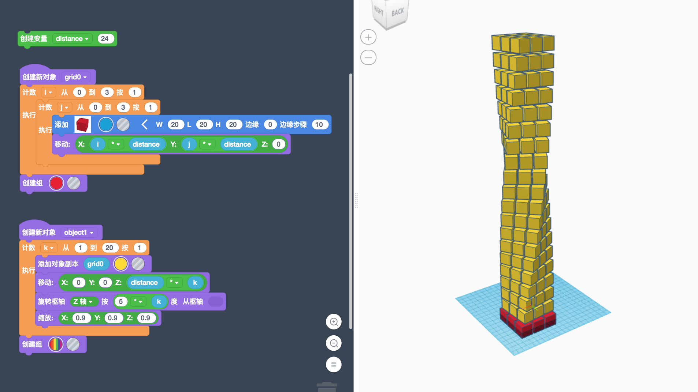

### [10 瓣状徽章](A10.md)  
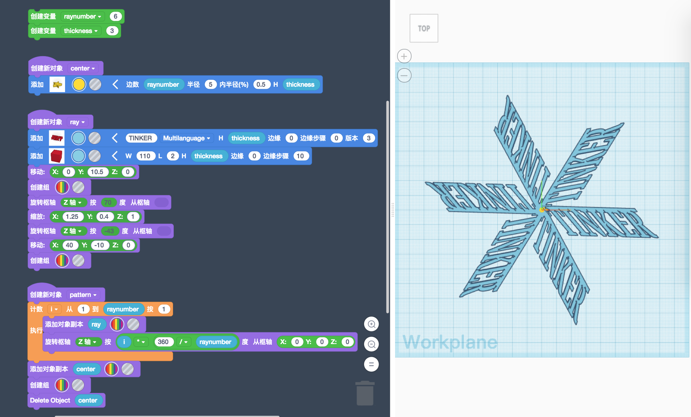

### [11 雪花](A11.md)  
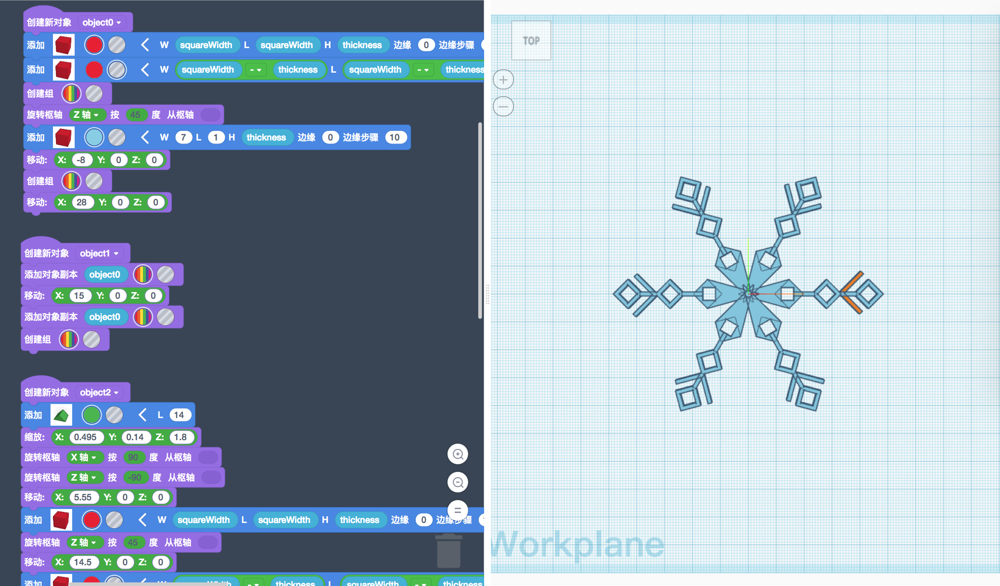

### [12 创意饰品](A12.md)  
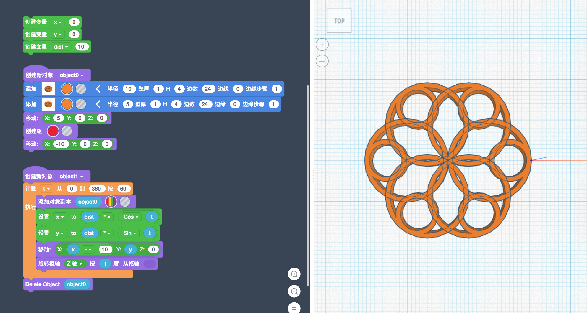

### [13 节日快乐](A12.md)  

### [14 心形曲线](A14.md)  

