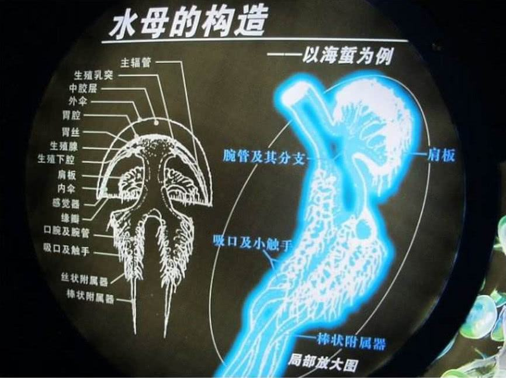
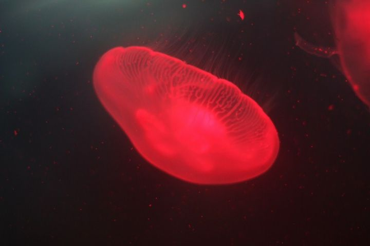
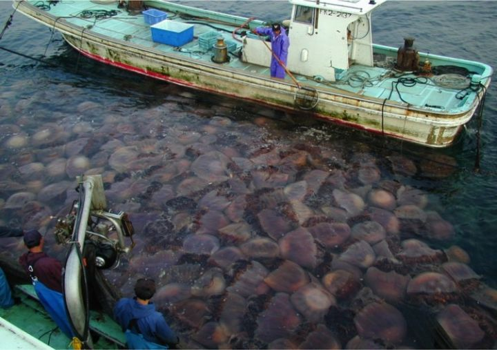
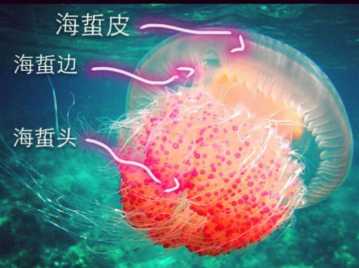

<style>
  img {
    width:600px;
    display: inline-block;
    vertical-align: middle;
    cursor: pointer;
  }
</style>

<script>
  function openImg(img) {
    window.open(img.src, '_blank');
  }
</script>


## 水母（英文名称：Jelly Fish）：

水母是一种低等的无脊椎浮游动物，肉食动物，是水生环境中重要的浮游生物。水母是一种非常漂亮的水生动物。它的身体外形就像一把透明伞，伞状体的直径有大有小，大水母的伞状体直径可达2米。伞状体边缘长有一些须状的触手，有的触手可长达20-30米。

水母身体的主要成分是水，并由内外两胚层所组成，两层间有一个很厚的中胶层，不但透明，而且有漂浮作用。它们在运动时，利用体内喷水反射前进，远远望去，就像一顶顶圆伞在水中迅速漂游；有些水母的伞状体还带有各色花纹，在蓝色的海洋里，这些游动着的色彩各异的水母显得十分美丽。

全世界的海洋中有超过两百种的水母，它们分布于全球各地的水域里。绝大部分海产，少数种类产于淡水，以热带和亚热带海洋的浅水区最丰富。

水母早在6.5亿年前就存在了，它们的出现比恐龙还早。

## 寿命

水母寿命很短，平均只有数个月的生命。

## 构造

<table>
  <tr>
    <td>
      
    </td>
    <td>
      
    </td>
    <td>
      
    </td>
  </tr>
</table>
大部分水母都有三个主要部位：圆伞状或是钟状的身体，触器和口腕。 水母钟状身体下面有一些特殊的肌肉能扩张然后迅速收缩，把身体内的水排出体外，通过喷水推进的方法，水母便能向相反的方向游动。一些水母有一层能够收缩钟状体的皮层，使水母能够快速移动。水母并不擅长游泳，它们常常要借助风、浪和水流来移动。

水母体内百分之九十五是水，百分之三是盐，百分之二是蛋白质。水母的伞状体内有一种特别的腺，可以发出一氧化碳，使伞状体膨胀。它们没有心脏﹑血液﹑鳃和脑。它们简单的感应器官，使它们能分辨气味、味道并帮助它们在水里保持平衡。

钟状体的边缘有一排圆形的小囊，当水母向一方过度倾斜的时候，这些囊就会刺激神经末梢来收缩肌肉，并把水母转到正确的方向上去。位于钟状体边缘的光感器官能使它们分辨光亮与黑暗。 通过化学感受器水母可感觉到气味和味道。通过触手和口腕上的感受器，水母还可以感到物体的运动，帮助它们寻找食物。

水母的触手和身体上都布满刺丝囊。这些丝囊可以在几毫秒内迅速螫伤、捕捉或征服猎物。有些水母是无毒。


## 发光原理



有些水母不单颜色多变，而且还会在水中发光，有些闪耀着微弱的淡绿色或蓝紫色光芒，有些还带有彩虹般的光晕，当它们在海中游动时，就变成了一个光彩夺目的彩球，光影随波摇曳，非常优美。水母发光靠的是一种叫埃奎明的奇妙蛋白质，这种蛋白质和钙离子相混合的时候，就会发出强蓝光来。埃奎明的量在水母体内越多，发的光就越强，每只水母平均只含有五十微克的这种物质。


## 繁殖

雌雄异体，有生殖腺在近胃囊处。成熟的精子流入雌彦萁体内受精。受精卵发育成幼虫离开母体，在水里游动一会儿后，沉下海底形成幼体，后变成横裂体，横裂体分裂成多个碟状幼体，再发育成成体。

近年，世界各地的海域常常有突如其来的水母群的出现。早前，日本海域便出现两米长的巨型“越前水母”群。随着沿海业的过度捕捞，减少了与水母争食的鱼类，增加了浮游生物，造成水母繁衍过剩。




## 水母的用途

- 较小种类可作鱼类食饵；
- 海蜇盐渍后成为食品，有些种类可作药用；
    海蜇是水母的一种。一般我们吃的海蜇分为海蜇头，海蜇皮，海蜇边。
    - 海蜇皮，其实是水母的腔体部分，像一把雨伞一样。又叫做海蜇丝。
    - 海蜇头，水母的触须。
    - 海蜇边，水母腔体最边缘的一层。

      

- 有些浮游水母类可作为海流指示生物；
  ```
  有一种水母，它们有一个或更多的口沟。里面有口腕，功能就像嘴巴。它们的触手里面有一个小小的器官，也就是水母们的“耳朵”，能够预报海洋风暴的来临，当海浪和空气磨擦而产生的次声波冲击它，便会刺激周围的神经感受器。所以，在风暴来临之前的十几个小时，它们就会接到消息从海面一下子全部消失了。
  ```


## 猎物与猎者

所有水母都是肉食性动物，它们以鱼类和浮游生物为食。当猎食的时候，水母很被动，只捕食游到它们身边的动物。它们用触手上的刺丝囊来螫伤或是杀死猎物，然后把食物送到嘴和消化腔里。大部分水母几乎是透明的，令敌人难于发现。有些水母能够发光，单凭身上发出的幽光，水母不费吹灰之力就能吸引猎物。

尽管水母有刺丝囊的保护，但海龟和翻车鱼还是以它们为食，而水母亦是许多人的美食。

- 若海龟数目减少，水母的繁殖率便会激增，水母过度繁殖，自然又会影响到其他鱼类及浮游生物的繁衍，令生态系统失衡。
- 近些年，大量海龟因误把塑料袋当作是水母食下而死亡。

  


## 总结
> - 保护生态环境，维护生态系统失衡
> - 减少塑料袋等一次性塑料制品的使用


## 参考
- [维基百科](https://zh.wikipedia.org/wiki/%E6%B0%B4%E6%AF%8D)
- [百度百科](https://baike.baidu.com/item/水母/1961)
